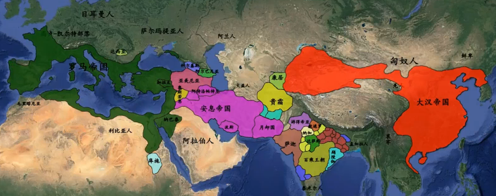
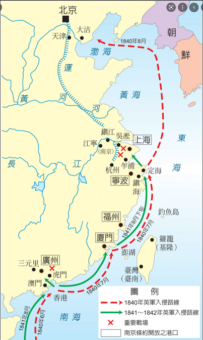

# 人类三千年智识水平顶峰

如果你认为现在是人类智识水平最高的时代，那你就太高估自己了。​

不错，现在的科技日新月异，搜索引擎和手机把知识送到每个人的掌心，我们处于知识饱和的时代。但知识不等于智识。智识是人类对真理的探索，是作为灵长类地位对其它动物，周遭世界，以及人类内心的深刻反思。​

我认为，人类智识水平的顶峰，应该是公元前600年到300年之间。这是群星璀璨的300年。​

在印度，[释迦牟尼](https://zh.wikipedia.org/wiki/%E9%87%8A%E8%BF%A6%E7%89%9F%E5%B0%BC)诞生于前563年，他是第一个思考人类生老病死问题的哲人。​

在中国，[孔子](https://zh.wikipedia.org/wiki/%E5%AD%94%E5%AD%90)生活在前551年到前479年，他是第一个把人类这种动物和他们构成的社会记载成历史的史学家。他也试图把道德伦理的枷锁套到人类头上。但他不是第一个这么做的人。几百年前的红海边，[摩西](https://zh.wikipedia.org/wiki/%E6%91%A9%E8%A5%BF)已经给以色列人留下了[十诫](https://zh.wikipedia.org/wiki/%E5%8D%81%E8%AA%A1)。

对真理的追求，常常需要几代人。如果把老子，孔子，孟子视为一脉相承的三代，西方也有这样类似的三代相传，就是苏格拉底，柏拉图，和亚里士多德。​

[苏格拉底](https://zh.wikipedia.org/wiki/%E8%8B%8F%E6%A0%BC%E6%8B%89%E5%BA%95)（前470年－前399年）是第一个对形而上的诸多问题进行思考的哲人，比如善恶，智慧，美德，政治。

[柏拉图](https://zh.wikipedia.org/wiki/%E6%9F%8F%E6%8B%89%E5%9B%BE)(前429年－前347年)创建了人类历史上第一所研究院---雅典学院。他是第一个试图建立一个完美社会---理想国的吃螃蟹者。

[亚里士多德](https://zh.wikipedia.org/wiki/%E4%BA%9A%E9%87%8C%E5%A3%AB%E5%A4%9A%E5%BE%B7)（前384年－前322年）是这所学院最杰出的学生。他几乎以一己之力，开创了后世无穷代人研究的对象：物理学、诗歌（包括戏剧）、音乐、生物学、动物学、逻辑学、政治、政府、以及伦理学。​

拉菲尔名画《雅典学院》（现藏于梵蒂冈博物馆）。中立争论者为柏拉图（左）和亚里士多德（右）。背后矗立神像为阿波罗和雅典娜。画家把自己藏身于右下角（白衣人左边），暗示自己也向往那哲人时代。

让人惊叹的是，东西方这几代人生活轨迹，居然是惊人类似。

孔子生活在一个诸侯割据的时代，他老人家可谓跑官跑了一辈子，颠簸流离，四处奔走，自嘲为“丧家之犬“也。混得最大的官也不过是一个小小鲁国的司法部长（大司寇）。他的半个老师[老子](https://zh.wikipedia.org/wiki/%E8%80%81%E5%AD%90)，在档案馆里面混得穷极无聊了，挂冠而去，在函谷关被关吏强留下来，写了一篇也是唯一的作品[《道德经》](https://www.daodejing.org/)。号称“亚圣“的[孟子](https://zh.wikipedia.org/wiki/%E5%AD%9F%E5%AD%90)，混得最好也不过是一个大学教授。他们所处的春秋战国时代，诸侯割据，小国林立，却是中国思想史上最光辉灿烂的时代，是为[“百家争鸣”](https://zh.wikipedia.org/wiki/%E8%AF%B8%E5%AD%90%E7%99%BE%E5%AE%B6)。​

再看看苏格拉底所处的雅典，刚刚在[伯罗奔尼撒战争](https://zh.wikipedia.org/wiki/%E4%BC%AF%E7%BD%97%E5%A5%94%E5%B0%BC%E6%92%92%E6%88%98%E4%BA%89)中被军事强国[斯巴达](https://zh.wikipedia.org/wiki/%E6%96%AF%E5%B7%B4%E8%BE%BE)击败，[民主制度](https://zh.wikipedia.org/wiki/%E9%9B%85%E5%85%B8%E5%BC%8F%E6%B0%91%E4%B8%BB)被破坏，热爱自由的雅典人还得忍气吞声生活在斯巴达强加于他们的寡头统治之下。心灵歪曲之下，居然把号称“最聪明的希腊人“苏格拉底判了死刑！还是通过民主投票的方式！罪名是“腐蚀青年“和“不敬神”。

柏拉图和亚里士多德所处的时代，雅典进一步衰落，直到前322年被北边崛起的马其顿吞并。跟孔子孟子一样，柏拉图和亚里士多德所处的时代也是战火纷飞的乱世。亚历山大大帝横空出世之前，希腊城邦国家竞相争霸​，斯巴达打赢雅典后，只风光一阵子就被[底比斯](https://zh.wikipedia.org/wiki/%E5%BA%95%E6%AF%94%E6%96%AF_(%E5%B8%8C%E8%87%98))拉下马。希腊本土群雄割据，和中国的春秋战国差不多。

考察西方三贤和东方三圣的历史轨迹，我们得到一个有趣的结论：大思想家往往出在分裂割据的时代，而且所在地往往是其中的中等国家（城邦）。如果是一个弱国，恐怕人民天天考虑的是如何逃命，无暇思考形而上的“虚无缥缈“的问题。如果是一个强国呢，人民安居乐业，恐怕也不屑于深层次的思考。只有在中不溜秋的国家，有这样的社会分工，让一批闲人有时间思考“为什么别的国家要来打我们？为什么我们行善没有好报？人生为何无常？什么样的一生才是有意义的一生“诸多狗屁倒灶的问题。嗯，这就是思想家的由来。​​所谓“生于忧患，死于安乐“，换一种说法就是“忧患逼人思考，忧患迫人上进”。

说到这里，也许有人出来喷：“说了半天，就是几个哲学家，他们能代表人类智识水平？除了哲学，还有数学，物理，化学，天文，地理，艺术呢？还有，出了一两个思想家就能代表他们那个时代的整体智识水平高？”

其实，科学界公认哲学是科学之母。因为一个人开始思考具体的科学问题之前，他必须有这样一个世界观认为这些问题是值得探索的，也是有可能被攻克的，这就涉及到哲学（详见《围城》第三章褚慎明对方鸿渐的回答）。英文里面博士叫PhD，中间那个P就是“Philosophy”（哲学）的简称。前面提到的希腊思想家往往身兼哲学家和自然科学家两职。亚里士多德然和创建几何学的[毕达哥拉斯](https://zh.wikipedia.org/wiki/%E6%AF%95%E8%BE%BE%E5%93%A5%E6%8B%89%E6%96%AF)就是最显然的代表。在希腊文里面，哲学就是“爱智慧”的意思。

其次，哲学家的智识水平绝不是从天上掉下来的。他们的智识水平是建立在同时代或前一时代人类的智慧之上的。如果没有前一时代的[希腊七贤](https://zh.wikipedia.org/wiki/%E5%8F%A4%E5%B8%8C%E8%85%8A%E4%B8%83%E8%B4%A4)（[梭伦](https://zh.wikipedia.org/wiki/%E6%A2%AD%E4%BC%A6)，[泰勒斯](https://zh.wikipedia.org/wiki/%E6%B3%B0%E5%8B%92%E6%96%AF)，等等）和他们留下的思想，如果没有同时代人的激烈争辩和脑力激荡，也就没有苏格拉底，柏拉图，和亚里士多德的智识。​同样的，如果没有春秋战国时代的百家争鸣（包括儒家，道家，法家等等），百花齐放，也不会有孔子和孟子的智识。

综上所述，我们可以相当有把握说，一个产生了大思想家的时代，和一个思想家乏善可陈的时代比，前者的人类智识水平明显要高。​ 

扯得太远了。回头来说公元前300年之后的事儿。

从公元前300年开始​，东西方都开始向大一统形态靠拢。在西方，罗马共和国通过三次布匿战争，击败了地中海老牌强国迦太基。前146年消灭迦太基，把西班牙，高卢（现法国），北非，西西里岛纳入囊中，可以看作是这个大一统国家的奠立。之后吞并希腊，埃及，不列颠，和小亚细亚，只不过是锦上添花。在东方，秦国建立了傲视其它六国的军事力量，通过几代秦王的经营，终于由秦始皇在前221年横扫六合，一统天下。

很可惜，继承了大一统状态的罗马帝国和秦朝汉朝，在几百年的时间里，居然没有涌现一位值得一提的思想家。更不用说流传下来深邃的思考。这让我们不得不思考前面命题的反命题，即：如果处于小国林立的分裂状态下，人类智识水平偏高，那么反过来，在大一统状态下，人类智识水平倾向于低落，这一反命题似乎也成立。

从统治阶级角度看，这是再自然不过的。什么人最能威胁到他们的统治？当然是聪明人，尤其是脑子里面成天胡思乱想的聪明人。​一个强有力的中央政权，为了自己的生存，当然会压制人民的智识，鼓励更多的人成为顺民。秦始皇的焚书坑儒就是赤裸裸的例子。

地球另一边的古罗马虽然没有钳制人民的智识，但他们也没有鼓励。古罗马之所以能统一环地中海，不是因为他们有先进的科技，而是因为他们有纪律严明的军队和坚韧不拔的毅力。固然，他们的工程学（古罗马的[道路](https://zh.wikipedia.org/wiki/%E7%BE%85%E9%A6%AC%E9%81%93%E8%B7%AF)和[桥梁](https://zh.wikipedia.org/wiki/%E5%9F%83%E7%B1%B3%E5%88%A9%E4%B9%8C%E6%96%AF%E6%A1%A5)），雄辩术（谁能用口才说服元老院和公民大会，谁就是领袖），法律（[十二铜表法](https://zh.wikipedia.org/wiki/%E5%8D%81%E4%BA%8C%E9%93%9C%E8%A1%A8%E6%B3%95)，[查士丁尼法典](https://zh.wikipedia.org/wiki/%E6%9F%A5%E5%A3%AB%E4%B8%81%E5%B0%BC%E6%B3%95%E5%85%B8)等等），建筑（[万神庙](https://zh.wikipedia.org/wiki/%E4%B8%87%E7%A5%9E%E5%BA%99)，[斗兽场](https://zh.wikipedia.org/wiki/%E7%BD%97%E9%A9%AC%E6%96%97%E5%85%BD%E5%9C%BA)等等），史学（[高卢战记](https://zh.wikipedia.org/wiki/%E9%AB%98%E7%9B%A7%E6%88%B0%E8%A8%98)等等），都继承了希腊文明并发扬光大，但很少看到古罗马人在人类智识层面有独创性的开拓，这对于一个延续了2000多年（从王政时代到东罗马帝国灭亡）的文明，​是让人很失望的。我想，这跟他们大部分时间处于大一统状态不无关系。

进入大一统状态之后，对人类智识水平的第二次打击也逐渐浮出水面，那就是宗教。

[古希腊神话](https://zh.wikipedia.org/wiki/%E5%B8%8C%E8%85%8A%E7%A5%9E%E8%AF%9D)里面有主宰人类的奥林匹亚诸神。但希腊神话里，神是有人性的，会吃醋，会愤怒，也会失败​。这样的神是活泼泼的神，是古希腊悲喜剧作家取之不尽用之不竭的灵感源泉。基督教的崛起带来了奥林匹亚诸神的黄昏，也给人类智识带来了铁枷。

当我们回首历史，审视公元初到公元313年基督教成为罗马帝国国教之间的往事，​一神教（基督教）取代多神教实际上是历史的大趋势，无可扭转。

首先，由于罗马帝国的兼容并蓄，吞并每一块土地的同时，也把当地人民敬奉的神明也纳入罗马文化中。据说在最多的时候，罗马人敬奉的各种各样的神明有三十万之多。这不可避免的带来纠纷和困惑。从一神教犹太教衍生出来的基督教，就像一缕清风，把所有乱七八糟的神明一扫而光，让罗马人民得到精神上的解脱。

[犹太教](https://zh.wikipedia.org/wiki/%E7%8A%B9%E5%A4%AA%E6%95%99)之所以是一神教，是因为在[摩西五经](https://zh.wikipedia.org/wiki/%E6%91%A9%E8%A5%BF%E4%BA%94%E7%BB%8F)里，上帝通过摩西颁布[《十诫》](https://zh.wikipedia.org/wiki/%E5%8D%81%E8%AA%A1)，其中很傲娇的一条就是“除了我以外、你不可有别的神​”。而耶稣和他的弟子所做的贡献，就是把本来在犹太人内部传播的犹太教，播撒到整个罗马帝国境内，宣称上帝的恩典不限于犹太人，而是世上所有信他的人。这颇有点[普罗米修斯](https://zh.wikipedia.org/wiki/%E6%99%AE%E7%BD%97%E7%B1%B3%E4%BF%AE%E6%96%AF)把火种传播到人间的意思。但跟普罗米修斯的无偿奉献不同，耶稣夹带了一点私货：想要得到上帝的恩典，可以，你不仅要信神，还要相信我是神的儿子，相信我是神为了拯救你们人类派到世上的。要快哦，因为世界末日快到了。到那天我就是审判日的主审官，相信我的就能上天堂，不信我的就得下地狱。

要落到现在，谁要这么说大家早就一个大嘴巴打过去了，然后直接扭送精神病院。但耶稣和他的门徒们做到了，而且是通过死亡这种悲壮的方式。首先是耶稣自己上十字架，然后是十二门徒和众多虔诚信徒殉教。时至今日，地球上超过一半的人类选择相信耶稣。这真是人类思想史上的一大奇迹！

深究起来，基督教的胜利实在是占了天时地利人和。当罗马人民厌倦了形形色色对他们命运漠不关心的假神，渴望和真正的神做更亲密的接触时​，耶稣及其门徒送来了简单明了的基督教，许诺了天堂和永生，此乃天时也。基督教萌芽于一个统一的大帝国，而且帝国的统治者最初容忍了基督教在帝国全境的传播，此乃地利也。早期基督徒的虔诚和种种“神迹”，给基督教打下稳固的基础。最初一段时间被罗马皇帝迫害的殉道者，反而让基督教在地下蔓延，终于等到君士坦丁大帝于公元313年通过[《米兰敕令》](https://zh.wikipedia.org/wiki/%E7%B1%B3%E5%85%B0%E6%95%95%E4%BB%A4_(%E5%90%9B%E5%A3%AB%E5%9D%A6%E4%B8%81))把基督教扶正，一跃成为罗马帝国的国教，此乃人和也。

六百多年后，阿拉伯半岛的[穆罕默德](https://zh.wikipedia.org/wiki/%E7%A9%86%E7%BD%95%E9%BB%98%E5%BE%B7)试图复制耶稣的成功，他宣称耶稣不是什么上帝的儿子，而只是上帝的使者，正如穆罕默德本人一样。但穆罕默德明确表示他是独一无二的，因为他是上帝派来的最后一位使者。至于上帝要托他捎的口信呢，估计你也猜到了：世界马上要毁灭了，只有信上帝和穆罕默德的人才能得永生。说老实话，虽然伊斯兰教最终复制了基督教的成功，但赢得实在有点难看。很多信徒是在被刀架在脖子上才信的。伊斯兰教也开了用军队武力传教的先河。

在中国，儒教也进入统治者的视野。汉武帝在[董仲舒](https://zh.wikipedia.org/wiki/%E8%91%A3%E4%BB%B2%E8%88%92)的大力推荐下，欣喜的发现儒教教义“仁义礼智信”是制造顺民的绝妙机器。本来孔子创立儒家的初衷让我们牢记人类和禽兽的区别：禽兽不会讲仁德，礼貌，义气，智慧和信誉，这恰恰是我们人类应该大力提倡的。无奈这真经到汉武帝和后世历届统治者这儿就被唱歪了。董仲舒的[”独尊儒术，罢黜百家”](https://zh.wikipedia.org/wiki/%E7%8B%AC%E5%B0%8A%E5%84%92%E6%9C%AF)为武帝所采纳，使儒学成为中华文化的社会基础，影响长达二千多年。统治者把对儒教经典的理解程度跟一个人是否有资格当官挂钩，而众多聪明智者一辈子孜孜不倦的钻研四书五经，揣摩圣人说的每一句话，把自己的诠释写成[八股文](https://zh.wikipedia.org/wiki/%E5%85%AB%E8%82%A1%E6%96%87)，成就中国传统文化一道最荒谬的风景线。

当基督教在罗马帝国境内方兴未艾时，另一支古老的宗教传到中国。公元67年，东汉汉明帝梦见金人，于是派人去西域，迎来两位高僧，并且带来了许多佛像和佛经，用白马驼回首都洛阳，皇帝命人将自己避暑的行宫改为精舍让僧人入住，翻译《四十二章经》。这精舍就是现在的白马寺。此乃佛教进入中国的开始。南北朝期间，佛教迅速发展，以南朝为盛。梁武帝萧衍甚至不惜屡次出家为僧，害得群臣花大价钱把他赎回来。“南朝四百八十寺，多少楼台烟雨中”是当时佛教昌盛的最佳写照。

到了唐朝，唐僧西天取经的事是确确凿凿的（虽然那只孙猴子是吴老先生的幻想），玄奘于唐太宗贞观二年（628年）从长安出发，贞观十九年（645年）回到长安，历时17年，取回600多部经书。佛教兴旺的同时，道教和儒教也在兼容并蓄的大唐帝国境内纷纷扬扬。儒教是前朝留下的传统国教，道教则沾了老子姓李（跟唐朝皇帝同姓）的光。佛道儒三家经常是轮流坐庄，往往一个皇帝刚刚升天，下一个皇帝信奉的宗教就粉墨登场，开始把另外两家往死里整。

从公元前300年到公元1000年间，人类生活在宗教的笼罩下。不管是基督教，伊斯兰教，儒教，佛教，还是道教，对人类智识水平都造成了不少的伤害。试想，一个社会中受教育水平最高的一批人，都把智慧精力投放到争辩三位一体，提炼仙丹，研究八股文，诵读古兰经，冥想，修行，他们又有何暇提高自己的智识水平呢？

大一统促进了宗教的传播，宗教传播压抑了人类智识。人类对同一宗教的信仰又反过来促进了大一统。终于，在公元1200多年，全球进入了一个前所未有的大一统状态，而人类智识也达到前所未有的低谷。

1206年，成吉思汗统一蒙古诸部落，旋即开始大规模西征。在此后50多年里，蒙古军队的铁骑踏遍了大半个欧亚的大陆，建立了一个覆盖如今的中国，俄罗斯，中亚，东欧，德国的庞大帝国，占地3300万平方公里。在蒙古帝国的扩张过程中，无数的文明和城市被彻底摧毁。中国人口在蒙古入侵的七十年间因战争和包括因战争造成的各种原因被消灭了一半。繁华的宋朝中国被消灭后，经济、文化停滞不前甚至倒退。历史学家普遍认为，蒙古汗国导致人类文明的大倒退，代表着人类历史上最黑暗的时代。

蒙古帝国破坏的余波甚至波及到100多年之后。1346年，蒙古军队进攻克里米亚时，用抛石机将患鼠疫而死的人的尸体抛进城内，导致鼠疫在欧洲广泛传播，最终在1348年—1349年造成2,000万人死亡，成为令人闻之色变的[“黑死病“](https://zh.wikipedia.org/wiki/%E9%BB%91%E6%AD%BB%E7%97%85)，使当时欧洲丧失了三分之一的人口。

最黑暗的时刻，往往在黎明破晓之前。悲惨的现实使人文主义得到觉醒。欧洲人文主义文学的第一部代表作[《十日谈》](https://zh.wikipedia.org/wiki/%E5%8D%81%E6%97%A5%E8%AB%87)就是[薄伽丘](https://zh.wikipedia.org/wiki/%E4%B9%94%E4%B8%87%E5%B0%BC%C2%B7%E8%96%84%E4%BC%BD%E4%B8%98)在黑死病泛滥最猖獗的时期写成的。欧洲就此迎来了[文艺复兴](https://zh.wikipedia.org/wiki/%E6%96%87%E8%89%BA%E5%A4%8D%E5%85%B4)的曙光。

[文艺复兴](https://zh.wikipedia.org/wiki/%E6%96%87%E8%89%BA%E5%A4%8D%E5%85%B4)的起源是欧洲人透过厚厚一层基督教的蒙纱，依稀看到老祖宗---就是古希腊和古罗马曾经创造的灿烂文明。而那是基督教曾经竭力不想让他们看到的，因为那段光荣属于“罪恶”的“异教徒”。这起源的挈机，第一来自黑死病削弱了基督教对人类头脑的禁锢，第二来自[君士坦丁堡于1453年的沦陷](https://zh.wikipedia.org/wiki/%E5%90%9B%E5%A3%AB%E5%9D%A6%E4%B8%81%E5%A0%A1%E7%9A%84%E9%99%B7%E8%90%BD)。君士坦丁堡的沦陷是人类历史最重要的里程碑之一。有兴趣的读者可以透过《三体》第三卷第一部《魔法师之死》回归当时的画面。

帝国首都被穆斯林占领，不仅代表东罗马帝国的灭亡，也迫使大批了解古希腊文明的学者西迁到意大利。当时意大利并非一个统一的政治实体，而是由一些城邦和领地组成，其中的[佛罗伦萨共和国](https://zh.wikipedia.org/wiki/%E4%BD%9B%E7%BD%97%E4%BC%A6%E8%90%A8%E5%85%B1%E5%92%8C%E5%9B%BD)就是文艺复兴的发祥地。

在一个分裂状态下的欧洲，人类智识又一次得到大解放：

* 天文学方面，[哥白尼](https://zh.wikipedia.org/wiki/%E5%B0%BC%E5%8F%A4%E6%8B%89%C2%B7%E5%93%A5%E7%99%BD%E5%B0%BC)提出了[日心说](https://zh.wikipedia.org/wiki/%E6%97%A5%E5%BF%83%E8%AF%B4)；
* 数学方面，我们初中课本里面的[代数学](https://zh.wikipedia.org/wiki/%E5%B8%8C%E7%9A%AE%E5%A5%A5%E5%86%85%C2%B7%E5%BE%B7%E5%B0%94%C2%B7%E8%B4%B9%E7%BD%97)和[解析几何](https://zh.wikipedia.org/wiki/%E5%8B%92%E5%86%85%C2%B7%E7%AC%9B%E5%8D%A1%E5%B0%94)基本是在此间建立的；
* 物理学方面，[伽利略](https://zh.wikipedia.org/wiki/%E4%BC%BD%E5%88%A9%E7%95%A5%C2%B7%E4%BC%BD%E5%88%A9%E8%8E%B1)发现了落体，抛物体，和振摆三大定律，另外我们中学课本里面好些个物理单位是用这期间的科学家名字命名的，像帕斯卡，托里拆利，波义耳等等，因为这些概念本来就是他们发明的；
* 近代生理学的鼻祖[哈维](https://zh.wikipedia.org/wiki/%E5%A8%81%E5%BB%89%C2%B7%E5%93%88%E7%BB%B4)通过人体解剖发现血液循环；
* 航海技术的飞跃促进了[地理大发现](https://zh.wikipedia.org/wiki/%E5%9C%B0%E7%90%86%E5%A4%A7%E5%8F%91%E7%8E%B0)，[哥伦布](https://zh.wikipedia.org/wiki/%E5%85%8B%E9%87%8C%E6%96%AF%E6%89%98%E5%BC%97%C2%B7%E5%93%A5%E4%BC%A6%E5%B8%83)发现新大陆，[麦哲伦](https://zh.wikipedia.org/wiki/%E6%96%90%E8%BF%AA%E5%8D%97%C2%B7%E9%BA%A5%E5%93%B2%E5%80%AB)环绕地球；
* 文学上，[但丁](https://zh.wikipedia.org/wiki/%E4%BD%86%E4%B8%81%C2%B7%E9%98%BF%E5%88%A9%E5%90%89%E8%80%B6%E9%87%8C)，[薄伽丘](https://zh.wikipedia.org/wiki/%E4%B9%94%E4%B8%87%E5%B0%BC%C2%B7%E8%96%84%E4%BC%BD%E4%B8%98)，[莎士比亚](https://zh.wikipedia.org/wiki/%E5%A8%81%E5%BB%89%C2%B7%E8%8E%8E%E5%A3%AB%E6%AF%94%E4%BA%9A)，[塞万提斯](https://zh.wikipedia.org/wiki/%E7%B1%B3%E6%A0%BC%E5%B0%94%C2%B7%E5%BE%B7%C2%B7%E5%A1%9E%E4%B8%87%E6%8F%90%E6%96%AF)，写下脍炙人口的作品；
* 艺术上，达芬奇，米开朗基罗，拉斐尔（[文艺复兴三杰](https://zhuanlan.zhihu.com/p/42163633)）留下的作品现在还让我们如痴如醉。

公元1500年到1600年一百年间是激动人心的时代。人类睁开慧眼，第一次利用自己的头脑成为这颗蓝色星球的主宰。

中国人虽然没有机会参与，但我们发明的[印刷术](https://zh.wikipedia.org/wiki/%E6%B4%BB%E5%AD%97%E5%8D%B0%E5%88%B7%E6%9C%AF)和[纸张](https://zh.wikipedia.org/wiki/%E7%BA%B8)传到欧洲，使知识得以从所未有的大规模而廉价方式传播。

现代文明的诸多元素：[科学方法](https://zh.wikipedia.org/wiki/%E7%A7%91%E5%AD%A6%E6%96%B9%E6%B3%95)、[地理大发现](https://zh.wikipedia.org/wiki/%E5%9C%B0%E7%90%86%E5%A4%A7%E5%8F%91%E7%8E%B0)、[民族国家](https://zh.wikipedia.org/wiki/%E6%B0%91%E6%97%8F%E5%9C%8B%E5%AE%B6)、[宪法](https://zh.wikipedia.org/wiki/%E6%86%B2%E5%88%B6%E6%80%A7%E6%B3%95%E5%BE%8B)，[资本市场](https://en.wikipedia.org/wiki/Capital_market)等等，都是源于文艺复兴。没有文艺复兴，人类文明之光恐怕还在黑暗中奄奄一息。没有文艺复兴，我们今天恐怕根本不知道苏格拉底和西方三贤的存在。亚里士多德的文章在中世纪的欧洲已经被销毁得干干净净。我们今天还能有幸读到完全是因为阿拉伯学者保存的残本在文艺复兴时期被重新翻译成拉丁文。

这场浩浩荡荡的文艺复兴，从佛罗伦萨开始，波及整个意大利，进而覆盖整个欧洲。然后欧洲人又通过地理大发现，扩散到整个世界，包括美洲，大洋洲，亚洲，非洲，至今余波荡漾。

19世纪初，全球化的大趋势浪潮，在一个骄傲而又固步自封的大一统国家面前，暂时止步，那就是中国。

中国有足够资本骄傲和固步自封，因为在最繁荣的时刻，中国的GDP占全球GDP的三分之一强。中国向西方源源不断的输出丝绸，茶叶，瓷器，换回白花花的银子。怀揣“黄金梦”的欧洲人纷纷来到中国,通过贸易来获取他们所渴求的财富。却发现中国人对他们的钢琴和刀叉不屑一顾，中国有四大发明，中国有勾股定理，中国有最早的纸币。而且，在3000多年历史里，中国绝大多数时间里神奇的保持了大一统状态。(注：[黄仁宇先生](https://zh.wikipedia.org/wiki/%E9%BB%84%E4%BB%81%E5%AE%87)有一个独特的观点，中国的大一统是因为黄河经常泛滥，必须有一个中央集权统一运筹。）正因为这样的中央集权，使得中国可以自给自足，还有武力不时敲打周边的蛮夷之国，让他们臣服。 

清朝最大的失误，就是把不远万里前来拜访的西方国家，也当成了可以随时敲打的蛮夷之邦。

西方国家对中国的认识，经历了一个从敬畏到蔑视的过程。起初的[马可波罗](https://zh.wikipedia.org/wiki/%E9%A9%AC%E5%8F%AF%C2%B7%E6%B3%A2%E7%BD%97)对中国富丽堂皇的描述，坐实让国小人穷的欧洲人羡慕得流口水。到了康熙朝，他们对中国还是还是尊敬有加的---汤若望等洋人还在朝中混饭吃。但随着[英国工业革命](https://zh.wikipedia.org/wiki/%E7%AC%AC%E4%B8%80%E6%AC%A1%E5%B7%A5%E4%B8%9A%E9%9D%A9%E5%91%BD)（开始于1769年）的发展和在欧洲的扩散，中国和西方的距离就越拉越开了。终于，在1840年，蓬勃发展的西方和昏睡百年的中国来了一次猛烈的碰撞。这就是[第一次鸦片战争](https://zh.wikipedia.org/wiki/%E7%AC%AC%E4%B8%80%E6%AC%A1%E9%B8%A6%E7%89%87%E6%88%98%E4%BA%89)。以271票对262票，英国议会通过对华战争法案。这个最新锐的西方国家终于麻起胆子，撩拨中国这头狮子的胡须。结果是让他们惊喜的，清朝的不堪一击出乎英国人的想象之外。从此，中国就像那只被识破“技只此耳”的黔之驴，被西方诸强反复蹂躏，被迫接受一次又一次的不平等条约。

落后就要挨打，这是中国人在残酷的现实中认识到的真理。关键问题是：为什么在数千年的漫长岁月里，中国没有发展出与其经济能力匹配的科技水平？[李约瑟博士](https://zh.wikipedia.org/wiki/%E6%9D%8E%E7%BA%A6%E7%91%9F)的[《中国科学技术史》](https://zh.wikipedia.org/wiki/%E4%B8%AD%E5%9B%BD%E7%A7%91%E5%AD%A6%E6%8A%80%E6%9C%AF%E5%8F%B2_(%E6%9D%8E%E7%BA%A6%E7%91%9F))对此做了很好的阐述。他认为中国的大一统和科举制度是主要原因。他也提到了中国独特的地理环境，比如黄河的治理，需要一个统一的政府安排。但恰恰就是这样的大一统和儒教对社会精英的毒害，钳制了一代又一代中国人的智识。祖辈们发明的好东西也被白白浪费。发明了指南针，却不知道用来航海探险；发明了火药，却用来做鞭炮而不是枪炮；发明了纸张和印刷术，却用来传播四书五经而不是论文。

历史的车轮走到今天，在东西方融为一体，世界已经成为一个地球村，全世界资本市场交织在一起，大部分科技成果可以自由跨国界流通分享的今天，人类的智识水平是怎样呢？

我认为，人类的智识还处于从文艺复兴以来的恢复阶段。现在，[帕斯卡](https://zh.wikipedia.org/wiki/%E5%B8%83%E8%8E%B1%E5%85%B9%C2%B7%E5%B8%95%E6%96%AF%E5%8D%A1)等人大力提倡的[“科学方法”](https://zh.wikipedia.org/wiki/%E7%A7%91%E5%AD%A6%E6%96%B9%E6%B3%95)和科学界通用的“论文制度”，还有推动科学界跨国界交流的种种渠道，保证了人类科技水平在即使没有天才的时代也能稳步上升。哪怕一个智力平平的人，只要他愿意，也可以用勤勤恳恳的方式拿到博士或发表论文，在他研究的领域为人类开拓哪怕是微不足道的一小步。人类现在是以制度取胜，而不是靠整体智识或一两个惊才绝艳的天才取胜。

如果有选择，我会选择生活在人类智识水平的最高点---苏格拉底的时代。我愿意在他的审判法庭上，投下神圣的一票：无罪！

**后注：**
1. 文章大部分资料来自维基百科，小部分来自知乎或其它网站。在此致敬。
1. 转载请注明出处：https://github.com/jxyang/essays/blob/main/3000-year-wisdom.md