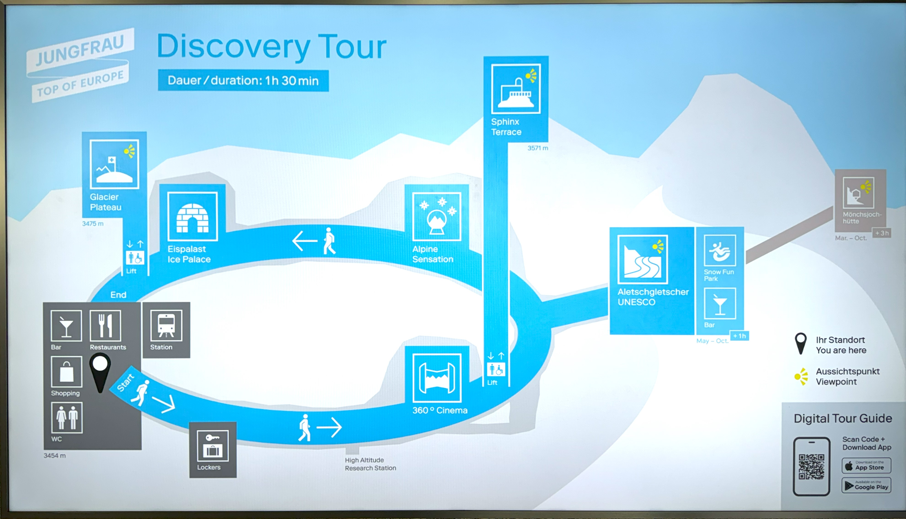

少女峰攻略

瑞士旅游绕不开的是少女峰（Jungfrau)，少女峰旅游绕不开的是中国网红。

在欧洲之巅（Top of Europe）打卡地，我看到网红们在一面瑞士国旗下的“Top of Europe”标志牌前排队。一位五短身材的胖大妈终于排到了（大妈也有粉丝？我怀疑是否有滤镜可以化腐朽为神奇），走上前对着三脚架上的镜头闪亮登场大声吆喝：

“Hi everybody, I proudly present to you the top of europe. Blah blah” 后面排队一个印度哥们不耐烦了，大声叫道，“喂，我们可等半天了，能不能快点”。

胖大妈面不改色，念完该念的台词，摆完该摆的Pose，最后还来了一句“圣诞快乐”。扭着腰扛起三脚架走了。当时还只是九月初，离圣诞还早得很，不知道大妈的脑神经是怎么搭的。

网红们以为少女峰只是欧洲之巅，其实这是瑞士精心打造的少女峰旅游黄金地带的一个点，集雪山登顶，湖泊泛舟，游乐项目，野外爬山，儿童乐园等等于一身。用铁路，缆车，游船把各个景点串起来。在这里你不用担心找不到乐子，唯一需要担心的是你的钱包够不够厚。

游客一般选择住宿半山腰的格林德瓦(Grindelwald)小镇。这里的客运中心（Grindelwald Terminal)可以通往五个地方（见上图）。简单说，如果你的目标是少女峰终点站（Jungfraujoch），最简洁快速方式是坐缆车从格林德瓦到艾格山墙Eiger-Gletscher，然后换火车。缆车早上7：45开始，随到随走。火车是半小时一趟，而且票价不包含在少女峰旅游套票（下文有套票的详细介绍）里面。

少女峰终点站可不仅仅是个火车站，里面探索之旅的有趣东西不少，比如满是冰雕的冰宫。你还可以走出去在雪地上撒野，或者滑雪。当然最吸引人的是前面提到的欧洲之巅。其实就是探索之旅能走到的最高点，一片雪地上插了几面瑞士国旗和欧洲之巅的标志牌。后面背景是少女峰顶峰。在3454米的海拔，这里举办过五花八门的活动，演唱会，网球比赛，不一而足，彰显人类征服大自然的能力和雄心。

如果你的目标是游乐项目，最佳去处是坐大巴到FirstBahn，坐缆车上山。缆车有三站，每一站有不同的项目。最后一站有滑翔伞和高空滑索。还可以有惊无险地在悬崖漫步一圈。中间一站有山地三轮车，适合小朋友。注意每天下午两点就可能售罄。所以得早一点去。

如果你的乐趣在登山，可以坐火车到Kleine Scheidegg，然后爬到艾格山墙。一路近距离欣赏少女峰的冰川，中间还有一个蔚蓝色的高山湖。另外一个颇受欢迎的山径是Schynige Platte。需要从格林德瓦坐火车到Widerswii，然后倒一趟火车到Schynige Platte山顶。注意去Schynige Platte山顶的是老式火车，相对较慢。好处是你可以伸头到车厢外，拍一张和蓝天雪山翡翠湖的美美合影。

想看瀑布的话，可以坐火车到劳特布龙嫩。这个小镇附近有山崖上落下来70多个瀑布和小河。从这里还可以坐缆车上山，然后转火车去Murren。那里是另一个爬山的好去处。

佛系一点的游客，留在格林德发呆就够了。从小镇任何一处都看得到梦幻山坡。翠绿的草地和星星点缀的木屋，不时传来牛羊吃草的铃铛声。让人感觉偷得浮生半日闲。

如果你在少女峰呆两三天以上，强烈推荐[少女峰旅游套票](https://www.jungfrau.ch/en-gb/jungfrau-travel-pass/)。有了它你可以几乎随便无限次坐所有的火车，缆车，巴士，和游船。上少女峰终点站的火车虽然不包括在内，但可以凭套票半价。

