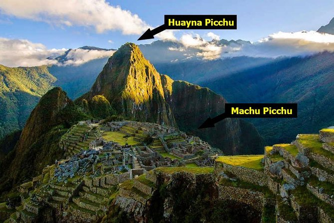

# 新冠肆虐下的奇幻南美之旅

## 1. 引子：跌跌撞撞的开始

“请出示您的护照”。墨西哥航空柜台的值机小姐扎着辫子，皮肤黝黑，典型的墨西哥姑娘。

我胸有成竹的拿出一家人的护照和新冠疫苗证明。疫苗都是最近打的，绝对没问题。

“健康证明申报呢？”

这个也难不倒我。我拿出昨天打印的申报表。小姐却大摇其头，辫子都飞起来了。
“No, no, no。这个是每人需要一份的。”

我头嗡的一下大了。表格是西班牙文的，昨天不知道是我看走了眼还是谷歌翻译漏了，我怎么看成是一家人一份表格呢？

“电子版可以吗？我们现在补填。”。小姐瞟了一眼旁边的时钟说，“可以啊。不过我们值机柜台起飞前四十五分钟关闭，你们还有十五分钟时间。”

我从背包里拿出电脑，一屁股坐在地上。幸好我昨天给申请表网页标了书签。网页不复杂，就是填护照号，电话号，地址，是否咳嗽，是否发烧等等。
不过要给四个人各填一份，还得在西班牙文和英文之间转换。短短十几分钟，我忙出一身大汗，好歹填完存下四份电子版。

小姐似乎也有几分诧异我们的神速，但还是很专业地扫描表格底下的二维码，都通过后微笑道，“飞行愉快。”

我们飞快跑到登机口，不用说，我们是最后一批登机的乘客。坐在椅子上半天，砰砰乱跳的小心脏才慢慢平复。

就像日航一定在东京转机一样，墨西哥航空也一定得在墨西哥城停一次。从西雅图到墨西哥城四个小时，从墨西哥城到秘鲁又是四个小时。
相当于飞到中间歇一次。挺体贴人意的。但墨西哥城这个中转机场有几大奇葩之处让我们从此敬而远之。

第一，尽管只是转机，我们都得通过道海关检查出去，然后再过一道安检进到下一个登机口。更变态的是托运行李也得跟着我们提进提出。
第二，排队等待海关检查的时候，居然禁用手机。女儿在那里刷手机就被海关人员呵斥了两句。第三，过安检的时候，每个人被逼着在照
光机前面摆出一个超级搞笑的姿势。后面的人看前面的人都偷偷乐不可支。如果硬要描述的话，你可以想象成敦煌莫高窟里反弹琵琶飞天
美女的妖娆姿态。

## 2. 秘鲁篇：幸运与不幸

秘鲁入境倒是很轻松，只是验看了我们的疫苗证明和健康申报表。当然，我们后来才知道旅游业是秘鲁经济的命脉，而新冠差点毁灭秘鲁
的旅游业。所以放宽入境要求是无奈之举。这也是秘鲁每百万人死于新冠人数在全球首屈一指的原因之一。

从利马机场拿到租车，我们向南直奔纳斯卡。纳斯卡离利马四百五十公里，开车六个半小时。是个普普通通的小村庄。但祖先给村民们留
下一样好东西也是生财之道，就是神秘的纳斯卡之线。这些在沙漠地表蚀刻出来的巨大线条，构成一个个栩栩如生的图案：蜘蛛，蜂鸟，
花，猴子，大大小小数百多个。每年还有新的图案被发现。三毛在她的小说集《万水千山走遍》用一篇
[《飞跃纳斯加之线》](https://www.kanunu8.com/book3/7180/158742.html)描述过这些神秘线条。

住进村里的“豪华酒店”，在狗吠声中，休整了一夜长途旅行带来的身心疲惫。女主人殷勤地端上早餐。

预定的小飞机时间是中午12点。我们先去参观地下沟渠。据说此地干旱少雨，烈日高照，水渠必须得挖在地下才能防止水分蒸发。螺旋是
为了方便人们从沟渠取水。

航空公司很不靠谱，让我们在机场等了两三个小时。机场电视循环放映纪录片，告诉我们古代纳斯卡文明为什么要在大地上刻下这些神秘
线条。据说此地古来风调雨顺，但是不知从何时起，雨水越来越少，气候越来越干旱，绝望的人们在祭司指导下，画下这些图案作为祭祀
求雨的一部分。看来龙王爷并没有听到这些苦苦哀求，那些作画的艺术大师们要么彻底灭绝，要么搬到更加肥沃的土地。给后人留下一个
巨大的不解之谜。

下午两点多，飞机终于起飞了。小飞机只能坐六人，除了我们一家，还有来自欧洲的一对情侣。飞机往北飞去，绿洲渐渐落在我们后面，
满眼都是沙漠，地上渐渐出现杂乱的线条。飞了十分钟左右，飞行员把机身偏向一侧，示意我们看下面的图案。

“蜘蛛！”儿子惊喜的叫出来。

飞机继续往前，广袤的沙漠像毯子一样延展开来。我们看到了猴子，树，巨大的蜂鸟。最密集也最清楚的的几个图案是一把宝剑，一棵枝叶
繁茂的大树，和一只举起双手的怪鸟。怪鸟的右手只有四根手指。从南到北纵贯美洲的
[泛美公路](https://www.uscreditcardguide.com/fanmeigongluzijiazhinan/)
把宝剑切成两半。

公路旁边修了座高塔，游客攀援而上，可以远眺最近的三个图案。这是德国奇女子
[玛丽亚·赖歇](https://zh.wikipedia.org/wiki/%E7%91%AA%E9%BA%97%E4%BA%9E%C2%B7%E8%B3%B4%E6%AD%87)
费尽心血修建的铁塔，作为她研究
这些神秘线条的工作一部分。玛丽亚1940年成为第一个把纳斯卡之线公之于世的美国考古学家
[保罗·柯索](https://zh.wikipedia.org/wiki/%E4%BF%9D%E7%BE%85%C2%B7%E6%9F%AF%E7%B4%A2)的助手。即使在
保罗·柯索离开后，她选择留下来，继续研究这些线条达三十多年之久。1998年她死在异国他乡的秘鲁，终身未嫁。

小飞机很颠簸，在空中不断盘旋，晕机感很快袭来。除了女儿之外，我们三个都有恶心感觉几欲呕吐。好不容易挨到下飞机，
老婆说，“妈呀，以后倒给我一百多美元我都不会坐了。”

我说，“那你应该感谢玛丽亚。她修了观景塔，不仅造福穷游客，也造福你这种娇气游客。不用飞上天也可以看到纳斯卡之线。”

从纳斯卡驱车回到利马，我们第二天的行程是游览这座“诸王之城”，秘鲁首都兼最大的城市，并拜访她富有传奇色彩的创建者。

武器广场是利马游客不可或缺的去处。几乎所有南美城市都有一个类似于市中心的武器广场。利马也不例外。西班牙首都
马德里的武器广场（也称主广场）一向是人们聚会社交和庆祝狂欢的地方，西班牙殖民者沿袭母国带来的惯例，在美洲新大陆
建立新城市时也无一例外的在市中心留下一块空地作为武器广场。

武器广场中心是长方形的花团锦簇的花园。花园中心是一个喷水池。喷水池旁边有几个踩高跷的纸扎新娘。花园里面还有位
真人版的穿着婚纱的新娘子。广场北面是总统府，东面是利马主座教堂(Catedral de Lima)和利马大主教宫
(Palacio Arzobispal de Lima)。从总统府再往东走一百多米是圣方济各圣殿与修院
(Basílica y Convento de San Francisco de Lima)。

不难看出，利马城几个著名景点都和天主教有或多或少的关系。这个城市的创建者
正是征服印加帝国的西班牙人弗朗西斯科·皮萨罗（Francisco Pizarro）。西班牙信奉天主教，这位带着几十名乡亲
不远万里来到南美，居然一举摧毁上千年历史的印记帝国的探险家，把他的幸运和成功都归功给国王和上帝。他和女儿
捐献白花花银子建成宏伟的利马主座教堂。给天主教开辟了新的教区和无数虔诚信众。有关这位从屌丝逆袭成封疆裂土
的总督的传奇人物的故事，我在以后的西班牙游记里面会详述。茨威格在《人类的群星闪耀时》第一章
[《通向不朽的逃亡》](https://www.zhonghuadiancang.com/waiguomingzhu/15958/313617.html)
中也提到他。

<i>“这些西班牙占领者的性格和行事方式是一种难以解释的独特的混合物。他们以基督徒才有的虔诚和信仰狂热地、发自
内心地祈求上帝，同时又以上帝的名义干出历史上最卑鄙无耻的非人道的勾当。他们的胆识、献身精神和承受艰险磨难
的能力，可以取得最壮丽的英雄业绩；同时他们又无耻至极地尔虞我诈，互相争斗，而在他们卑鄙的态度中又有一种明
显的荣誉感和对于他们的历史使命的伟大意义所具有的奇妙的、真正令人赞叹的意识。”</i>

利马主座教堂的右手第一座小教堂就是献给皮扎罗的。上面的壁画描述他带领手下，从西班牙挂帆而来，第一次踏上秘鲁
土地的场景。小教堂右侧的大理石棺里面是皮扎罗的遗体。上面是一尊睡狮雕像，左右两边各有一个哀泣的少女，少女们
中间的碑文记载皮扎罗不平凡的生平。石棺前面的盒子里装着皮扎罗家乡的泥土。

 

圣方济各圣殿与修院离利马主座教堂不远，这是天主教里面一大分支圣方济各派为自己的教众修的大教堂。教堂里面
最出名的除了一幅秘鲁版的《最后的晚餐》，还有神秘的“骷髅地窟”。西班牙殖民者从肉体上征服本地秘鲁人之后，
开始从心灵上征服这些“不开化的野蛮人”。也就是向他们宣传天主教教义。显然他们的努力相当成功，从十六世纪
到十九世纪的几百年里，无数秘鲁人昄依天主教，并死后埋葬在这个修道院的地下坟场里。日积月累，埋在这里的教徒
达到惊人的两万多人。给卫生防疫带来很大挑战。据我们向导说，当时修道院方圆几里都有挥之不去的恶臭气味。
利马市政府对此很头疼，终于在1821年关闭了坟场。清扫整洁之后，在1950年作为景点对公众开放。这是世界第二大
的骷髅地窖，规模仅次于巴黎地下墓穴。

我们的导游一开始就严正声明，说严禁拍摄任何照片和录像。在地窟里走了一圈说，导游笑道，

“今天你们很乖呀，我允许你们在这个房间拍几张照片。”。

队伍里面的游客个个面露喜色，赶紧拿着手机咔嚓。看来，猎奇之心人人有之啊。

第二天我们计划中午飞去库斯科。我看早上还有一点时间，就安排了两个景点。一个土坯金字塔（Huaca Pucllana），
一个爱情公园（Parque del Amor），都离酒店很近。到机场的路很堵，谷歌地图把我们导到了机场停车场，而不是
租车公司。其实租车公司就在旁边，只被几个水泥墩隔开。眼看飞机马上要起飞了，我心急如焚，走过去，找到租车公司
的人。

小伙子看起来很憨厚，只是不会说英文，我用手势和谷歌翻译告诉他，我的车就在几步之遥，但要急着赶飞机，他能不能
帮我们开过来。小伙子摇摇头，用手势说，我必须得开出机场的收费站后，从另一个入口开到租车公司的停车场。我一咬牙，
拿出钱包里仅有的一张秘鲁百元大钞，递给他。

“帮帮忙吧。”

小伙子惊诧看了我一眼，摆摆手，还是坚定地指着收费站那个出口方向。事后想想，我觉得不是钱没给够，更可能是秘鲁人的天性。正如三毛在《万水千山走遍》所写：

<i>“车停着，司机、列车长、随车警察和服务员全在那儿。“怎么突然停了？”我微笑着说。
他们谁也不响，做错了事情一般的呆立着，那份老实，看了拿人没办法。”</i>
    
无奈之下，我们只得绕个大圈子，回到租车
公司停车场。办好还车手续，我们一溜小跑来到航空公司柜台时，不用说，飞机是妥妥的误了。好在我们航班是属于
南美最大的航空公司LATAM Airlines，而他们每天在利马和库斯科之间有很多航班。值机小姐很快就帮我们免费顺
延到两个小时之后去库斯科的下一班航班。

到了库斯科，我们去租车公司SixT拿车。因为柜台在机场外面，我们晚到了两个多小时。服务小姐又不会讲英文，
我们又是一番苦苦挣扎之后，天色已黑，才拿到车开往欧雁台（Ollantaytambo）。

欧雁台是从库斯科到马丘比丘的必经之地。但不是必到之地。一般人从库斯科到马丘比丘都选择火车。欧雁台是其中一站，
可下可不下。
我们选择开车去欧雁台过夜，然后在欧雁台上火车是想去看看途中的几个景点，一个印加梯田（Moray），一个玛纳斯盐池
（Salt Mines of Maras），还有欧雁台本身的几个印加文明遗址。当然，因为意想不到的原因，我们最终一个景点都没
去成。这个后面再表。

第二天我们把车和行李箱寄存在酒店，坐上去马丘比丘的火车。火车是360度全景的，上面和左右两边都是玻璃。如果想
去马丘比丘，请务必提前在官方网站预订火车票，汽车票，和门票，三样缺一不可。
记住，经常有一些网站自称可以帮你买到马丘比丘的票，但他们要么会加价，要么干脆是假票。下面这些都是官方网站。

* 火车票：https://incarail.com/en 火车票负责把你从库斯科带到马丘比丘山脚下的小镇。下火车后过一座小桥就是汽车站。
* 汽车票：https://comprar.consettur.com/ 汽车票负责把你从小镇带到半山腰的马丘比丘景点入口。如果你头铁，
  还是登山爱好者，可以选择徒步上山，大约两个小时。
* 门票：https://tuboleto.cultura.pe/llaqta_machupicchu （秘鲁政府的官网）

买门票这事貌似简单，却是机关重重，秘鲁政府似乎很乐意设置路障，好给那些旅行社和黄牛生存的土壤。首先官网只有西班
牙文，必须用谷歌翻译才有英文。其次，秘鲁政府本着“靠山吃山，靠海吃海，靠古迹吃古迹”的精神，开发出“一鱼三吃”的新
品种，即每张门票都只能选一条路线，而那些不同的路线只能去景点里面被人为隔开的不同的地方。每个分岔口都有专门工作人员
虎视眈眈，如果你想偷偷溜到不是你的门票指定的别的路线上，就会传来尖利的令人头皮发怵的口哨声和怒喝声。也就是说，
想看完马丘比丘所有地方，你必须掏好几张门票的钱。另外，马丘比丘夹在两个山峰中间，如果你想爬上这两个山峰，俯瞰全景，
那对不起，还得交一笔钱。

我们选择了路线4加两个山峰之一的瓦伊纳皮克丘山 （Circuito 4 + Waynapicchu）。但我刚刚瞄了一下官网，好像只有三条
路线了。所以不清楚这还是否一个有效选择项。门票右边，还鲜明的标着九点到十点，意思是如果不能准时赶到，门票作废。

我们火车八点左右到达山脚下的阿瓜斯小镇。意想不到的是买汽车票的队伍已经排成长龙，而汽车票是我们唯一没有事先买好的票。这一
疏漏导致我们多花了半个小时买汽车票，到达马丘比丘门口的时间是九点一刻。我松了一口气，对老婆说，

“还好还好，我们赶上了门票规定的时间。不然连门都进不去。”

我们花了一个多小时，十点一刻左右走到路线4的最远端，看到一个箭头指向瓦伊纳皮克丘山。刚准备爬山，被工作人员拦下了。“门票呢？”

我自信地拿出电子版的门票给他看。

“对不起，你的门票过期了。”

当头一棒，打得我眼花缭乱。揉着眼睛看了半天，我终于明白了，九点到十点，是限制我们上瓦伊纳皮克丘山的时间。
而我们进园子的时间规定在早上八点。这个限制显然执行不严，因为我们九点到门口也被放进来了。而上瓦伊纳皮克丘山
的时间限制，却被严格执行了。

最终，我们没有看到俯瞰马丘比丘的美景，这就是没有提前买汽车票的苦果。

 
从瓦伊纳皮克丘山俯瞰马丘比丘

“遗失的印加古城”马丘比丘是印加帝国皇帝于1450年修建的行宫，功能类似于清朝皇帝的热河。 除了休闲，皇帝在这里还可以和神灵沟通。 

1533年皮扎罗灭掉印加帝国后，驻扎在马丘比丘的印加人大约因为害怕四散逃开（还有一说是他们集体死于西班牙人带来的猴痘）, 马丘比丘自此被废弃和丛林覆盖。 

印加文明没有文字，西班牙征服秘鲁后也一直没有发现被群山环绕的马丘比丘，直到1911年一位美国教授偶然从当地人听到并考古，马丘比丘才以“消失的奇迹”而闻名于世。其实本地人一直知道，我们向导是土生土长的阿瓜斯镇人，他说小时候他们常常爬到马丘比丘废弃的皇帝宴会大厅踢足球。 

印加皇帝选择马丘比丘的原因有五，一是这里满山都是石头可以拿来建房，二是这里四面环水宛如护城河，三是这里气候湿润适于农业，四是山上有供饮用沐浴的清泉，五是太阳迎面升起犹如和他们信奉的太阳神交流。 

马丘比丘分为三个区，左边是种田区，玉米土豆之类；中间是神庙，王宫，还有大祭司和贵族住宅；右边是打杂工人的住处。据向导说越是身份高贵，住宅的建筑质量越好，石头切割得越光滑（顺便说一句，石头都是没有机器前提下手工磨出来的），堆砌得越整齐。神庙的建筑最好。最有名的是太阳神神庙，三窗神庙，和主神庙。 

最后提一句，其实马丘比丘这个名字不够准确。这其实是块马鞍地，夹在两座山峰中间。一座叫machu picchu，印加语意老山，一座叫Huayna Picchu，印加语意新山。想看马丘比丘全景，你订票时得附加这两座山之一。

从马丘比丘回到欧雁台，老婆去拿行李箱，我去拿车。从停车场开过来时，穿过一条小巷子。我对车子的宽度估计不足，居然蹭了
一下停在路边的一辆车。慌忙下车查看，只见我的车还好，只有一点浅浅的痕迹，而对方的车被蹭出三道明显的凹沟。

对方车主，一个穿着花衬衫的小伙子出现了。用西班牙文吆喝着，“怎么回事？”

我们昨晚的酒店老板也出来了，指着我，然后指着车上的凹痕，跟小伙子说了一大串西班牙语。那意思显然是在说，
“这是我的客人，算了吧。”

小伙子依然一幅不依不饶的样子。于是在老板的斡旋下，通过手机上的谷歌翻译，我们进行了一场艰难的讨价还价。
小伙子抚着自己胸膛，要我凭良心开个价。我说我不清楚这里的修车价格，还是你开价吧。几番回合后，小伙子开出三百
秘鲁索尔（大约100美元）的价格。我故作难色，思索了一下，说，太贵，不过我们得赶回库斯科，三百就三百吧。

经过这场车祸，我们游兴全无，回去的路上什么印加梯田，什么盐池，都顾不上了。一路赶回库斯科，入住希尔顿花园酒店，
已是饥肠辘辘。我们去酒店餐馆吃饭的路上，无意中居然乱入了一场神秘聚会。

酒店负一层有个大厅，放着十几排椅子坐满了人。椅子最远端是一个舞台，烟雾缭绕，熏香入鼻。舞台上有人吹奏一种印加人
的乐器，类似于管弦乐那种，还有两个女孩子表演舞蹈。我们刚一驻足，就有一个西装革履的黑衣汉子走过来说，对不起，
我们是私人聚会，不对外人开放。我们只能灰溜溜的走开。

印加帝国的古都库斯科是我们在秘鲁最后一天的行程。在这里可以看到截然不同的两种文明的遥远回声：一个是拥有千载
岁月的印加文明留下的太阳神殿（Qurikancha), 一个是后起之秀的西班牙征服者留下的武器广场（Plaza Mayor de Cusco）和紧挨着的库斯科主座教堂（Catedral de Cuzco）。它们如此和谐的共存着，用不同方式见证这个城市的骄傲。

综观我们的秘鲁之行，可谓翻车现场，不幸的事情屡屡发生。第一桩不幸是误了从利马到库斯科的飞机，第二桩是错过上
瓦伊纳皮克丘山的时间，第三桩不幸当然是车祸。但幸运的是这些意外都没有让我们的行程彻底泡汤：误机之后很快就找到
下一班飞机，车祸之后的赔偿也算是破财免灾。错过瓦伊纳皮克丘山当然可惜，但我们至少看到了马丘比丘，这已经很不错啦，
再晚一点，因为政治动荡，马丘比丘对游客关闭了几个月。和在库斯科苦等了17天的三毛比，我们也算幸运。

总之，幸运与不幸从来不是两个隔离的端点，而是一个线性函数的连续取值。换言之，幸运与不幸永远是相对的。不幸转换成幸运，只需要一点点推动或视角变换。反之亦然。

## 3. 智利篇：执念与失望 (待续)

理想中的目的地：复活节岛和天空之镜
现实中的目的地：瓦尔帕莱索和圣佩德罗德阿塔卡马

困局中的最佳解：花2000美元买一张机票

圣地亚哥：武器广场，总统府
瓦尔帕莱索：Plaza Sotomayor，花种，里奥哈宫（Decorative Arts Museum Rioja Palace）
卡马拉：铜矿，节日，萍水相逢的“热心人”
德阿塔卡马：Geysers Del Tatio，月亮谷，死亡谷，德阿塔卡马盐池（小天空之镜）

总结：执念是无法替代的。退而求其次往往带来更大的失望。