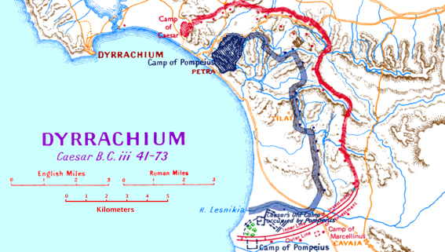
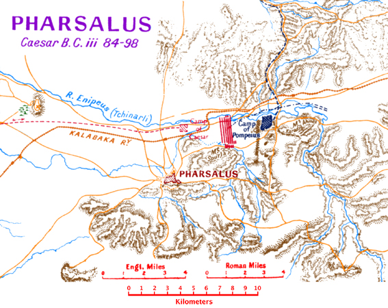

https://penelope.uchicago.edu/Thayer/E/Roman/Texts/Caesar/Civil_Wars/home.html

CAESAR
CIVIL WARS

## Book III

40 On learning of these proceedings the young Gn. Pompeius, who was in command of the Egyptian fleet, came to Oricum and by great efforts drew off  p253 the submerged ship with a windlass and a number of ropes; and attacking the second ship, which had been stationed by Acilius to guard it, with a number of vessels on which he had constructed towers of equal height, fighting as he was from a higher position and always sending up fresh combatants in place of the exhausted, and in other directions assailing the walls of the town at once by ladders from the land and with his fleet, so as to keep apart the forces of the foe, he thus overcame our men by sheer hard work and overwhelming showers of missiles. And having driven off the fighting men, who were all picked up by boats and escaped, he took the ship by assault, and at the same time gained possession in the other direction of the projecting natural breakwater which had almost made an island of the town, and drew across into the inner harbour four biremes, placing rollers under them and propelling them by crowbars. And so attacking from either side the warships which were empty and fastened to the shore, he drew off four of them and burned the rest. Having finished this business, he left behind D. Laelius, whom he had taken from the Asiatic fleet. This officer proceeded to prevent stores from Byllis and Amantia from being imported into the town. He himself went to Lissus and attacked thirty merchant-vessels which had been left by M. Antonius within the port and burned them all. He attempted to storm Lissus, which was defended by the Roman citizens belonging to that corporation and by the soldiers whom Caesar had sent there as a garrison, and after staying for three days and having lost a few men in the siege, he left the district without effecting anything.

41 Caesar as soon as he knew that Pompeius was at  p255 Asparagium set out to the same place with his army, and after storming on the way the town of the Parthini in which Pompeius had a garrison, reached Pompeius on the third day, and pitched his camp close to him, and on the following day, leading out all his forces, drew them up in battle array and gave Pompeius the chance of fighting a pitched battle. On observing that he kept in his position, he withdrew his army to the camp, considering it necessary to form a different plan. So on the next day he set out in full force for Dyrrachium, taking a wide circuit by a difficult and narrow route, in the hope that Pompeius could be either driven to Dyrrachium or cut off from it, because he had collected there all his provisions and his whole war equipment. And so it happened. For Pompeius, at first failing to understand his plan, because he saw him setting out by a route that led away from that district, thought that he had gone away because he had been compelled to do so by scarcity of food supply. Afterwards receiving information through his scouts, he shifted his camp the next day, hoping to be able to confront him by a shorter route. Caesar, suspecting that this would happen and having exhorted his men to bear their toil with an equal mind, staying his march only for a short period during the night, arrived in the morning at Dyrrachium, when for the first time the line of Pompeius was seen afar off, and there pitched his camp.2

42 Pompeius, being cut off from Dyrrachium, on failing to gain his purpose adopts the next best plan and entrenches a camp on a lofty spot called Petra, which allows a moderately good approach for ships and protects them from certain winds. He gives orders for some of his warships to meet there, and for corn  p257 and stores to be brought in from Asia and from all the districts that he held. Caesar thinking that the war was going to be unduly prolonged, and despairing of his supplies from Italy, because all the shores were being held with such vigilance by the Pompeians, and his own fleets which he had constructed in the winter in Sicily, Gaul, and Italy were slow in coming, sent Q. Tillius and the legate L. Canuleius into Epirus in order to get provisions, and because these districts were some distance off he established granaries in certain places and apportioned to the neighbouring communities their respective shares in the carriage of corn. He also gave orders that all the corn that there was should be sought and collected at Lissus, among the Parthini, and in all the fortified posts. This was of very small amount, partly from the nature of the land, because the district is rugged and hilly and the people generally use imported corn, and also because Pompeius had foreseen this and had at an earlier date treated the Parthini as spoils of war, and, hunting for all their corn by ransacking and digging up their houses, had carried it off by means of his horsemen to Petra.

43 On learning of these things, Caesar forms a plan to suit the nature of the ground. Round Pompeius' camp there were very many lofty and rugged hills. These he first occupied with garrisons and erected strong forts on them. Then, according to the indications afforded by the nature of each locality, by drawing a line of works from fort to fort he proceeded to invest Pompeius, with these objects in view: first, that as he had a scanty supply of provisions and Pompeius had a large preponderance of cavalry, he might be able to bring in for his army corn and stores from any direction at less risk; and also that he might  p259 prevent Pompeius from foraging and might make his cavalry useless for active operations; and, thirdly that he might diminish the moral influence on which Pompeius seemed chiefly to rely among foreign nations when the report should have spread throughout the world that he was being beleaguered by Caesar and did not dare to fight a pitched battle.

44 Pompeius was unwilling to go far from the sea and Dyrrachium because he had placed there his whole war material, pikes, armour, catapults, and was bringing up, by sea, corn for his army, nor could he put a stop to Caesar's works except by choosing to fight a pitched battle, which he had decided should not be done at that time. The only remaining course was to adopt a desperate method of warfare by occupying as many hills as possible, by holding with garrisons the widest extent of land possible, and by keeping Caesar's forces as far extended as he could; and this was done. By making twenty-four redoubts he embraced a circuit of •fifteen miles, and within this he foraged; and in this district there were a number of hand-sown crops with which he could meanwhile feed his animals. And just as our men by a continuous line of fortifications took measures to prevent the Pompeians from breaking out anywhere and attacking us in the rear, so the enemy made an unbroken line of defence in the interior of the space so that our men should not be able to enter any part of it and surround them from the rear. They, however, outstripped us in the work, being superior in numbers and having a shorter  p261 interior circuit to complete. Whenever Caesar had to occupy any spot, although Pompeius had decided not to try to prevent it with his whole armed force and fight a pitched battle, yet he kept sending up, in suitable positions, archers and slingers, of whom he had a great number, and many of our men were wounded. A great dread of the arrows fell on them, and to avoid the missiles nearly all the soldiers had made themselves jerkins or other protections out of felt, quilt, or hide.

45 In occupying positions each strove with the utmost energy: Caesar to confine Pompeius within the narrowest limits, Pompeius to occupy as many hills as he could in the widest possible circuit; and for this reason frequent skirmishes took place. In one of these, when Caesar's Ninth Legion had occupied a certain post and had begun to fortify it, Pompeius occupied a hill near and opposite to it and began to hinder our men in their work; and since on one side Caesar's position admitted of an almost level approach, he first of all threw round a force of archers and slingers, and then, sending up a great multitude of light-armed men and putting forward his engines, he began to hinder the works; nor was it easy for our men at one and the same time to stand on the defensive and to fortify. Caesar, on seeing that in every direction his men were being wounded, ordered them to retire and to quit the position. The way of retreat lay down a slope. The enemy, however, pressed on all the more keenly, and did not allow our men to retire, because they appeared to be abandoning the position under the influence of fear. It was at this time that Pompeius is said to have made the boastful remark to his friends that he did not object to be considered a worthless commander if Caesar's legions should  p263 succeed in retiring, without the most serious loss, from the place to which they had rashly advanced.

46 Caesar, fearing for the retreat of his men, ordered hurdles to be carried to the furthest point of the hill​3 and to be set up fronting the foe to bar their way, and within these a ditch of moderate width to be drawn athwart their path, the men being under cover, and the place to be made as difficult as possible in every direction. He himself drew up his slingers in suitable places to serve as a protection to our men in their retreat. When these arrangements were finished he ordered the legion to be withdrawn. The Pompeians then began with all the more insolence and audacity to press and close in on our men, and in order to cross the ditches overthrew the hurdles that had been set up as a defence against them. And Caesar, on observing this, fearing lest his men should appear to have been flung back rather than withdrawn and a more serious loss should be incurred, exhorted his men about midway down the slope, by the mouth of Antonius, who was in command of that legion, and ordered the signal to be given with the clarion and the enemy to be charged. The men of the Ninth with prompt and unanimous resolution hurled their pikes and, breaking into a run from the lower ground and charging up the hill, drove the Pompeians headlong and compelled them to turn their backs in flight; the overturned hurdles and the uprights planted in their way and the ditches that had been drawn across proved a great hindrance to them in their retreat. But our men, who considered it sufficient to depart without disaster, when several of the enemy had been killed and five in all of their own comrades lost, retired with  p265 the utmost quietness and, halting a little on this side of that spot, included in their lines some other hills and completed their defensive works.

47 The method of warfare was new and unprecedented both on account of the large number of redoubts, the wide space covered, the great defensive works, and the whole system of blockade, as well as in other respects. For whenever one army has attempted to blockade another, it is when they have attacked a discomfited and weakened foe, overcome in battle or demoralized by some reverse, and have thus hemmed them in, being themselves superior in number of horse and foot; while the motive of the blockade has usually been to prevent the foe from getting supplies. But on this occasion Caesar with an inferior number of men was hemming in fresh and uninjured forces, the enemy having an abundant supply of all necessaries. For every day a large number of ships was gathering from every quarter to bring up stores, nor could any wind blow without their having a favourable course from some direction. But Caesar himself was in extreme straits, all the corn far and wide having been used up. Nevertheless the men bore these hardships with exemplary patience. For they bore in mind that they had endured these same hardships the year before in Spain and by their toil and patience had concluded a very serious war. They remembered that at Alesia they had endured great privation, still greater at Avaricum, and had come off victors over very important nations. When barley was offered them they did not refuse it, or vegetables; whereas meat, of which there was a very large supply from Epirus, they held in high favour.

48 Some of the men who had been unemployed found  p267 also a kind of root called "chara," which, when mixed with milk, greatly assuaged their need. They made this up into something resembling bread, and there was a large supply of it. When the Pompeians in conversation taunted our men with hunger they used to throw at them loaves made of this, to reduce their expectations.

49 Now the corn was already beginning to ripen and the mere hope served to lighten the pinch, because they were confident that they would soon have abundance; and remarks were frequently heard from the men in their talks while on sentry duty that they would feed on bark from the trees before they would let Pompeius slip from their hands. Moreover, they were glad to learn from deserters that though the cavalry horses of the enemy were being kept alive, the rest of their animals had perished, and that the men themselves were experiencing bad health, both by reason of the cramped space and the foul stench from the multitude of corpses and their daily toils, as they were unaccustomed to work, and were also troubled by an extreme scarcity of water. For all the streams and all the rivulets which ran to the sea Caesar had either diverted or blocked by great works; and as the district was hilly and rugged he had dammed the narrow defiles by sinking piles into the ground and heaping up the earth, so as to keep in the water. So the foe were necessarily compelled to keep to the low and marshy ground and to dig wells, and this labour was an addition to their daily work. These springs, however, were at a considerable distance from some of the forts and quickly dried up in the hot weather. On the other hand, Caesar's army enjoyed excellent health and an abundant supply of water, and abounded with every kind of  p269 provision except grain, and for this they saw a better season daily approaching and a greater hope set before them through the ripening of the corn.

50 In a novel kind of warfare novel methods of waging it were invented by each side. When the enemy had observed from the fires that our cohorts were lying out at night by the earthworks, silently advancing in a body they used to discharge arrows within the crowded mass and then hastily retire to their comrades. Our men, taught by experience, discovered the following remedies for these emergencies, to light fires in one place . . .

51 Meanwhile P. Sulla, whom Caesar at his departure had put in charge of his camp, being informed of this came to the support of the cohort with two legions; and by his arrival the Pompeians were easily repulsed. In fact, they could not endure the sight or the onset of our men, and when the first of them had been overthrown the rest turned to flight and abandoned the position. But when our men followed, Sulla recalled them lest they should go too far in pursuit. Many people, however, think that if he had chosen to pursue more vigorously the war might have been finished that day. But his policy does not seem deserving of censure. For the duties of a legate and of a commander are different: the one ought to do everything under direction, the other should take measures freely in the general interest. Sulla, having been left by Caesar in charge of the camp, was contented with the liberation of his men, and did not choose to fight a pitched battle, a course which in any case admitted possibly of some reverse,  p271 in order that he might not be thought to have taken on himself the duties of a commander. As to the Pompeians, their situation caused them great difficulty in retreating; for, having advanced from unfavourable ground, they had halted on the top: if they were to withdraw by the slope they feared the pursuit of our men from the higher ground, nor was there much time left before sunset, since in the hope of finishing the business they had prolonged the action almost till nightfall. So Pompeius, of necessity and adapting his plans to the emergency, occupied a certain hill which was so far removed from our fort that a missile discharged from a catapult could not reach it. In this place he sat down and entrenched it, and kept all his forces confined there.

52 At the same time there was fighting in two other places besides, for Pompeius had made attempts on several redoubts with the object of keeping our force equally scattered, so that succour might not be brought from the nearest garrisons. In one place Volcatius Tullus sustained with three cohorts the attack of a legion and drove it from its position; in the other the Germans went out of our lines, and after killing a number of men retired in safety to their comrades.

53 Thus six battles having taken place in one day, three at Dyrrachium and three at the outworks, when account was taken of them all we found that about two thousand in number of the Pompeians had fallen, and very many reservists and centurions — among them was Valerius Flaccus, son of the Lucius who had governed Asia as praetor — and that six military standards had been brought in. Of our men not more than twenty were lost in all the battles.  p273 But in the redoubt there was not a single one of the men who was not wounded and four centurions out of one cohort lost their eyes. Wishing to produce a proof of their labour and peril, they counted out to Caesar about thirty thousand arrows which had been discharged at the redoubt, and when the shield of the centurion Scaeva was brought to him one hundred and twenty holes were found in it. For his services to himself and to the republic Caesar, having presented him with two hundred thousand sesterces and eulogized him, announced that he transferred him from the eighth cohort to the post of first centurion of the first cohort, for it was certain that the redoubt had been to a great extent preserved by his aid, and he afterwards presented the cohort in amplest measure with double pay, grain, clothing, bounties, and military gifts.

54 Pompeius, having added strong defences by night, erected towers on the following days, and having carried his works to a height of •fifteen feet, protected that part of his camp with mantlets; and after a lapse of five days, chancing on a second dark night, he blocked all the gates of the camp, setting obstacles to hinder the foe, and at the beginning of the third watch led his army out in silence and betook himself to his old entrenchments.

55 On every day in succession Caesar led out his army to level ground in battle array so as to bring his legions almost close up to the camp of Pompeius, in case he should choose to fight a pitched battle; and his front rank was only so far from the rampart that a weapon could not be cast at it from a catapult. Pompeius however, in order to maintain his credit  p275 and reputation, arranged his army in front of his camp, but in such a way that his third line rested on the rampart, while the whole army when drawn up could be protected by javelins thrown from the rampart.

### The Loeb Editor's Notes:
1 Taxes on pillars or columns.

2 See map of Dyrrachium and district.

Thayer's Note: The map is from the end of the volume, to which I've added the Google map of the area today (slightly different scale).

		
3 The Pompeians were storming Caesar's position, and he was now retiring before them down the further side of the hill. Here he made a successful stand, and finally drove the foe back in confusion over the hill.

56 Aetolia, Acarnania, and the Amphilochi having been recovered through Cassius Longinus and Calvisius Sabinus, as we have shown, Caesar thought that he ought to make an attempt on Achaea and advance a little further. And so he sent Q. Calenus thither, associating with him Sabinus and Cassius with some cohorts. On their arrival becoming known, Rutilius Lupus, who, on commission from Pompeius, was in charge of Achaea, determined to block approach to the Isthmus so as to prevent Fufius from entering Achaea. Calenus recovered Delphi, Thebes, and Orchomenus with the goodwill of the communities themselves, and took some towns by storm. The rest of the communities he endeavoured to win over to friendship with Caesar by sending round embassies. Such were mainly the occupations in which Fufius was engaged.

57 While this was going on in Achaea and at Dyrrachium and when it was known that Scipio had come into Macedonia, Caesar, mindful of his long-established custom, sends to him their common friend A. Clodius, who had been originally brought to his notice by an introduction from Scipio and whom he had been in the habit of regarding as one of his intimates. To him he gives a letter and instructions to carry to Scipio of which this was the purport: that, having made every effort on behalf of peace, he thought that the fact that nothing had been done was the fault of those whom he had wished to be the prime movers in the matter because they feared to carry his  p277 instructions to Pompeius at an inopportune time. Scipio was a man of such authority that he could not only express with freedom what his judgment approved, but could also to a large extent compel and control one who was going astray; moreover he commanded an army in his own name, so that in addition to authority he also possessed strength to coerce. If he should do this everyone would put down to his sole credit the tranquillity of Italy, the peace of the provinces, the safety of the empire. Clodius carries these instructions to him, and though on the first few days he apparently met with a ready hearing, on subsequent days he is not admitted to a conference, Scipio having been censured by Favonius, as we found out afterwards when the war was over; and so he returned to Caesar without having effected anything.

58 To keep the Pompeian cavalry more easily in check at Dyrrachium and to prevent them from foraging, Caesar fortified with large works the two approaches, which, as we have shown, were narrow, and planted forts at these spots. When Pompeius found out that no advantage was gained by the cavalry, after a few days' interval he fetches them back again by sea to his own quarters within the entrenchments. There was a great scarcity of provisions, so much so that they fed their horses on leaves stripped from the trees and on the soft powdered roots of reeds, for they had used up the crops that had been sown within the entrenchments. They were gradually forced to bring up fodder from Corcyra and Acarnania, with a long sea passage intervening, and as the supply of this was deficient, to supplement it with barley and by these devices to keep their horses alive. But when not only the barley and other fodder and the herbs that had been everywhere cut down began to  p279 fail, but even the foliage from the trees, the horses being rendered useless by emaciation, Pompeius thought that he ought to attempt something in the way of a sortie.

59 There were with Caesar, among his horsemen, two Allobrogian brothers, Raucillus and Egus, sons of Adbucillus, who had held the chieftain­ship in the state for many years, men of singular valour, whose very able and valiant co-operation Caesar had enjoyed in all his Gallic wars. He had bestowed on them for these reasons offices of great dignity in their own homes, had arranged that they should be chosen on the senate out of due course, had assigned to them lands in Gaul taken from the enemy and large prizes of money, and had raised them from poverty to wealth. These men, on account of their worth, were not only held in honour by Caesar, but were also regarded with affection in the army; but, relying on Caesar's friendship and puffed up with stupid and barbarous arrogance, they began to despise their countrymen and fraudulently to appropriate the pay of the cavalry and to divert the whole of the plunder to their own homes. Deeply stirred by this conduct, the men approached Caesar in a body and openly complained of their wrong-doings, and added to their other complaints that they were in the habit of sending in a false return of the number of the cavalry in order that they might appropriate their pay.

60 Caesar, thinking that this was not the time for punishment and overlooking much in consideration of their valour, postponed the whole matter, but privately he took the offenders to task for having made profit out of the cavalry and urged them to expect everything from his friendship, and to judge from his past good offices what they had still to hope  p281 for. The occurrence, however, brought on them great obloquy and contempt in the sight of all, and they understood that this was so not merely from the reproaches of others but also from the judgment of their intimates and from their own conscience. Influenced by this sense of shame and thinking, perhaps, that they were being reserved for punishment on a future occasion rather than let off free, they determined to quit us and hazard a new fortune and make trial of new friendships. And having conferred with a few of their clients, to whom they ventured to submit such an enterprise, they first attempted to kill G. Volusenus, the prefect of horse, as was ascertained afterwards when the war was over, that they might be seen to have deserted to Pompeius with some service to show. But when this seemed rather difficult and no opportunity of carrying it out was afforded, they borrowed as large sums as possible, just as if it was their intention to satisfy their comrades and restore their defalcations, and having bought up a number of horses, they crossed over to Pompeius with those whom they had made the participators of their plans.

61 And as they were born in a respectable position and were bountifully supplied, and had come with a great retinue and many animals, and were regarded as brave men and had been held in honour by Caesar, and as the occurrence was novel and out of the ordinary course, he conducted them round all his garrisons for purposes of display. For before that time no one, either of foot or horse, had changed sides from Caesar to Pompeius, though men were deserting almost every day from Pompeius to Caesar, and the troops levied in Epirus and Aetolia and from all the regions which were in Caesar's occupation  p283 were going over as a rule in mass. But these men having an acquaintance with everything, whether there was any lack of completeness in the lines of investment, or whether anything was thought lacking by men of considerable experience in warfare, and after observation of the times of occurrences and the distance between localities, and the varying watchfulness at the outposts, according to the diversities of natural temperament or zeal on the part of the several officers in charge of affairs — all these things they reported to Pompeius.

62 Having ascertained these facts and having already planned a sortie, as we have shown, he orders his men to make protective coverings of osier for their helmets and to collect material for earthworks. When these were provided he embarks by night a large number of light-armed men and archers with all the material on board row-boats and merchant-vessels, and about midnight he leads sixty cohorts drawn from his largest camp and outposts to that part of the entrenchments which extended to the sea and was the furthest removed from Caesar's largest camp. To the same place he sends his ships, which, as we explained, had on board the material and the light-armed troops, and the warships which he had at Dyrrachium, and issues orders stating what he wishes each man to do. At these entrenchments Caesar had his quaestor Lentulus Marcellinus posted with the Ninth Legion, and as he was in unsatisfactory health, he had sent up Fulvius Postumus to assist him.

63 There was in that place a ditch •fifteen feet wide and a rampart •ten feet high facing the enemy, and the earthwork of this rampart was also ten feet in breadth. And at an interval of •six hundred feet  p285 from this there was a second stockade facing in the other direction with a rampart of rather lower elevation. For on the preceding days Caesar, fearing lest our men should be hemmed in by the fleet, had constructed a double stockade in this spot, so that in case of an attack on both sides it might be possible to hold out. But the magnitude of the works and the continuous toil of every day, since he had taken in entrenchments of •seventeen miles circuit, did not allow opportunity of completion. And so he had not yet completed the cross stockade facing the sea to join these two lines. This fact was known to Pompeius, who had been informed of it by the Allobrogian deserters, and it had caused our men great inconvenience. For two cohorts of the Ninth Legion being on sentry duty by the sea, the Pompeians suddenly approached at early dawn; at the same time soldiers conveyed round on shipboard began to hurl javelins at the outer stockade,​1 the ditches were being filled up with earth, the Pompeian legionaries, having brought up ladders, were terrifying the defenders of the inner line with engines of every kind and missiles, and a great multitude of archers were being thrown around them on every side. But the osier coverings placed on their helmets protected them to a great extent from the blows of stones, which were the only weapon our men had. And so when our men were being hard pressed in every way and with difficulty holding their ground, the defect, mentioned above, of the line of entrenchment became observable and between the two stockades, where the work was not yet finished, the Pompeians, disembarking, took our men in the  p287 rear on both sides and, dislodging them from each line, compelled them to take to flight.

64 On the announcement of this sudden attack Marcellinus sends up some cohorts from the camp to the support of our suffering troops. And these, seeing them fleeing, could not strengthen them by their coming and themselves failed to sustain the onset of the enemy. And so every additional reinforcement that was sent up was demoralized by the fright of the fugitives and increased the terror and the peril; for retreat was hindered by the multitude of men. An eagle-bearer who had been seriously wounded in this battle and whose strength was now failing, seeing our horsemen, exclaimed: "This eagle in my life I defended with great care for many years, and now, dying, I restore it to Caesar with the same loyalty. Do not, I beseech, suffer a military disgrace to take place, which has never happened before in Caesar's army, and convey it to him in safety." By this chance the eagle was preserved, though all the centurions of the first cohort were slain except the senior centurion of the second maniple.

65 Already the Pompeians, after great slaughter of our men, were approaching the camp of Marcellinus, causing no slight terror in the rest of the cohorts, when M. Antonius, who held the nearest position among the outposts, after receiving the news was seen coming down with twelve cohorts from the higher ground. His arrival checked the Pompeians and encouraged our men, so that they recovered themselves from their extreme fear. And not long after Caesar, signalling by smoke from one redoubt to another, according to his previous custom, brought down some cohorts from the garrisons and came to  p289 the same place. And having learnt of the loss sustained, on observing that Pompeius had gone out of his lines and was entrenching a camp near the sea so as to be able to get fodder freely and to have none the less a way of approach for his ships, he changed his tactics, since he had failed to gain his purpose and ordered his men to entrench a camp close to Pompeius.

66 When this entrenchment was finished it was noticed by Caesar's scouts that certain cohorts, enough to seem equivalent to a legion, were behind the wood​2 and were being led to the old camp. The position of the camp was this: on the preceding days Caesar's Ninth Legion, after it had confronted the Pompeian forces and was investing them (as we have shown) with earthworks, encamped in that spot. This camp bordered on a wood and was not more than •three hundred paces from the sea. Afterwards changing his plans for certain reasons, Caesar transferred his camp a little beyond that spot, and after a few days' interval Pompeius had occupied the same camp, and as he was likely to have several legions in that place he had abandoned the inner rampart and had added a larger entrenchment. So the smaller camp included in a larger one took the place of a redoubt and citadel. Also from the left corner of his camp he had drawn a line of entrenchments to the river, •about four hundred paces long, in order that his men might get water with more freedom from risk. But he, too, changing his plan for certain reasons which it is not necessary to mention, had quitted that place. So for many days the camp had remained empty; as for the earthworks, they were all intact.

 p291 67 The scouts reported to Caesar that the standards of the legion had been borne thither. They assured him that the same thing had been seen from some of the higher redoubts. This place​3 was •about five hundred paces from the new camp​4 of Pompeius. Caesar, hoping to be able to crush this legion and anxious to repair the loss of that day, left two cohorts at the work to give an appearance of fortifying. Himself taking a divergent route in the utmost secrecy, he led out in double line towards Pompeius' legion and the smaller camp​5 the remaining cohorts, numbering thirty-three, among which was the Ninth Legion, which had suffered the loss of many centurions and a diminution of the rank and file. Nor did his original idea fail him. For he arrived before Pompeius could be aware of it, and though the defences of the camp were large yet by attacking quickly with the left wing, where he himself was, he drove the Pompeians from the rampart. Beams studded with spikes barred the gates. Here there was fighting for a while, our men attempting to break in, the others defending their camp, Titus Pulio, by whose aid we have said that the army of G. Antonius was betrayed, leading the fighting with the utmost bravery at that spot. Nevertheless our men won by their endurance, and cutting down the beams burst first into the larger camp, then also into the fort which was included within the larger camp, whither the legion when routed had retired for shelter. There they slew a few men who continued the struggle.

 p293 68 But fortune, which has great influence in affairs generally and especially in war, produces by a slight disturbance of balance important changes in human affairs; and so it happened then. The cohorts of Caesar's right wing in their ignorance of the locality followed up the entrenchment which, as we have explained above, extended from the camp to the river, looking for the gate, and supposing that these lines were a part of the camp. And when they observed that they only served to connect the camp with the river they threw down the defences, no one opposing them, and crossed over, and our whole cavalry followed the cohorts.

69 Meanwhile, a fairly long interval of time had elapsed, and the news having reached Pompeius, he withdrew five legions from their work and led them to the relief of his men; and at the same time his cavalry approached our horsemen, and his serried ranks came into the view of our men who had occupied the camp. At once everything was changed. The Pompeian legion, encouraged by the hope of speedy succour, attempted resistance by the decuman gate, and taking the aggressive began to attack our men. Caesar's cavalry, fearing for its retreat, as it was mounting by a narrow track over the earthworks, began to flee. The right wing, cut off from the left, observing the panic among the cavalry, to avoid being overwhelmed within the defences began to withdraw by the part of the rampart which it had levelled; and many of these men, fearing that they might get involved in the cramped space, flung themselves from the •ten-foot rampart into the fosses, and when the first were crushed the rest tried to attain safety and a way of escape over their bodies. On the left wing the soldiers, seeing  p295 from the rampart the approach of Pompeius and the flight of their own men, fearing that they might be cut off in the narrow space, as they had the enemy both inside and outside the camp, took counsel for themselves, retreating by the way by which they had come; and every place was full of disorder, panic, and flight, so much so that when Caesar grasped the standards of the fugitives and bade them halt, some without slackening speed fled at full gallop, others in their fear even let go their colours, nor did a single one of them halt.

70 The only relief that came to mitigate these great disasters, preventing the destruction of the whole army, was the fact that Pompeius, fearing, I suppose, an ambuscade, since these events had happened contrary to his expectation, for a little while before he had seen his men fleeing from the camp, did not venture for a long time to approach the lines, and his horsemen were hindered in their pursuit by the narrowness of the passages, especially as they were occupied by Caesar's troops. So have small events often turned the scale of fortune for good or evil. For the lines which were drawn from the camp to the river interrupted the victory of Caesar, which when once Pompeius' camp had been stormed was all but assured, and the same circumstance by checking the speed of the pursuers brought safety to our men.

71 In these two battles in one day Caesar lost nine hundred and sixty men and some well-known Roman knights — Tuticanus the Gaul, son of a senator, G. Fleginas of Placentia, A. Granius of Puteoli, M. Sacrativir of Capua — and thirty-two military tribunes and centurions; but the majority of these were overwhelmed at the ditches and lines of investment and river-banks in the panic and flight of  p297 their comrades and perished without any wound; and thirty-two military standards were lost. In this battle Pompeius received the appellation of Imperator. To this title he adhered and afterwards allowed himself to be saluted as such but he was never wont to use the ascription in his dispatches, nor did he display the insignia of the laurel on his fasces. But Labienus, having induced Pompeius to order the captives to be handed over to him, brought them all out, apparently for the sake of display, to increase his own credit as a traitor, and, styling them "comrades" and asking them with much insolence of language whether veterans were in the habit of running away, killed them in the sight of all.

72 By these successes the Pompeians gained so much confidence and spirit that instead of forming a plan of campaign they regarded themselves as having already conquered. They did not reflect that the cause of their success had been the small number of our troops, the unfavourable conditions of the site and the narrow space, when they had forestalled us in the occupation of the camp; the twofold panic, within and without the fortifications; the severance of the army into two parts, one being unable to bear aid to the other. They did not consider further that they had not fought in a sharp encounter or in a pitched battle, and that our men had brought a greater loss upon themselves by their numbers and the confined space than they had suffered from the enemy. Finally, they did not recollect the common chances of warfare, how often trifling causes, originating in a false suspicion, a sudden alarm, or a religious scruple, have entailed great disasters, whensoever a mistake has been made in an army through the incapacity of a general or the fault of a  p299 tribune; but just as if their victory were due to their valour and no change of fortune could occur, by reports and dispatches they proceeded to celebrate throughout the world the victory of that day.

73 Caesar, driven from his former plans, came to the conclusion that he must alter his whole method of campaign. And so simultaneously withdrawing all his garrisons, abandoning the siege, and gathering all his army together, he delivered an harangue before his troops and exhorted them not to take to heart what had happened nor to be terrified by these events and set one reverse, and that a slight one, against many successful battles. They should be grateful to fortune that they had captured Italy without a disaster of some kind; that they had pacified the two Spains, the home of most warlike races, with generals of the utmost skill and experience; that they had brought under their own control the neighbouring cornº-supplying provinces; finally, they should remember with what good fortune they had all been transported in safety through the midst of the enemy's fleets when not only the harbours but even the shores were crowded with their foes. If everything did not fall out favourably, they must assist fortune by their own energy. The loss that had been sustained should be attributed to the fault of anyone rather than himself. He had given them a favourable situation for fighting, he had gained possession of the enemy's camp, he had expelled and overcome them in fight. But whether it was their own nervousness or some blunder, or even a chance of fortune that had interrupted a victory already won and within their hands, they must all exert themselves to repair by their valour the damage they had sustained. If this were done, the  p301 result would be that the loss would be turned to advantage, as had happened at Gergovia, and those who had previously feared to fight would voluntarily offer themselves for battle.

74 After delivering this harangue he publicly disgraced and degraded some standard-bearers. The army, as a whole, was seized with such remorse as a result of the disaster, and such eagerness to repair the discredit, that no one waited for the commands of tribune or centurion, and each man imposed even heavier tasks on himself by way of penalty, and all were alike inflamed by an eager desire for fighting, while some even of higher rank, moved by reflection, thought that they ought to remain on the spot and entrust the issue to a pitched battle. On the other hand, Caesar had not sufficient confidence in his panic-stricken troops and thought that an interval should be allowed to restore their spirits; and if he abandoned his lines he was in great fear for his corn supply.

75 And so, with only such delay as attention to the sick and wounded required, he quietly sent on all his baggage-train from the camp at nightfall to Apollonia and forbade it to stop for rest till the journey was finished, and one legion was sent to protect it. Having arranged these matters, he kept back two legions in camp and led out the rest at the fourth watch by several gates and sent them on by the same route; and after a short interval he ordered the signal to be given in order that the military custom might be observed and that his departure might be known as late as possible; and at once marching out and following the rearguard, he quickly departed out of sight of the camp. Nor, on the other hand, did Pompeius, when he learnt of his design, allow any delay in pursuit, but with the same object in  p303 view, hoping to overtake the foe in the confusion and alarm of a difficult march, led his army from the camp and sent forward his horse to delay the rearguard, but was unable to overtake them, because Caesar, being in light marching order, had gone far ahead. But when they reached the River Genusus, with its difficult banks, the cavalry following up engaged and hindered the rearguard. Caesar opposed his own horsemen to them, mixing with them four hundred light-armed front-rank men, who gained such success that, engaging in a cavalry skirmish, they repelled them all, slaying many, and withdrew unhurt to the main body.

76 Having completed his full march for that day, and having taken his army across the River Genusus, Caesar established himself in his old camp over against Asparagium and kept all his men within the rampart of the camp, and ordered his cavalry, which had been sent out under the pretence of foraging, to return to camp at once by the decuman gate. In the same way Pompeius, having finished his day's march, sat down in his old camp at Asparagium. Of his soldiers, who were free from work owing to the fortifications being intact, some were going to a distance for the purpose of getting wood and fodder; others, who had left behind a great part of their baggage-train and accoutrements, when they suddenly formed the design of setting out, being induced by the propinquity of their last camp to fetch them back, had deposited their arms in their quarters and were leaving the ramparts. As they were thus hindered from pursuing, Caesar, having foreseen that this would happen, gave the signal for departure, and about noon led out his army, and doing a double march this  p305 day he advanced •about eight miles from this place. This Pompeius was unable to do owing to the dispersal of his men.

77 On the next day Caesar, having in the same way sent on his baggage-train at nightfall himself marched out at the fourth watch, so that if any necessity for fighting should be laid on him he might meet the sudden emergency with a lightly equipped force. He did the same thing on the following days. By which means it resulted that, notwithstanding the very deep streams and the extremely difficult routes, he sustained no damage. For Pompeius, after the delay caused on the first day and the toil undertaken to no purpose on the subsequent days, pressing forward as he did by forced marches in his eagerness to overtake the troops in front of him, ended his pursuit on the fourth day and concluded that he must adopt a different plan.

78 It was necessary for Caesar to go to Apollonia for the purpose of depositing his wounded, paying his army, encouraging his allies, and leaving garrisons for the towns. But to these measures he assigned only so much time as the hurry of his movements allowed. Fearing for Domitius, lest he should be taken unawares by the arrival of Pompeius, Caesar hastened to him with all speed and urgent endeavour. Now he was evolving his general plan of campaign with various contingencies in view: if Pompeius should hurry to the same place he would compel him, when drawn away from the sea and separated from the stores that he had gathered at Dyrrachium, to fight with him under equal conditions of warfare; if he should cross into Italy he would join his army with that of Domitius and set out through Illyricum to succour Italy; if Pompeius  p307 should attempt to besiege Apollonia and Oricum and to exclude him from the whole coast, he would blockade Scipio, and so compel Pompeius of necessity to take aid to his own people. And so Caesar sent on messengers and wrote to Gn. Domitius explaining what he wanted done; and leaving a garrison of four cohorts at Apollonia, one at Lissus, and three at Oricum, and depositing at various places those who were suffering from wounds, he began his march through Epirus and Athamania. Pompeius also, forming a conjecture as to Caesar's plans, thought it his duty to hasten to Scipio, so that if Caesar was marching thither he should go to the aid of Scipio, but if Caesar did not choose to leave the coast and the district of Oricum, waiting for his legions and cavalry from Italy, he should himself attack Domitius In full force.

79 For these reasons each of them aimed at celerity of movement, both to succour his own allies, and not to miss the opportunity that any moment might afford of crushing his adversaries. But Apollonia had turned Caesar aside from the direct route, and Pompeius was marching in light equipment through Candavia into Macedonia. Another unforeseen difficulty also arose in the fact that Domitius, whose camp had been pitched over against that of Scipio for several days, had moved away from him for foraging purposes and had marched to Heraclia, which lies close under Candavia, so that fortune itself seemed to expose him to the attack of Pompeius. Of this, however, Caesar was till then ignorant. At the same time, letters having been sent by Pompeius through all the provinces and communities after the battle at Dyrrachium, couched in a more exaggerated and inflated style than the facts warranted, a report had spread abroad that Caesar had  p309 been beaten and was in flight with the loss of nearly all his forces. This rumour had made the routes full of danger and was drawing off some of the communities from their friendship with him. In consequence of this it happened that persons sent by various routes from Caesar to Domitius and from Domitius to Caesar could by no means finish their journey. But the Allobroges, friends of Raucillus and Egus, who, as we have explained, had deserted to Pompeius, having seen on the route some scouts of Domitius, either by reason of their old intimacy because they had waged war together in Gaul, or in the elation of vainglory, set before them everything that had happened, and told them of the departure of Caesar and the arrival of Pompeius. Domitius, who was scarcely four hours ahead, receiving this information from them, escaped his peril thanks to the foe, and met Caesar on his way to Aeginium, a town which lies over against Thessaly.

80 With his army thus united Caesar arrived at Gomphi, the first town in Thessaly as one comes from Epirus: a few months before, the people had voluntarily sent envoys to Caesar bidding him use all their resources, and had asked him for a garrison of troops. But the rumour which we have mentioned above about the battle at Dyrrachium, which it had considerably exaggerated, had already outstripped him. And so Androsthenes, governor of Thessaly, preferring to share the victory of Pompeius rather than be associated with Caesar in adversity, compels the whole multitude of slaves and freedmen to come from the fields to the town, shuts the gates, and sends messengers to Scipio and Pompeius asking them to come to his aid, saying that he has confidence in the defences of the town if succour is  p311 brought quickly, but that he cannot hold out against a long siege. Scipio, having learnt of the departure of the armies from Dyrrachium, had brought his legions to Larisa. Pompeius was not yet near Thessaly. Caesar, having made an entrenched camp, ordered ladders and mantlets for a hasty siege to be made and hurdles to be got ready. When these measures had been taken he exhorted his troops and explained to them how useful it would be for the purpose of alleviating the general scarcity to get possession of a well-filled and opulent town, and at the same time to strike terror into the remaining communities by the example of this town, and that this should be done quickly before reinforcements could come together. And so, experiencing the utmost zeal on the part of his troops, he began to besiege the town, which had very high walls, on the very day of his arrival after the ninth hour, and took it by storm before sunset, and gave it over to his men for plunder. He then immediately moved his camp away from the town and came to Metropolis so quickly as to outstrip all news and rumour of the storming of the town.

81 The Metropolitans, at first following the same policy, influenced by the same rumours as the others, closed their gates and manned their walls with armed men; but afterwards learning from captives, whom Caesar had directed to be produced before the walls, of the fall of the town of Gomphi, they opened their gates. The inhabitants were most carefully preserved from harm, and when their fortune was compared with the fate of the men of Gomphi there was no state of Thessaly, with the exception of the Larisaeans, who were held in check by the large armies of Scipio, that did not obey Caesar and  p313 submit to his authority. Finding a suitable place in the country district where the crops were now nearly ripe, he determined there to await the arrival of Pompeius and to transfer thither all his military operations.

### The Loeb Editor's Notes:
1 The southern line: the interior munitio mentioned just after is the northern line.

2 A wood near the coast and between the River Lesnikia and Caesar's lines.

3 Referring back to eo in the first line of this chapter, indicating the enlarged camp, described in ch. 66, near the River Lesnikia.

4 The camp entrenched by Pompeius on the spot where he had broken through Caesar's lines, as described in ch. 65.

5 The old interior portion of the enlarged camp near the Lesnikia. In ch. 66 this smaller portion is said to have served as a castellum, and it is so styled at the end of the present chapter.

----------------------------------
82 Pompeius reached Thessaly a few days later, and, haranguing his whole army, thanks his own men and exhorts those of Scipio to consent to share the plunder and prizes of war when once the victory is won, and after getting all the legions into one camp, he shares his official dignity with Scipio and gives orders that the bugle should be sounded before him and a second pavilion erected for his headquarters. By this accession to the forces of Pompeius and the joining of two large armies into one, the old confidence of the troops is confirmed and their hope of victory increased, so that the interval that separated them from battle seemed merely a postponement of their return to Italy; and whenever any action of Pompeius showed some degree of slowness and deliberation, they declared it was only a single day's task, but that he was making the most of his imperial command and treating men of consular and praetorian rank as though they were slaves. Already they openly contended for rewards and priesthoods and apportioned the consul­ship for successive years, while others clamoured for the houses and property of those who were in Caesar's camp; and it was hotly argued in their discussions whether Lucilius Hirrus, who had been sent by Pompeius to the Parthians, might be allowed to compete in absence at the ensuing election of praetors, his friends imploring Pompeius to keep his word and fulfil the promise he made him at his departure, that people might not think that Hirrus had trusted his authority in vain; the rest objecting to one man's getting the advantage  p315 over all the others, when the labour and the danger had been shared equally.

83 Already Domitius, Scipio, and Lentulus Spinther, in daily rivalry for the priesthood of Caesar, publicly condescended to the gravest insolence of speech, Lentulus parading the distinction of age, Domitius boasting of his urban influence and dignity, Scipio expressing confidence in his kinship with Pompeius. Acutius Rufus also arraigned L. Afranius before Pompeius on a charge of betraying the army, an act which he said had been done in Spain. And L. Domitius said, in a council of war, that it was his view that, when the war was over, there should be given to those who belonged to the senatorial order and had taken part with themselves in the war three tablets apiece for the purpose of recording their vote, and that votes should be given separately about those who had remained at Rome and those who had been in Pompeius' garrisons but had not offered their services in the field: one tablet, they said, would be for those who should decide that such persons should be exempted from all peril, the second for those who should condemn them to loss of civil status, the third for those who should mulct them in a fine. In a word, all were agitating about honours for themselves, or about prizes of money, or about the prosecution of their private quarrels, nor were their reflections concerned with the means by which they could gain the upper hand, but with the way in which they ought to use their victory.

84 When he had arranged for his cornº supply and had encouraged his soldiers and had allowed a sufficient time to elapse after the battles of Dyrrachium to admit of his feeling assured of the temper of his troops, Caesar thought it right to find out what  p317 purpose or what disposition for fighting Pompeius had. And so he led his army out of the camp and drew up his lines, first of all in a position favourable to himself and some little distance from the camp of Pompeius,​1 but on subsequent days advancing away from his own camp and pushing his line up to the foot of the hills held by the Pompeians. This action made his army day by day more confident. But in the case of his cavalry he retained his previous custom which we have explained above: since they were many times inferior in number, he gave orders that lightly equipped youths from among the first-rank men, with arms selected with a view to fleetness, should go into battle among the cavalry, so that by daily practice they might win experience in this kind of fighting also. The result of these measures was that one thousand horsemen, even in the more open ground, ventured, with the experience they had gained, to sustain the attack of seven thousand Pompeian horse, and were not greatly terrified by their multitude. For even on those days he fought a successful cavalry skirmish and killed among some others one of the two Allobrogians who, as we explained above, had deserted to Pompeius.

85 Pompeius, who had his camp on the hill, kept drawing up his line on the lowest spurs of the mountain, apparently always waiting to see whether Caesar would approach close up to the unfavourable ground. Caesar, thinking that Pompeius could by no means be enticed out to a battle, judged that his most convenient plan of campaign was to move his camp from that place, and to be always on the march, with the view of getting his supplies more conveniently by moving camp and visiting various  p319 places and at the same time of meeting with some opportunity of fighting on the route, and of wearing out the army of Pompeius, which was unaccustomed to hard work, by daily marches. After making these arrangements, when the signal for starting had now been given and the tents had been unstretched, it was noticed that a little while before, contrary to its daily custom, Pompeius' line had advanced somewhat further from the rampart, so that it seemed possible for a battle to be fought in no disadvantageous position. Then Caesar, addressing his men, when his force was just at the gates, said: "We must put off our march for the present and think of giving battle, as we have always demanded. Let us be prepared in heart for a conflict; we shall not easily hereafter find an opportunity." At once he leads out his troops in light order.

86 Pompeius, too, as was found out afterwards, had determined, with the general encouragement of his men, to fight a pitched battle. For he had gone so far as to assert in the council of war on previous days that Caesar's army would be repulsed before the lines met. When several had expressed their surprise at this: "I know," said he, "that I am promising a thing almost incredible, but listen to the nature of my plan that you may go forth to battle with a stouter heart. I have induced my cavalry — and they have assured me that they will do it — as soon as the two armies have drawn nearer, to attack Caesar's right wing on his open flank, and by surrounding his column from the rear to drive his army in confused rout before a weapon is cast at the foe by us. So we shall finish the war without imperilling the legions and almost without a wound. And this is not difficult, considering that we are so strong in cavalry."  p321 At the same time he urged upon them that they should be strong in spirit for the coming day, and since they had now the opportunity for fighting which they had often demanded, they should not disappoint either his expectation or that of the rest.

87 Labienus followed him. Depreciating Caesar's forces and extolling to the utmost the strategy of Pompeius, he said: "Do not suppose, Pompeius, that this is the army that subdued Gaul and Germany. I was present at all the battles and do not rashly pronounce on a matter of which I am ignorant. A very small part of that army survives; a great part of it has perished — a necessary result of so many battles; autumnal pestilence has destroyed many in Italy; many have departed home; many have been left on the mainland. Have you not heard that cohorts have been composed at Brundisium of those who remained behind on the pretence of ill-health? These forces which you see have been made up from the levies of these last few years in hither Gaul, and most of them come from the Transpadane colonies. And nevertheless all the flower of them has fallen in the two Dyrrachian battles." Having said this, he swore that he would not return to the camp except as conqueror and exhorted the rest to do the same. Pompeius, commending this, took the same oath, nor was there anyone of the rest who hesitated to swear. Such were their proceedings at this council, and they departed with general rejoicing and high expectation. And already in their thoughts they were anticipating the victory, because it did not seem likely that they should receive groundless encouragement on so important a matter and from so experienced a commander.

 p323 88 Caesar, having approached the camp of Pompeius, observed that his line was drawn up as follows: On the left wing were the two legions which had been handed over by Caesar at the beginning of the civil strife by decree of the senate, one of which was called the First, the other the Third. At that place was Pompeius himself. Scipio occupied the middle of the line with the Syrian legions. The Cilician legion, united with the Spanish cohorts, which, as we explained, had been brought over by Afranius, was stationed on the right wing. These legions Pompeius regarded as the strongest under his command. The rest he had interposed between the centre and the wings and had made up the number of one hundred and ten cohorts. These forces amounted to forty-five thousand men, and about two thousand reserves who had come to him from the beneficiaries​2 of his former armies; and these he had distributed throughout the whole force. Seven remaining cohorts he had placed on garrison duty in the camp and the neighbouring forts. A stream with difficult banks protected his right wing; for which reason he had stationed his whole cavalry and all his archers and slingers opposite the enemy on the left wing.

89 Caesar, observing his previous custom, had posted his Tenth Legion on the right wing, and his Ninth on the left, though it had been seriously attenuated by the Dyrrachian battles. To this legion he added the Eighth, so that he almost made the two into one, having given orders that the one should support the other. He had eighty cohorts posted in his lines, making a total of twenty-two thousand men; seven cohorts he had left as a protection for the camp.  p325 He had placed Antonius in command on the left wing, P. Sulla on the right, and Gn. Domitius in the centre. He himself confronted Pompeius. At the same time, having noticed the arrangements mentioned above, fearing lest his right wing should be surrounded by the multitude of cavalry, he hastily withdrew individual cohorts from the third line and out of these constructed a fourth line, stationing it opposite the cavalry, explaining what his object was and reminding them that the day's victory depended on the valour of these cohorts. At the same time he commanded the third line and the whole army not to join battle without orders from himself, saying that when he wished this to be done he would give the signal with a flag.

90 When, according to the custom of war, he was exhorting his army to battle, and setting forth his unbroken record of kindness to his men, he particularly reminded them that he could call his troops to witness with what zeal he had sought peace, what negotiations he had conducted through Vatinius in conferences and through Aulus Clodius with Scipio, how at Oricum he had urged Libo about the sending of envoys. He had never, he said, wished to squander the blood of his soldiers or to deprive the republic of either of its armies. After delivering this speech, the soldiers clamouring for action and burning with zeal for the fight, he gave the signal with a trumpet.

91 There was in Caesar's army a reservist, G. Crastinus, who in the previous year had served under him as first centurion in the Tenth Legion, a man of remarkable valour. On the signal being given: "Follow me," said he, you who have been my comrades, and give your commander your wonted loyal service.  p327 This one battle alone remains; when it is over he will recover his dignity and we our liberty." At the same time, looking at Caesar, he says: "To-day, General, I will give you occasion to thank me alive or dead." Having said this, he ran forward first from the right wing, and about one hundred and twenty picked men of the same cohort, serving as volunteers, followed him.

92 Between the two lines there was only as much space left as was necessary for the charge of each army. But Pompeius had previously ordered his men to await Caesar's attack without moving from their position, and to allow his line to fall into disorder. He is said to have done this on the advice of G. Triarius, in order that the first charge and impetus of the troops might be broken and their line spread out, and that so the Pompeians marshalled in their proper ranks might attack a scattered foe. He hoped, too, that the javelins would fall with less effect if the men were kept in their place than if they themselves discharged their javelins and advanced; also that by having a double distance to run Caesar's soldiers would be breathless and overdone with fatigue. Now this seems to us to have been an irrational act on the part of Pompeius, because there is a certain keenness of spirit and impetuosity implanted by nature in all men which is kindled by the ardour of battle. This feeling it is the duty of commanders not to repress but to foster, nor was it without good reason that the custom was instituted of old that signals should sound in every direction and the whole body of men raise a shout, by which means they thought that the enemy were terrified and their own men stimulated.

93 But when our men on the giving of the signal, had  p329 run forward with javelins levelled and had observed that the Pompeians were not advancing against them, profiting by the experience they had gained in former battles, they spontaneously checked their speed and halted in about the middle of the space, so that they might not approach the foe with their vigour exhausted; and after a brief interval, again renewing their rapid advance, they discharged their javelins and quickly drew their swords, according to Caesar's directions. Nor indeed did the Pompeians fail to meet the emergency. For they parried the shower of missiles and withstood the attack of the legions without breaking their ranks, and after discharging their javelins had recourse to their swords. At the same time the horse on Pompeius' left wing, according to orders, charged in a body, and the whole multitude of archers poured forth. Our cavalry, failing to withstand their attack, gradually quitted their position and retired. Pompeius' cavalry pressed forward all the more eagerly, and deploying by squadrons began to surround our lines on their exposed flank. Caesar, observing it, gave the signal to his fourth line, which he had composed of six cohorts. These advanced rapidly and with colours flying attacked Pompeius' horse with such fury that not one of them stood his ground, and all, wheeling round, not only quitted the position but forthwith in hurried flight made for the highest hills. When these were dislodged all the archers and slingers, left defenceless, without support, were slain. With the same onslaught the cohorts surrounded the left wing, the Pompeians still fighting and continuing their resistance in their lines, and attacked them in the rear.

94 At the same time Caesar ordered the third line, which had been undisturbed and up to that time had  p331 retained its position, to advance. So, as they had come up fresh and vigorous in place of the exhausted troops, while others were attacking in the rear, the Pompeians could not hold their ground and turned to flight in mass. Nor was Caesar wrong in thinking that the victory would originate with those cohorts which had been posted opposite the cavalry in the fourth line, as he had himself stated in exhorting his troops; for it was by them that the cavalry was first repulsed, by them that the archers and slingers were slaughtered, by them that the Pompeian force was surrounded on the left and the rout first started. But Pompeius, when he saw his cavalry beaten back and that part of his force in which he had most confidence panic-stricken, mistrusting the rest also, left the field and straightway rode off to the camp. To the centurions whom he had placed on duty at the praetorian gate he exclaimed in a loud voice that the troops might hear: "Protect the camp and defend it carefully if anything goes amiss. I am going round the other gates and encouraging the guards of the camp." Having said this, he betook himself to the general's headquarters, mistrusting his fortunes and yet waiting to see the issue.

95 When the Pompeians were driven in flight within the rampart, Caesar, thinking that no respite should be given them in their terror, urged his men to take advantage of the kindness of fortune and attack the camp. And though fatigued by the great heat, for the action had been prolonged till noon, they nevertheless obeyed his command, with a spirit ready for every toil. The camp was being zealously defended by the cohorts which had been left there on guard, and much more keenly still by the Thracians and barbaric auxiliaries. For the soldiers who had fled  p333 from the battlefield panic-stricken in spirit and exhausted by fatigue, many of them having thrown away their arms and their military standards, were thinking more of further flight than of the defence of the camp. Nor could those who had planted themselves on the rampart stand up any longer against the multitude of javelins, but, worn out by wounds, quitted their position, and forthwith all, following the guidance of centurions and military tribunes, fled for refuge to some very lofty hills that stretched up to the camp.

96 In the camp of Pompeius one might see bowers constructed, a great weight of silver plate set out, soldiers' huts laid with freshly cut turf, and those of Lucius Lentulus and some others covered over with ivy, and many other indications of excessive luxury and confidence of victory, so that it could easily be supposed that they had felt no fear about the issue of the day, inasmuch as they sought out unnecessary indulgences. Yet these men kept taunting Caesar's most wretched and long-suffering army with luxurious indulgence, though it had always lacked every article of necessary use. When our men were now circulating within the rampart, Pompeius, procuring a horse and tearing off his insignia as Imperator, flung himself out of the camp by the decuman gate and, putting spurs to his horse, hurried straight off to Larisa. Nor did he halt there, but, coming across a few of his men in flight, with undiminished speed, not stopping his course at night, arrives at the sea with a retinue of thirty horsemen and embarks on board a corn-ship, often complaining, as it was said, that his expectations had been so utterly falsified that it almost seemed as if he had been betrayed, the flight having originated with that particular  p335 part of his force from which he had hoped for the victory.

97 Caesar having got possession of the camp urgently demands of his men not to let slip an opportunity of completing their task through absorption in plunder. Having gained his object, he begins to surround the hill with earthworks. The Pompeians, as the hill had no water supply, distrusting the position, began to withdraw in mass by its ridges towards Larisa. Caesar, observing this, divided his forces and ordered a part of the legions to remain in Pompeius' camp, and sent back part to his own camp; four legions he took with him and began to advance against the Pompeians by a more convenient route, and when he had proceeded •four miles drew up his line. On observing this the Pompeians halted on a certain hill. The foot of this was washed by the river. Caesar exhorted his troops, and then, although they were worn out by the continuous toil of a whole day, and night was now coming on, nevertheless cut off the river from the hill by a line of fortification, so that the Pompeians might be unable to get water at night. When this work was concluded the enemy sent a deputation and began to treat of surrender. A few men of the senatorial order who had joined them sought safety in flight at nightfall.

98 At early dawn Caesar ordered all those who had taken up their position on the hill to come down from the higher ground to the plain and to throw down their arms. When they did this without demur and, flinging themselves on the ground in tears, with outstretched hands begged him for safety, he consoled them and bade them rise, and addressing a few words to them about his own lenity to lessen their fears, preserved them all safe and commended them  p337 to his soldiers, urging that none of them should be injured and that they should not find any of their property missing. After this exercise of care he ordered the other legions to come from the camp and join him, and those which had been under his command to take rest in their turn and to return to the camp, and on the same day he arrived at Larisa.

99 In this battle he lost not more than two hundred from the ranks, but about thirty brave centurions. Also Crastinus, whom we have mentioned above, was slain by a sword-stroke in his face while fighting with the utmost bravery. Nor did the remark which he had made when starting out for the fight prove false, for Caesar was of opinion that the valour of Crastinus in that battle had been most remarkable, and judged that he had rendered him a great service. Of the Pompeian army about fifteen thousand appeared to have fallen, but more than twenty-four thousand surrendered, for even the cohorts which had been on garrison duty in the forts surrendered to Sulla; many besides fled to the neighbouring communities. There were brought to Caesar from the battle one hundred and eighty military standards and nine eagles. L. Domitius in his flight from the camp to the mountain was slain by the cavalry, his strength having failed him from fatigue.

100 At the same time D. Laelius reached Brundisium with the fleet and occupied the island lying over against the Brundisian port, as we have shown that Libo did previously. In the same way Vatinius, who was in charge of Brundisium, having covered over with a deck and carefully equipped some rowing-boats, enticed out the ships of Laelius and captured in the narrows of the harbour one quinquereme which had been brought out too far and two smaller  p339 ones and also by placing pickets of cavalry here and there took measures to prevent the sailors from getting water. But Laelius, finding the time of year more suitable for navigation, brought up supplies of water for his men from Corcyra and Dyrrachium in merchant-vessels, and, until news was brought of the battle fought in Thessaly, he was not deterred from his purpose, nor could he be driven to leave the port and the island either by the disgrace of losing his ships or by the want of necessaries.

101 About the same time G. Cassius came to Sicily with the Syrian, Phoenician, and Cilician fleets, and as Caesar's fleet was divided into two parts, the praetor P. Sulpicius at Vibo being in command of one half, and M. Pomponius at Messana of the other, Cassius hurried with his ships to Messana before Pomponius could learn of his approach, and finding him in a state of disorganization, with no surveillance and no fixed order of battle, with the aid of a strong and favourable wind he sent against the fleet of Pomponius some merchant-ships loaded with pine, pitch, tow, and other combustibles and burnt all thirty-five ships, of which twenty were decked. Such terror was caused by this action that, though there was a legion on guard at Messana, the town was scarcely defended, and had not some news of Caesar's victory been brought, just at that time, by relays of horsemen, many were of opinion that it would have been lost. But news having most opportunely arrived, the town was defended. Cassius departed thence to Vibo to the Sulpician fleet, and our ships having been moored to the shore in the same way as before, Cassius, with the advantage of a favourable wind, sent down some merchant-vessels prepared for burning, and the fleet having caught  p341 fire on each wing, five ships were consumed. And when the fire, through the greatness of the wind, spread more widely, some soldiers on the sick list, who had been left from the veteran legions to guard the ships, could not brook the ignominy, but of their own accord boarded the ships and let loose from the land; and making an attack on the Cassian fleet, they captured two quinqueremes, in one of which was Cassius himself, but he was taken off by a boat and escaped; besides this two triremes were sunk. And not long after news arrived of the battle fought in Thessaly, the result being that the Pompeians themselves believed it, for up to that time they thought it was an invention of Caesar's envoys and friends. So these events having become known, Cassius departed with his fleet from this district.

102 Caesar thought it right to put aside everything else and follow Pompeius, into whatever parts he should have betaken himself in his flight, that he might not be able again to collect other forces and to renew the war: he advanced every day as great a distance as he could cover with his cavalry, and ordered one legion to follow by shorter marches. An edict had been issued at Amphipolis in the name of Pompeius that all the youths of that province, whether Greeks or Roman citizens, should assemble to take the oath. But no opinion could be formed whether Pompeius had proposed this to avert suspicion, in order that he might keep his purpose of a distant flight concealed as long as possible, or that with the new levies he might attempt to hold Macedonia, if no one checked him. He himself stopped there one night at anchor, and after inviting his friends at Amphipolis to a conference and collecting money for necessary expenses,  p343 on receiving news of Caesar's approach he quitted that place and in a few days arrived at Mytilenae. Detained there for two days by rough weather, after adding to his fleet other small craft he came to Cilicia and thence to Cyprus. There he learns that, by the consent of all the people of Antioch and of the Roman citizens engaged in business there, arms had been taken up for the purpose of excluding him, and that messages had been sent to those who were said to have betaken themselves in flight to the neighbouring townships bidding them not to go to Antioch. If they did so, they were told, it would be at great peril of their lives. The same thing had happened at Rhodes to L. Lentulus, who had been consul the previous year, to P. Lentulus, an ex-consul, and to some others, who, when they were following Pompeius in flight and had come to the island, had not been allowed admittance in the town and the harbour, and on messages being sent to them to quit these parts, had weighed anchor contrary to their intention. And already a report of Caesar's approach was being conveyed to the communities.

103 Ascertaining these facts, Pompeius gave up his idea of visiting Syria, took the funds belonging to the association of tax-farmers, borrowed money from certain private persons, and deposited on shipboard a great weight of bronze coinage for the use of the soldiers; and having armed two thousand men, partly those whom he had selected from the households of the tax-farmers, partly those whom he had re­quisitioned from the merchants and those of their own men whom each owner judged to be fit for the purpose, arrived at Pelusium. There by chance was King Ptolomaeus, a boy in years, waging war with large forces against his sister Cleopatra, whom a few  p345 months before he had expelled from the throne by the help of his relations and friends. The camp of Cleopatra was not far distant from his camp. To him Pompeius sent begging to be received in Alexandria and supported in his calamity by the king's resources, in remembrance of the hospitality and friendship that he had shown his father. But his messengers, having fulfilled the duty of their embassy, began to converse more freely with the king's soldiers and to exhort them to show their dutiful loyalty to Pompeius, and not to despise his fortunes. In the number of these men were very many soldiers of Pompeius, whom Gabinius had taken over from his army in Syria and had transported to Alexandria, and on the conclusion of the war had left them with Ptolomaeus, the youth's father.

104 Then, on learning of these proceedings, the king's friends, who, on account of his youth, were in charge of the kingdom, whether moved by fear, as they afterwards gave out, lest Pompeius should seize on Alexandria and Egypt after tampering with the royal army, or because they despised his fortunes, according to the common rule that in misfortune friends become enemies, gave in public a generous reply to his messengers and bade him visit the king, but themselves formed a secret plot, and sent Achillas, the king's prefect, a man of singular audacity, and L. Septimius, a military tribune, to assassinate Pompeius. And he, being courteously addressed by them and being lured forth by some previous knowledge of Septimius, because he had been a centurion under him in the pirate war, embarked in a little boat with a few of his friends, and is thereupon assassinated by Achillas and Septimius. L. Lentulus is also arrested by the king and slain in prison.

 p347 105 On Caesar's arrival in Asia he found that T. Ampius had attempted to remove sums of money from Ephesus from the temple of Diana, and that with this object he had summoned all the senators from the province, that he might employ them as witnesses in reference to the amount of the sum, but that he had fled when interrupted by Caesar's arrival. So on two occasions Caesar saved the Ephesian funds. Also it was established, by going back and calculating the dates, that at Elis in the temple of Minerva, on the very day on which Caesar had fought his successful battle, the image of Victory, which had been placed in front of Minerva herself and had previously looked towards the image of Minerva, had turned itself towards the folding-doors and threshold of the temple. And on the same day at Antioch in Syria so great a clamour of a host and a noise of trumpetings had twice been heard that the body of citizens rushed about in arms on the walls. The same thing happened at Ptolomais. At Pergamum in the secret and concealed parts of the temple, whither no one but the priests is allowed to approach, which the Greeks call ἄδυτα, there was a sound of drums. Also at Tralles in the temple of Victory, where they had dedicated a statue of Caesar, a palm was pointed out as having grown up during those days from the pavement between the joints of the stones.

106 When Caesar, after lingering a few days in Asia, had heard that Pompeius had been seen in Cyprus, conjecturing that he was on his way to Egypt because of his ties with the kingdom and the further advantages of the place, he went to Alexandria with one legion which he had ordered to follow him from Thessaly and another which he had summoned  p349 out of Achaea from his legate Q. Fufius, and also with eight hundred horse and with ten warships from Rhodes and a few from Asia. In these legions there were about three thousand two hundred men; the rest, worn out by wounds received in battle and by their toil and the severity of their march, had been quite unable to follow. But Caesar, trusting in the report of his exploits, had not hesitated to advance with weak supports, thinking that every place would be equally safe for him. At Alexandria he learns of the death of Pompeius, and there immediately on landing he hears the shouting of the soldiers whom the king had left in the town on garrison duty and sees them hurrying to meet him, because the fasces were being carried in front of him. Hereby the whole multitude asserted that the royal authority was being infringed. When this tumult was appeased frequent disturbances took place on successive days from the gathering of the multitude, and many soldiers were killed in all parts of this town.

107 Observing these events, he ordered other legions which he had made up out of the Pompeian troops to be brought him from Asia. For he was himself compulsorily detained by the etesian winds, which blow directly counter to those sailing from Alexandria. Meanwhile, thinking that the controversies of the princes affected the Roman people and himself as consul, and concerned his functions all the more because in his previous consul­ship an alliance had been formed with the elder Ptolomaeus both by legislative enactment and by decree of the senate, he declares that it is his pleasure that King Ptolomaeus and his sister Cleopatra should disband the armies that they controlled, and should settle their  p351 disputes by process of law before himself rather than by armed force between themselves.

108 On account of the king's youth his tutor, a eunuch named Pothinus, was in charge of the kingdom. He at first began to complain among his friends and express his indignation that the king should be summoned to plead his cause; then, finding certain persons among the king's friends to abet his plot, he secretly summoned the army from Pelusium to Alexandria and put the same Achillas, whom we have mentioned above, in command of all the forces. This man, puffed up as he was by his own and the king's promises, he urged to action, and informed him by letter and messenger what he wished to be done. In the will of their father Ptolomaeus the elder of the two sons and the elder of the two daughters were inscribed as heirs. In the same will Ptolomaeus adjured the Roman people in the name of all the gods and of the treaties which he had made at Rome to carry out these provisions. One copy of the will had been taken to Rome by his envoys to be placed in the treasury, but had been deposited with Pompeius because it had not been possible to place it there owing to the embarrassments of the state; a second duplicate copy was left sealed for production at Alexandria.

109 When these matters were being dealt with by Caesar, and he was particularly desirous of settling the disputes of the princes as a common friend and arbitrator, word is suddenly brought that the royal army and all the cavalry are on their way to Alexandria. Caesar's forces were by no means so large that he could trust them if he had to fight outside the town. It remained that he should keep in his own position in the town and learn the intentions of  p353 Achillas. But he ordered all his men to stand by their arms, and exhorted the king to send to Achillas those of his friends whom he judged to be of chief authority and to explain what his intentions were. Accordingly Dioscorides and Serapion, who had both been envoys at Rome and had possessed great influence with his father Ptolomaeus, were commissioned by the king and came to Achillas. And when they had come into his presence, before hearing them or learning for what reason they had been sent he ordered them to be arrested and killed. And one of them, having received a wound, was promptly snatched away by his friends and carried off for dead; the other was slain. After this deed Caesar manages to bring the king under his own control, because he thinks that the king's title had great weight with his subjects, and in order to make it apparent that the war had been undertaken on the private initiative of a small clique and a set of brigands rather than on that of the king.

110 The forces with Achillas were not such as to seem contemptible in respect of number or grade of men or experience in warfare. For he had twenty thousand men under arms. These consisted of soldiers of Gabinius who had habituated themselves to Alexandrian life and licence and had unlearnt the name and discipline of the Roman people and married wives by whom very many of them had children. To them were added men collected from among the freebooters and brigands of Syria and the province of Cilicia and the neighbouring regions; also many condemned criminals and exiles had joined them. All our own fugitive slaves had a sure place of refuge at Alexandria, and assurance of their lives on the condition of giving in their names and being on the army roll; and if any one of them was  p355 arrested by his owner he would be rescued by the common consent of the soldiery, who repelled violence done to their comrades as a peril to their own selves, since they were all alike involved in similar guilt. These men had been in the habit of demanding for execution the friends of the princes, of plundering the property of the rich, of besetting the king's palace to secure an increase of pay, of driving one man from the throne and summoning another to fill it, after an ancient custom of the Alexandrian army. There were besides two thousand cavalry. All these had grown old in the numerous wars at Alexandria, had restored the elder Ptolomaeus to the throne, had killed the two sons of Bibulus, had waged war with the Egyptians. Such was their experience in warfare.

111 Achillas, trusting in these forces and despising the small number of Caesar's troops, was trying to occupy Alexandria, except that part of the town which Caesar held with his troops, though at the first assault he had endeavoured to burst into his house; but Caesar, placing cohorts about the streets, held his attack in check. And at the same time a battle was fought at the port, and this affair produced by far the most serious fighting. For at one and the same time a battle was going on with scattered forces in several streets and the enemy were attempting in great numbers to seize the warships, of which fifty had been sent to the support of Pompeius and had returned home after the battle in Thessaly, all of them quadriremes and quinqueremes fitted and equipped with everything necessary for navigation, and, besides these, twenty-two which had usually been on duty at Alexandria, all of them decked. And if they had seized these, by robbing Caesar of  p357 his fleet they would have the harbour and the whole seaboard in their control and would shut off Caesar from supplies and reinforcements. Consequently the struggle was fought with the intense eagerness that was bound to occur when the one side saw a speedy victory, the other their own safety, depending on the event. But Caesar gained his purpose. He burnt all those ships and the rest that were in the docks, because he could not protect so wide an extent with his small force, and at once he embarked his men and landed them on Pharos.

112 On the island there is a tower called Pharos, of great height, a work of wonderful construction, which took its name from the island. This island, lying over against Alexandria, makes a harbour, but it is connected with the town by a narrow roadway like a bridge, piers •nine hundred feet in length having been thrown out seawards by former kings. On this island there are dwelling-houses of Egyptians and a settlement the size of a town, and any ships that went a little out of their course there through carelessness or rough weather they were in the habit of plundering like pirates. Moreover, on account of the narrowness of the passage there can be no entry for ships into the harbour without the consent of those who are in occupation of Pharos. Caesar, now fearing such difficulty, landed his troops when the enemy was occupied in fighting, and seized Pharos and placed a garrison on it. The result of these measures was that corn and reinforcements could be safely conveyed to him on shipboard. For he sent messengers to all the neighbouring provinces and summoned reinforcements from them. In the remaining parts of the town the result of the fighting was that they separated after an indecisive engagement and neither  p359 side was beaten, the reason of this being the narrowness of the space; and a few men having been slain on both sides, Caesar drew a cordon round the most necessary positions and strengthened the defences by night. In this region of the town there was a small part of the palace to which he had been at first conducted for his personal residence, and a theatre was attached to the house which took the place of a citadel, and had approaches to the port and to the other docks. These defences he increased on subsequent days so that they might take the place of a wall as a barrier against the foe, and that he might not be obliged to fight against his will. Meanwhile the younger daughter of King Ptolomaeus, hoping to have the vacated tenure of the throne, removed herself from the palace to join Achillas, and began to conduct the war with him. But there quickly arose a controversy between them about the leader­ship, an event which increased the bounties to the soldiers, for each strove separately to win their favour by large sacrifices. While this was going on among the enemy, Pothinus, the young king's tutor and controller of the kingdom, in Caesar's part of the town, while sending messengers to Achillas and exhorting him not to slacken in the business nor to fail in spirit, was slain by Caesar, his messengers having been informed against and arrested. This was the beginning of the Alexandrian war.

The Loeb Editor's Notes:
1 See plan of the battle of Pharsalus.

		
2 Soldiers of various grades who had owed their advancement to the personal interest of the general: cp. I.75.