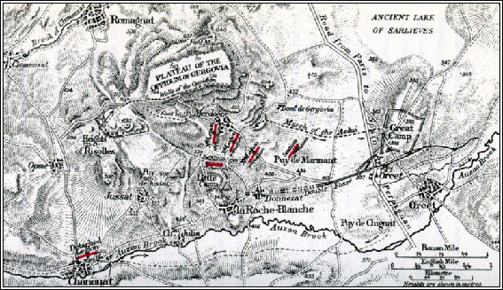
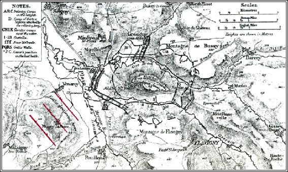

https://penelope.uchicago.edu/Thayer/E/Roman/Texts/Caesar/Gallic_War/home.html

CAESAR

# GALLIC WAR

## Book VII (chapters 1‑7)
1 When Gaul was quiet Caesar set out for Italy, as he had determined, to hold the assizes. There he heard of the murder of Clodius;​1 and having been informed of the Senate's decree that all the younger men of military age​2 in Italy should be sworn in, he decided to hold a levy throughout his province.​3 These events were speedily reported to Transalpine Gaul. The Gauls added to the reports a circumstance of their own invention, which the occasion seemed to require, that Caesar was detained by the commotion at Rome and, in view of discords so serious, could not come to the army. Such an opportunity served as a stimulus to those who even before were chafing at their subjection to the sovereignty of Rome, and they began with greater freedom and audacity to make plans for a campaign. The chiefs of Gaul summoned conventions by mutual arrangement in remote spots and complained of the death of Acco. They pointed out that his fate might fall next upon themselves; they expressed pity for the common lot of Gaul; by all manner of promises and rewards they called for men to start the campaign and at the risk of their own life to champion the liberty of Gaul. First and foremost, they said,  p383 they must devise means, before ever their secret designs got abroad, to shut Caesar off from the army. It was an easy task, because the legions would not dare to march out of cantonments in the absence of the commander-in‑chief, nor could the latter without a strong escort reach the legions. Finally, it was better, they urged, to be slain in battle than to fail of recovering their old renown in war and the liberty which they had received from their forefathers.

2 When these subjects had been discussed, the Carnutes declared that there was no hazard they refused for the general welfare, and promised that they would be the first of all to make war; and, since in the present circumstances they could not give one another security by means of hostages, for fear the matter should get abroad, they asked for the sanction of an oath of honour before the assembled war‑standards — the formality which represents their most solemn ritual — to make sure that after beginning the campaign they should not be abandoned by the rest. Thereupon all present praised the Carnutes with one accord and gave their oath, and after appointing a season for the enterprise departed.

3 When the day came, the Carnutes, under the leader­ship of two desperate men, Cotuatus and Conconnetodumnus, rushed at a given signal on Cenabum, put to the sword the Roman citizens who had established themselves there for trading purposes — among them Gaius Fufius Cita, a Roman knight of distinction, who by Caesar's order was in charge of the cornº-supply — and plundered their goods. Speedily the report thereof was carried to all the states of Gaul. As a matter of fact, whenever any event of greater note or importance occurs, the Gauls shout it abroad through fields and districts  p385 and then others take it up in turn and pass it on to their next neighbours; as happened on this occasion. For deeds done at Cenabum at sunrise were heard of before the end of the first watch in the borders of the Arverni, a distance of about •one hundred and sixty miles.

4 There in like fashion Vercingetorix, son of Celtillus, an Arvernian youth of supreme influence (whose father had held the chieftain­ship of all Gaul and consequently,​4 because he aimed at the kingship, had been put to death by his state), summoned his own dependents and easily fired their spirit. Directly his design was known there was a general rush to arms. Gobannitio, his uncle, and the rest of the chiefs, who did not think this adventure should be hazarded, sought to prevent him; he was cast out of the town of Gergovia, but he did not give up for all that; and in the fields he held a levy of beggars and outcasts. Then, having got together a body of this sort, he brought over to his own way of thinking all the members of his state whom he approached, urging them to take up arms for the sake of general liberty; and having collected large forces, he cast out of the state his opponents by whom he had been expelled a short time before. He was greeted as "King" by his followers. He sent out deputations in every direction, adjuring the tribesmen to remain loyal to him. He speedily added to his side the Senones, Parisii, Pictones, Cadurci, Turoni, Aulerci, Lemovices, Andi, and all the other maritime tribes; by consent of all, the command was bestowed upon him. In virtue of the power  p387 thus conferred he made re­quisition of hostages on all these states, and ordered a certain number of soldiers to be brought to him speedily; he determined what amount of arms, and by what date, each state should manufacture​5 at home, and he paid especial attention to the cavalry. To the utmost care he added the utmost strictness of command, compelling waverers by severity of punishment. Indeed for the commission of a greater offence he put to death with fire and all manner of tortures; for a lesser case he sent a man home with his ears cut off or one eye gouged out, to point the moral to the rest and terrify others by the severity of the penalty.

5 By enforcing punishments of this sort he speedily raised an army, and he despatched Lucterius, a Cadurcan of the utmost intrepidity, with a part of the forces into the land of the Ruteni, while he himself started forth against the Bituriges. At his coming the Bituriges sent envoys to the Aedui, in whose allegiance they were, to ask for succour, so as to enable them the easier to withstand the enemy's forces. Acting on the advice of the deputies left by Caesar with the army, the Aedui sent a force of horse and foot to the support of the Bituriges. When they were come to the river Loire, which parts the Bituriges from the Aedui, they halted there for a few days; and, not venturing to cross the river, they returned home, and reported to the Roman deputies that their return was due to fear of treachery on the part of the Bituriges, who, they learnt, had planned that, if the Aedui crossed the river, they themselves should surround them on the one side, and the Arverni on the other. As we have no clear knowledge whether they acted as they did for the  p389 reason which they declared to the deputies, or from motives of treachery, it does not seem proper to state it as a certainty. Upon their departure the Bituriges at once joined the Arverni.

6 When these matters were reported to Caesar in Italy, he had already received intelligence that affairs in Rome had been brought by the energy of Gnaeus Pompeius into a more satisfactory state, and he therefore set out for Transalpine Gaul. Upon arrival there he was confronted with a great difficulty, as to the means whereby he could reach the army. For if he should summon the legions to the Province, he realised that on the march they might have to fight an action without his presence; if, on the other hand, he himself pressed on to the army, he saw that it was a mistake to entrust his personal safety at that time even to the tribes which appeared to be at peace.

7 Meanwhile Lucterius the Cadurcan, who had been sent into the country of the Ruteni, united that state with the Arverni. He then advanced into the land of the Nitiobriges and the Gabali, and received hostages from both tribes; and so, having collected a large force, he made an effort to overrun the Province in the direction of Narbo. On report of this Caesar thought that he should proceed to Narbo in preference to any other plan. When he was come thither he put new strength into timorous hearts by posting garrisons among the Ruteni of the Province, the Volcae Arecomici, the Tolosates, and around Narbo — all localities adjacent to the enemy; and he ordered a part of the forces of the Province, and the supplementary levy which he had brought with him from Italy, to assemble in the territory of the Helvii, which touches the borders of the Arverni.

The Loeb Editor's Notes:
1 By Milo, 52 B.C.
2 i.e. from seventeen years upwards; Rheinhard explains coniurare as = "to be sworn in en masse."
3 i.e. Cisalpine Gaul.
4 Ob eam causam may refer either to the chieftain­ship or to the attempt at the kingship. Celtillus evidently desired to advance from principatus to regnum.
5 Or perhaps, in a less literal sense, "produce."

8 By these measures of security Lucterius was checked and set back, for he deemed it dangerous to penetrate the line of garrisons; and so Caesar was free to proceed into the district of the Helvii. Now the range of the Cevennes, which parts the Arverni from the Helvii, in this the severest season of the year was likely to hinder the march with great depth of snow; however, he cleared away snow •six feet deep and, having thus opened up the roads by a supreme effort of the troops, reached the borders of the Arverni. They were caught off their guard, for they thought themselves fortified by the Cevennes as by a wall, and not even a solitary traveller​1 had ever found the paths open at that season of the year; and Caesar commanded the cavalry to extend on as broad a front and strike as much terror into the enemy as possible. Rumour and reports hereof were speedily brought to Vercingetorix, and all the Arverni gathered about him panic-stricken, beseeching him to have regard to their fortunes and not suffer them to be pillaged by the enemy, especially now that, as he saw, the whole war had been turned against them. He was prevailed upon by their prayers to move his camp from the country of the Bituriges towards that of the Arverni.

9 Caesar, however, having anticipated that this would be the natural course of things for Vercingetorix, halted for two days in this locality; then he left the army on the pretext of assembling the supplementary levy and the cavalry. He put young Brutus in command of the force here, instructing him to let his cavalry range the district in every direction on as broad a front as possible, and saying that he would endeavour to be away from the camp no longer than three days.  p393 Having set these matters in order, he reached Vienna​2 by forced marches before his own army expected him.​3 There he found the cavalry which he had sent on thither many days beforehand fit for action, and without a break in his march by day or night he pressed on through the country of the Aedui into that of the Lingones, where two legions were wintering — so speedily as to forestall even the possibility of any design of the Aedui on his own safety. Upon arrival at the station he sent word to the rest of the legions and concentrated them all in one place, or ever report of his coming could reach the Arverni. When he was informed of this, Vercingetorix led his army back again to the country of the Bituriges, and starting thence determined to assault Gorgobina, a stronghold of the Boii, whom, after their defeat in the battle against the Helvetii, Caesar had established there as dependents of the Aedui.

10 This action of Vercingetorix caused Caesar great difficulty in forming his plan of campaign. If he were to keep the legions in one place for the rest of the winter, he was afraid that the reduction of the tributaries of the Aedui would be followed by a revolt of all Gaul, on the ground that Caesar was found to be no safeguard to his friends. If he were to bring the legions out of cantonments too soon, he was afraid that difficulties of transport would cause trouble with the cornº-supply. However, it seemed preferable to endure any and every difficulty rather than to put up with so dire a disgrace​4 and thus to alienate the sympathies of all his own adherents. Therefore he urged the Aedui to see to the transport of supplies, and sent men forward to the Boii to apprise them of his own coming and urge them  p395 to remain loyal and courageously to withstand the attack of the enemy. Then, leaving two legions at Agedincum with the baggage-train of the whole army, he set off for the Boii.

11 On the next day he came to Vellaunodunum, a stronghold of the Senones; and in order to leave no enemy in his rear, and so to expedite the corn-supply, he determined to assault the place, and in two days invested it. On the third day deputies were sent out of the town to treat for surrender, and Caesar ordered arms to be collected, pack-animals furnished, and six hundred hostages given. He left Gaius Trebonius, lieutenant-general, to carry out these orders. He himself, in order to end his march as soon as possible, started for Cenabum, a town of the Carnutes. The news of the siege of Vellaunodunum had been brought to them, and thinking that the business would be long drawn out, they were at this moment beginning to raise a garrison to be sent to Cenabum for the protection thereof. Caesar reached it in two days. He pitched his camp before the town, and as the hour of the day forbade further action he deferred the assault until the morrow. He commanded the troops to make ready the appliances required for the operation; and as the bridge over the river Loire was contiguous to the town of Cenabum, he ordered two legions to bivouac under arms, as he feared the inhabitants might escape from the town by night. A little before midnight the men of Cenabum moved out in silence from the town and began to cross the river. This was reported to Caesar by the scouts; and setting the gates on fire, he sent in the legions which he had ordered to be ready for action, and took possession of the town. Exceeding few of the enemy's total strength  p397 were lacking to make the capture complete, inasmuch as the narrowness of the bridge and the roads had prevented the escape of the general population. He plundered and burnt the town, bestowed the booty on the troops, crossed the Loire with the army, and reached the borders of the Bituriges.

12 As soon as he heard of Caesar's approach Vercingetorix abandoned the siege and started to meet him. Caesar, for his part, had determined to assault Noviodunum, a stronghold of the Bituriges stationed on his route. And as deputies came out to him from the place to entreat pardon for their faults and pity for their lives, he ordered arms to be collected, horses to be furnished, hostages to be given, with intent to complete the remainder of the business as speedily as he had accomplished the greater part thereof. Part of the hostages had already been handed over, and the other demands were in process of fulfilment, as some centurions and a few soldiers had been sent in to collect arms and animals, when the enemy's horsemen were sighted at a distance, the vanguard of the column of Vercingetorix. The moment the townsfolk caught sight of them and conceived a hope of assistance, they raised a shout and began to take up their arms, to shut the gates, and to man the wall. When the centurions in the town perceived by the demonstration on the part of the Gauls that some new design was afoot, they drew their swords, seized the gates, and withdrew all their parties in safety.

13 Caesar ordered the cavalry to be brought out of camp, and engaged the cavalry of the enemy. When his own troops began to be distressed he sent in support some four hundred German horse, whom he had made a practice of keeping with him from the  p399 first. The Gauls could not resist their charge, and were put to flight, retiring to the main body with a loss of many men. At their discomfiture the townsfolk were once more panic-stricken, and seizing the persons by whose efforts they supposed the populace had been roused, they brought them to Caesar and surrendered themselves to him. When this business had been despatched, Caesar moved off to the town of Avaricum,​5 the largest and best fortified in the territory of the Bituriges, and situated in a most fertile district. He felt confident that by the recovery of that town he would bring the state of the Bituriges again into his power.

14 Having experienced three continuous reverses — at Vellaunodunum, Cenabum, and Noviodunum — Vercingetorix summoned his followers to a convention. He pointed out that the campaign must be conducted in far different fashion from hitherto. By every possible means they must endeavour to prevent the Romans from obtaining forage and supplies. The task was easy, because the Gauls had an abundance of horsemen and were assisted by the season of the year. The forage could not be cut; the enemy must of necessity scatter to seek it from the homesteads; and all these detachments could be picked off​6 daily by the horsemen. Moreover, for the sake of the common weal, the interests of private property must be disregarded; hamlets and homesteads must be burnt in every direction for such a distance from the route as the enemy seemed likely to penetrate in quest of forage. The Gauls had a supply of such necessaries, because they were assisted by the resources  p401 of the tribes in whose territory the campaign was being carried on. The Romans would not endure scarcity, or else would advance farther from their camp at great risk; and it made no difference whether the Gauls killed them or stripped them of their baggage, the loss of which rendered the campaign impossible. Moreover, any towns which were not secure from all danger by fortification or natural position ought to be burnt, in order that they might not afford the Gauls a refuge for the avoidance of service, nor offer the Romans a chance to carry off plunder and store of supplies. If these measures seemed grievous or cruel, they ought to take into account that it was far more grievous that their children and their wives should be dragged off into slavery, that they themselves should be slaughtered — the inevitable fate of the conquered.

The Loeb Editor's Notes:
1 Much less a body of troops.
2 Vienne.
3 Or, "to the surprise of the army." The march to Vienne may have been expected, but not so soon, or it may have been quite unexpected.
4 i.e. as proving unable to safeguard his friends.
5 Bourges.
6 Or, reading deleri, "destroyed." deligi is difficult; perhaps it means "marked down" for destruction by cavalry raids.

15 This view was approved by general consent, and in a single day more than twenty cities of the Bituriges were set on fire. The same was done in the other states, and in every direction fires were to be seen. And although it was a bitter pain to all to endure this, yet they set before themselves thus much of comfort, that they were confident of recovering their losses by a well-nigh assured victory. They deliberated in a general convention whether Avaricum should be burnt or defended. The Bituriges flung themselves at the feet of all the Gauls, entreating that they might not be compelled with their own hands to set light to almost the fairest city in all Gaul, the safeguard and the ornament of their state. They declared that they would easily defend themselves by its natural strength, for it was surrounded by river and marsh on almost every side, and had a single and a very narrow approach. Leave was granted to their  p403 petition: Vercingetorix at first argued against it, but afterwards yielded to the prayers of the tribesmen and to compassion for the multitude. Suitable defenders for the town were chosen.

16 Vercingetorix followed after Caesar by shorter stages, and chose for his camp a place fenced by marshes and woods, •about sixteen miles from Avaricum. There, by means of scouting parties appointed for each section of the day, he could keep himself informed of the operations about Avaricum, and give such orders as he desired. He kept all our foraging and cornº-collecting parties under observation, and when they were scattered, since they had of necessity to advance farther afield, he would attack them and inflict serious loss; at the same time our men took every precaution they could think of to counteract this, by moving at uncertain times and by different routes.

17 Caesar pitched his camp on that side of the town which was unenclosed by the river and the marshes, and had, as above mentioned, a narrow approach. He began to prepare a ramp, to move up mantlets, to build two towers; for the nature of the locality precluded an investment. He did not cease to importune the Boii and the Aedui in the matter of the corn-supply; but the latter, with no zeal for the task, did not help much, and the former, having no great resources, because their state was small and feeble, speedily consumed what they had. So the army suffered from the utmost difficulty in its corn-supply, because of the indigence of the Boii, the apathy of the Aedui, and the burning of the homesteads — so much so that for several days the troops were without corn, and staved off the extremity of famine by driving in cattle from the more distant  p405 hamlets. Yet never a word was heard from their lips unworthy of the dignity of Rome and of their previous victories. Nay more, when Caesar addressed single legions at work, and declared that if the burden of scarcity were too bitter for them to bear he would raise the siege, one and all would beseech him not to do so. They had served, they said, for many years under his command without once incurring disgrace, without anywhere leaving a task unaccomplished; they would regard it in the nature of a disgrace if they relinquished the siege they had begun; it were better to endure any and every bitterness than to fail of avenging the Roman citizens who had perished at Cenabum by the treachery of the Gauls. They entrusted messages in the same spirit to the centurions and tribunes, to be tendered to Caesar through them.

18 By the time that the towers had come near to the wall, Caesar learnt from prisoners that Vercingetorix had exhausted his forage and moved his camp nearer to Avaricum, and was gone forward in person, with horsemen and the light troops that were accustomed to do battle among the horse, to set an ambush in the place whither he believed our troops would come next day to get forage. Having learnt this, Caesar marched in silence at midnight, and reached the enemy's camp in the morning. They had speedily learnt through their scouts of Caesar's coming, and having hidden away their wagons and baggage in the denser part of the woods, they drew up all their force on high, open ground. On report of this Caesar ordered packs to be speedily piled and arms got ready.

19 There was a hill sloping generally from the base, and surrounded on almost every side by a difficult and  p407 troublesome marsh, •not more than fifty feet across. On this hill, having broken up the causeways, the Gauls were established, with all confidence in the position; distributed according to their several nationalities, they held every ford and thicket by the marsh. They were resolved, if the Romans tried to burst through the marsh, to overwhelm them from the higher ground as they stuck fast. So anyone who remarked how near they were thought them prepared to fight to a finish in almost equal battle; but anyone who observed the inequality of the conditions recognised that they were displaying themselves in empty bravado. The troops were furious that the enemy were able to endure the sight of themselves at so brief an interval, and demanded the signal for action. But Caesar pointed out what great loss, in the death of so many gallant men, a victory must necessarily cost, and said that, when he saw them resolved to refuse no risk that might win him renown, he deserved to be condemned for the uttermost injustice if he did not count their life dearer than his own welfare. Having thus pacified the troops, he led them back to camp the same day, and began to set in order everything else required for the siege of the town.

20 When Vercingetorix returned to his followers, he was accused of treachery because he had moved the camp nearer to the Romans, because he had gone off with all the horse and had left so large a force without a commander, and because on his departure the Romans had come with such speed upon their opportunity. All these circumstances, they said, could not have happened by chance or without design; he preferred to possess the kingship of Gaul by the leave of  p409 Caesar rather than by favour of themselves. Accused in such sort, he replied to the charges. As for having moved the camp, it had been done, he said, actually at their own instance, through lack of forage; as for having gone nearer the Romans, he had been influenced by the advantage of a person which could protect itself by its own defences; further, the service of the horse should not have been needed on marshy ground, and it had been useful in the place to which they had marched. It was of purpose that he had committed the chief command to no one at his departure, for fear that his deputy might be driven by the zeal of the host to an engagement — an object for which he saw that all were zealous through weakness of spirit, because they could not longer endure hardship. If the appearance of the Romans on the scene had been due to chance, the Gauls had fortune to thank; if they had been summoned thither by some informer, the Gauls had that man to thank for the satisfaction of having been able to learn from their higher station the scantiness of their numbers, and to despise a courage which had not ventured to fight but had retired disgracefully to camp. He had no need to obtain from Caesar by treachery a title of command which he could enjoy by a victory already assured to himself and all the Gauls. Nay more, he gave the title back to them if they thought that they were bestowing honour on him rather than deriving security from him. "That you may perceive," he continued, "the sincerity of this statement on my part, listen to Roman soldiers." He brought forward slaves whom he had caught foraging a few days before and had tortured with hunger and chains. These had been previously instructed what to state when questioned, and said that they were soldiers of  p411 the line; they had been induced by hunger and want to go secretly out of the camp, to see if they could find any corn or cattle in the fields; the whole army was suffering from similar want, no man had any strength left, none could endure the strain of work, and therefore the commander-in‑chief had decided, if they made no progress in the siege of the town, in three days to withdraw the army. "These," said Vercingetorix, "are the benefits you have from me, whom you accuse of treachery, by whose effort, without shedding of your own blood, you behold this great victorious army wasted with hunger; while it is I who have seen to it that, when it takes shelter in disgraceful flight, no state shall admit within its borders."

21 The whole host shouted with one accord, and clashed their arms together in their peculiar fashion, as they always do for a man whose speech they approve. They declared that Vercingetorix was a consummate leader, that there could be no doubt of his loyalty, and that the campaign could not be conducted with greater intelligence. They decided that ten thousand men picked from the whole force should be sent into the town, and resolved that the common safety of all must not be entrusted to the Bituriges alone, for they perceived that in keeping possession of the town rested almost the whole issue of victory.

22 The matchless courage of our troops was met by all manner of contrivances on the part of the Gauls; for they are a nation possessed of remarkable ingenuity, and extremely apt to copy and carry out anything suggested to them. So now they sought to drag aside the grappling-hooks with nooses, and, when they had caught them, to pull them back inwards with windlasses; and they tried to under‑cut  p413 the ramp by mines, the more scientifically because they have large iron-workings in their country, and every kind of mine is known and employed. Further, they had furnished the whole wall on every side with a superstructure of wooden turrets, and covered these over with hides. Then in frequent sallies by day and night they tried to set fire to the ramp or to attack the troops engaged in the works; and whatever increase was made in the height of our turrets by daily additions to the ramp,​1 they equalised by joining fresh scaffolding​2 to their own turrets, and tried to check the progress of our own mines where they opened up,​3 and to prevent their approach to the walls by means of timbers​4 hardened in the fire and sharpened, boiling pitch, and stones of a very great weight.

23 All Gallic walls are, as a rule, of the following pattern. Balks are laid on the ground at equal intervals of •two feet throughout the length of the wall and at right angles thereto. These are made fast on the inside and banked up with a quantity of earth, while the intervals above mentioned are stopped up on the front side with big stones. When these balks have been laid and clamped together a second course​5 is added above, in such fashion that the same interval as before is kept, and the balks​6 do not touch each other, but each is tightly held at a like space apart by the interposition of single stones. So the whole structure is knit together stage by stage until the proper height of wall is completed. This work is not unsightly in  p415 appearance and variety, with alternate balks and stones which keep their proper courses in straight lines; and it is eminently suitable for the practical defence of cities, since the stone protects from fire and the timber from battery,​7 for with continuous balks, generally •forty feet long, made fast on the inside it can neither be breached nor pulled to pieces.

24 All these circumstances impeded the siege; but though the troops were delayed throughout by cold and constant showers, still by continuous effort they overcame all these obstacles, and in twenty-five days they built a ramp •three hundred and thirty feet broad and eighty feet high. This was almost touching the enemy's wall, and Caesar, according to his custom, bivouacked by the work, urging the troops not to leave off working even for a moment: when shortly before the third watch​8 the ramp was observed to be smoking, for the enemy had set fire to it from a counter-mine. At the same moment a shout was raised all along the wall, and a sortie was made from two gates on either side of the Roman turrets. Others began at long range to hurl torches and dry wood from the wall on to the ramp, and to pour down pitch and everything else that can kindle a fire, so that it was scarcely possible to form an idea in which direction the troops should hasten first or to what point bring assistance. However, as by Caesar's standing order two legions were always in bivouac before the camp, and more, by a succession of reliefs, were engaged on the earthwork, it was speedily arranged that some troops should resist the sorties, while others dragged back the turrets and cut a gap in the ramp, and the whole host from the camp rushed up to extinguish the fire.

25 Even when the rest of the night was spent, there was fighting at every point, and ever the enemy's hope of victory was renewed — the more so because they saw that the breastworks of the turrets​9 were burnt up, and observed that without cover it was not easy for the troops to advance in support; and ever, on their side, fresh men replaced the weary, and they believed that the deliverance of Gaul depended on that moment of time. Then there occurred before our eyes a thing which, as it seemed worthy of record, we have not thought it right to omit. A certain Gaul before the gate of the town was hurling into the fire over against a turret lumps of grease and pitch that were handed to him. He was pierced by a dart from a "scorpion"​10 in the right side and fell dead. One of the party next him stepped over his prostrate body and went on with the same work; and when this second man had been killed in the same fashion by a scorpion-shot, a third succeeded, and to the third a fourth; and that spot was not left bare of defenders until the ramp had been extinguished, the enemy cleared away on every side, and a stop put to the fighting.

26 The Gauls had tried every expedient, and as nothing had succeeded they resolved next day to escape from the town, as Vercingetorix urged and ordered. They hoped that by attempting it in the silence of night they would accomplish it with no great loss of their men, because the camp of Vercingetorix was not far from the town, and the marsh, which filled without break all the space between, must hinder the Romans in pursuit. And  p419 it was now night and they were already preparing to do this, when the matrons suddenly rushed out of doors, and, flinging themselves with tears at the feet of their men, with prayers and supplications besought them not to surrender, to the tender mercies of the enemy, themselves and their common children, whom natural weakness hampered from taking flight. When they saw that the men were firm in their purpose, for as a rule in extreme peril fear admits no sense of pity, they began to cry out in a body and to make signs to the Romans as touching the flight. So the Gauls were terror-struck by the fear that the Roman cavalry might seize the roads before them, and they abandoned their design.

27 On the morrow, when a turret had been advanced and the works which Caesar had begun to construct were finished,​11 a heavy shower of rain came on. He thought the moment suitable for the execution of his plan, as he observed that the guards on the wall were less carefully posted than usual; so he ordered his men to move more leisurely about the work, and showed them what he wanted to be done. The legions made ready for action secretly under cover of the mantlets; and having urged them to reap at length the fruit of victory in return for their great labours, he offered prizes to those who should first mount the wall, and gave the signal to the troops. They dashed out suddenly from all sides and speedily lined the wall.

28 The enemy were panic-stricken by the surprise, and when they were hurled down from the wall and the turrets they stood fast in wedge-formations in  p421 the market-place and the more open places, with intent, if a movement were made from any side upon them, to deploy into line and fight to a finish. When they saw no one coming down on to the level ground, but that the troops were pouring round everywhere all along the wall, they feared that the hope of escape might be cut off altogether, and, casting away their arms, they made in a continuous rush for the farthest parts of the town; and part, as they crowded one another at the narrow passage of the gates, were slain there by the troops, part after they had got out of the gates by the cavalry, and no one had any thought for plunder. In such fashion the troops, maddened by the massacre at Cenabum and the toil of the siege-work, spared not aged men, nor women, nor children. Eventually of all the number, which was about forty thousand, scarcely eight hundred, who had flung themselves out of the town when they heard the first shout, reached Vercingetorix in safety. He intercepted the refugees late at night in silence, fearing that a mutiny might arise if they were met and pitied by the common sort: therefore, by stationing his own friends and the chiefs of states at some distance along the roads, he took steps to separate them and conduct them to their friends in the part of the camp allotted to each state from the beginning.

29 On the next day, summoning a conference, he comforted them, and exhorted them not greatly to lose heart, nor to be disturbed by the disaster. The Romans had not conquered by courage nor in pitched battle, but by stratagem and by knowledge of siege operations, in which the Gauls had had no experience. It was a mistake to expect in war that all events would have a favourable issue. He himself had never agreed with the defence of Avaricum, and  p423 of that he had themselves as witnesses; but this experience of disaster had been brought about by the unwisdom of the Bituriges and the undue complaisance of the rest. However, he would speedily remedy it by greater advantages. He would by his own efforts bring to their side the states which disagreed with the rest of Gaul, and establish one policy for the whole of Gaul, whose unanimity not even the world could resist; and already he had almost brought that to pass. Meanwhile it was reasonable that for the sake of the common weal they should do as he asked and set to work to fortify the camp, in order more easily to resist sudden attacks of the enemy.

30 This speech was not unpleasing to the Gauls, chiefly because the commander himself had not failed them after the great disaster they had suffered, nor hidden out of their sight and avoided the gaze of the host; and they considered his foresight and forethought the greater because, while the matter was still open, he had first advocated the burning, and afterwards the abandonment, of Avaricum. And thus, whereas the authority of commanders in general is diminished by reverses, so his position, on the contrary, was daily enhanced by the disaster they had suffered. At the same time they were inclined to be hopeful, by reason of his assurance, about bringing in the remaining states; and on this occasion for the first time the Gauls set to work to fortify the camp, and they were so strengthened in spirit that, although unaccustomed to toil, they thought that they must submit to any commands.

31 As good as his promise, Vercingetorix worked with a will to bring in the remaining states, and tried to attract them by presents and promises. He selected for  p425 the purpose suitable persons, each of whom, by guileful speech or by friendly demeanour, should be able most easily to captivate. The men who had escaped at the storming of Avaricum he caused to be armed and clothed; at the same time, to recruit his diminished force, he made re­quisition of a certain number of soldiers from the states, saying what number he wished for and by what day they should be brought into camp; and he ordered all archers, of whom there was a very great number in Gaul, to be sought out and sent to him. By this means the loss at Avaricum was speedily made up. Meanwhile Teutomatus, the son of Ollovico and king of the Nitiobriges, whose father had been saluted as Friend by the Roman Senate, came to him with a large number of horsemen: some were his own, and others he had hired from Aquitania.

32 Caesar halted at Avaricum for several days, and by the immense quantity of corn and all other supplies which he found there recuperated the army after toil and want. The winter was now almost spent; the very season was inviting him to continue the war, and he had decided to march against the enemy to see whether he could entice them out of the marshes and woods or reduce them by blockade, when at this juncture chiefs of the Aedui came on a mission to him to beseech his succour for the state in a crisis of absolute urgency. The administration, they said, was in the utmost peril, because, in spite of their ancient custom of electing single magistrates to hold kingly power for a year, two persons were exercising office, and each of them declared himself legally elected. One of the two was Convictolitavis, a successful and distinguished young man; the other Cotus, the scion of a most ancient house, and himself a man of dominant power and noble connection, whose brother  p427 Valetiacus had exercised the same office in the previous year. The whole state was in arms, the senate was divided, and each claimant had his own following. If the quarrel were any longer fomented, one part of the state must inevitably come to blows with the other. The prevention of that depended upon Caesar's energy and authority.

33 Caesar thought it disastrous to move away from the war and the enemy, but at the same time he knew full well what great troubles generally arose from such dissensions; and therefore, to prevent this large state, so closely connected with Rome — a state which he himself had always cherished and by every means distinguished — from resorting to armed violence, wherein the party which had less confidence in itself would seek succours from Vercingetorix, he thought the matter should receive his first attention. And, inasmuch as the laws of the Aedui did not suffer those who exercised the highest office to leave the country, he determined, in order that he might not appear in any way to disparage their rights or laws, to proceed in person into the territory of the Aedui, and summoned all their senate, together with the parties to the quarrel, to join him at Decetia. Almost the whole state assembled there, and he was informed that in a small and secret assembly, held in a place and at a time which were irregular, one brother had declared the other elected, although the law not only forbade two of one house, in the lifetime of both, to be elected as officers of state, but even precluded them from member­ship of the senate. He therefore compelled Cotus to lay down the supreme authority, and ordered Convictolitavis, who had been elected by the priests, according to the tradition of the state when the  p429 succession of civil officers had been interrupted, to hold the power.

### The Loeb Editor's Notes:
1 As the Roman ramp rose day by day, the turrets on it were, not actually, but relatively higher.

2 Or, "by joining poles together on their own turrets," and so building up a fresh story.

3 Or, "opened up our mines, and tried to check their progress."

4 Presumably these were long stout poles thrust into the end of the mine, when it had been pushed close up to the wall, from a counter-mine.

5 Of balks and stones.

6 The balks of the second course are laid on the stones of the first.

7 i.e. the battering-ram.

8 The Roman night, from sunset to sunrise, was divided into four equal "watches."

9 Or "the screens round the turrets," which gave cover to the forward working-parties.

10 A kind of small catapult, the Roman machine-gun.

11 Or, reading derectis, "the works which Caesar had decided to construct were set in order" (after the disarrangement of the recent engagement).

34 Having made this decision between them, he urged the Aedui to forget disputes and discord and, leaving all such matters alone, to devote themselves to the present campaign, in anticipation of the rewards they deserved from himself so soon as the conquest of Gaul was complete. He bade them send him speedily all their horsemen and ten thousand infantry, that he might put them in various garrisons to protect the cornº-supply. He then divided the army into two parts. Four legions he gave to Labienus to be led against the Senones and Parisii, six he led in person along the river Allier towards the town of Gergovia, in the country of the Arverni; he assigned part of the cavalry to Labienus, part he left for himself. As soon as Vercingetorix heard of it he broke up all the bridges over that river and began to march along the other side thereof.

35 When the two armies had drawn apart, they proceeded to pitch camp in sight of each other and almost opposite, with the enemy's scouts posted about to prevent the Romans from constructing a bridge and effecting a passage. Caesar's position was thus beset by great difficulties; for there was danger that the river would block him for the greater part of the summer, as the Allier is not usually fordable in the autumn. To prevent this, therefore, he pitched camp in a wooded spot opposite one of the bridges which Vercingetorix had caused to be cut away, and on the morrow he kept two legions hidden, sending on the rest of the force with all the baggage, according to his custom, and opening out some of the cohorts to make the number of the legions appear the same as usual. This force  p431 was ordered to march out as far as possible, and when by the time of day he conjectured that they were safe in camp, he began to rebuild the bridge on the same piles as before, the lower part of which was still intact. The work was speedily completed and the legions put across; and when a suitable camping-ground had been chosen, he recalled the rest of the force. On report of this, Vercingetorix moved ahead by forced marches, in order that he might not be forced to fight against his own wish.

36 From that position Caesar reached Gergovia​1 in five days' march. On the fifth day a slight cavalry skirmish took place; and having reconnoitred the position of the city, which was set upon a very lofty height, with difficult approaches on every side, he despaired of taking it by storm, and he determined not to attempt a blockade until he had secured his corn-supply. Vercingetorix, for his part, had pitched camp near the town, and posted the contingent of each state separately at short intervals around himself. Every eminence on the ridge from which a bird's‑eye view was possible had been seized, and the appearance was formidable. He would order the chiefs of the states, whom he had chosen to assist him in council, to assemble at dawn daily at his quarters in case there should seem to be anything to communicate or to arrange. And scarcely a day passed that he did not put to the test, by an encounter of horsemen with archers placed among them, the spirit and the courage of each of his followers. Opposite the town there was a hill at the very foot of the mountain, an exceedingly strong position, precipitous on every side. If our troops  p433 secured this they thought they could cut off the enemy at once from great part of their water-supply and from freedom of foraging. The post was held, however, by the enemy with a garrison, albeit not a very strong one. None the less, Caesar marched out of camp in the silence of night, dislodged the garrison before it could be reinforced from the town, and made himself master of the position. He posted two legions there, and ran a double ditch, •twelve feet broad in each case, from the greater to the lesser camp, so that even single soldiers could pass to and fro safe from a sudden onset of the enemy.

37 During these operations about Gergovia Convictolitavis the Aeduan, to whom, as above mentioned, the magistracy had been adjudged by Caesar, was tempted by a bribe on the part of the Arverni, and held converse with certain young men, among whom the leaders were Litaviccus and his brethren, young scions of a most distinguished house. The Aeduan shared his bribe with them, and urged them to remember that they were born to freedom and command. The state of the Aedui was the only bar to the absolutely certain victory of Gaul; by its influence the rest were held in check; if it were brought over, the Romans would have no foothold in Gaul. It was true that he himself had received some benefit at Caesar's hands, but simply in the sense that he had won an entirely just cause before him, and he had a greater duty to the general liberty. Why should the Aedui come to Caesar to decide a question of their own right and law, rather than the Romans to the Aedui? The young men were speedily won over by the speech of the magistrate and by the bribe, and avowed that they would be the very first to support his design. Then they  p435 began to seek a means of executing it, because they were not sure that the state could be induced off‑hand to undertake a war. It was resolved that Litaviccus should be put in command of the ten thousand soldiers who were to be sent to Caesar for the war, and should be responsible for their leading, while his brethren hastened forward to Caesar. They determined the plan to be adopted for carrying out the rest of the scheme.

38 Litaviccus took over the army, and when he was •about thirty miles from Gergovia he suddenly called together the troops, and with tears addressed them: "Whither, soldiers, are we proceeding? All our horsemen, all our chivalry is perished; Eporedorix and Viridomarus, chief men of our state, have been accused of treachery by the Romans, and put to death with their cause unheard. This you shall learn from men who actually escaped from that same massacre; for all my own brethren and all my kindred have been put to death, and grief prevents me from declaring what was brought to pass." The persons whom he had instructed what they were to say were brought forward, and set forth to the host the same tale which Litaviccus had declared — that many horsemen of the Aedui had been put to death because it was alleged that they had held converse with the Arverni; that they themselves had hidden in the general throng of soldiers, and so had escaped from the midst of the massacre. The Aedui shouted with one accord and entreated Litaviccus to take counsel for their safety. "As if," quoth he, "this were a matter of counsel, and it were not necessary for us to make speed to Gergovia and join ourselves to the Arverni! Or can we doubt that after committing an abominable  p437 crime the Romans are already hastening hither to slay us? Wherefore, if we have any spirit in us, let us avenge the death of those who have perished most shamefully, and let us slay these brigands." He pointed to Roman citizens, who were accompanying his force in reliance on his safeguard; he plundered a large quantity of corn and supplies, and put the Romans to death with cruel tortures. He sent messages throughout the state of the Aedui and sought to arouse them by the same falsehood concerning the massacre of horsemen and chiefs, urging them to avenge their own wrongs in the same fashion as he himself had done.

39 Eporedorix the Aeduan, a young man of the highest rank and of supreme influence in his own country, and with him Viridomarus, his peer in age and popularity, but not in birth — he had been commended by Diviciacus to Caesar, who had advanced him from a humble station to a pre‑eminent position — had come along with the horsemen in response to a personal summons from Caesar. These two had a struggle between them for chieftaincy, and in the late dispute​2 between the magistrates the one had fought with might and main for Convictolitavis, the other for Cotus. Of these two, Eporedorix, when he learnt the design of Litaviccus, reported the matter about midnight to Caesar. He besought him not to allow the state to fall away from the friendship of Rome through the mischievous designs of the young men; yet this, as he foresaw, would happen if those thousands of troops joined forces with the enemy, for their kindred could not ignore their safety, nor could the state account it of slight importance.

 p439 40 This report caused Caesar great anxiety, because he had always shown especial indulgence to the state of the Aedui; and without a moment's hesitation he marched four legions in light order, and all the cavalry, out of camp. There was no time at such a crisis to reduce the camp-area,​3 as the issue seemed to depend on speed; he left Gaius Fabius, lieutenant-general, with two legions as camp-garrison. He ordered the brethren of Litaviccus to be arrested, but found that they had fled to the enemy shortly before. He urged the troops not to be disturbed by the fatigue of a march which the emergency rendered necessary, and then, amid the greatest eagerness of all ranks, he advanced for •five-and‑twenty miles, when he caught sight of the column of the Aedui. By sending on the cavalry he checked and hampered the enemy's march, and he forbade all to put any man to the sword. Eporedorix and Viridomarus, whom the other side supposed to be slain, he ordered to move among the horsemen and address their own people. When they were recognized, and the deceit of Litaviccus was discovered, the Aedui began to stretch out their hands in token of surrender and, casting away their arms, to beg for mercy. Litaviccus escaped to Gergovia with his dependents; for, according to the custom of Gaul, it is a crime in dependents to desert their patrons, even in desperate case.

41 Caesar sent messengers to the state of the Aedui to report that the men, whom by right of war he might have put to death, had by his own favour been saved; and then, having given the army three hours of the  p441 night for rest, struck camp for Gergovia. About halfway thither some troopers sent by Fabius related how perilous had been their case. They reported that the camp had been attacked in full force, fresh men frequently taking the place of the fatigued and wearing down our troops by incessant toil, inasmuch as the size of the camp obliged the same men to continue throughout on the rampart. Many men, they said, had been wounded by the swarms of arrows and of every kind of missile; the artillery, however, had proved of great use in resisting these assaults; and, on the withdrawal of the enemy, Fabius was barricading all the gates except two, setting screens to the rampart, and preparing for a like event on the morrow. On report of this, Caesar reached the camp before sunrise, by a supreme effort of the troops.

42 During these operations about Gergovia the Aedui received the first messages sent by Litaviccus. They left themselves no time to investigate: some were influenced by avarice, others by anger and the recklessness which is specially characteristic of their race,​4 treating frivolous hearsay as assured fact. They plunder the goods of Roman citizens, massacred some, dragged off others into slavery. Convictolitavis encouraged the general tendency, and urged the common folk to fury, that by committing crime they might be ashamed to return to a right mind. By giving him a pledge of safety they then induced Marcus Aristius, a military tribune, who was travelling to his legion, to quit the town of Cabillonum; those who had settled there for the sake of trade they compelled to do the same. Then they attacked them the moment they started on their journey, stripped  p443 them of all their baggage, and, when they defended themselves, blockaded them for a day and a night. After many persons had been slain on both sides, they brought up a still greater multitude of armed men.

43 In the midst of this a message was brought that all their soldiers were prisoners in the power of Caesar. At once they ran with one consent to Aristius, declaring that the state had had no share in their design or deed. They ordered an inquiry as touching the plundered goods, they confiscated the goods of Litaviccus and his brethren, and sent deputies to Caesar to clear themselves. This they did to recover their kith and kin; but they were stained with crime, they were tempted by the profit to be made of plundered goods, as the business concerned a large number of persons; so, as they were alarmed by the fear of penalty, they began to entertain secret designs of war and to sound the other states by means of deputations. Caesar was fully aware of this; nevertheless he accosted their deputies as gently as possible, assuring them that the ignorance and inconsequence of the common people did not make him judge more severely of the state, nor diminish aught of his personal goodwill towards the Aedui. He himself was anticipating a greater rising in Gaul; and that he might not be surrounded by all the states, he began to plan how he might withdraw from Gergovia and once more concentrate the whole army without allowing a departure occasioned by fear of the revolt to resemble flight.

44 While he reflected on these matters, a chance of successful action seemed to offer itself. He had come to the lesser camp to inspect the works, when he noticed that a hill held by the enemy, and on  p445 the previous days scarcely visible for the crowd upon it, was undefended. Surprised thereat, he asked deserters, a large number of whom were flocking to him daily, for the reason. All agreed in stating, what Caesar himself had already learnt through scouts, that the crest of the ridge there​5 was almost level, but that this hill was wooded and narrow where it gave access to the other​6 side of the town. For this spot the Gauls, they said, were grievously alarmed, and had now no alternative but to believe that if, after the seizure of one hill by the Romans, they lost the other, they would find themselves to be almost invested, and cut off from all egress and from foraging. Vercingetorix had accordingly called out every man to fortify this hill.

PLAN OF GERGOVIA
(after Colonel Stoffel)

		
A larger, fully readable version (479K) opens in a separate window.

45 On this information Caesar sent several troops of cavalry thither just after midnight, with orders to range in every direction in rather more noisy fashion than usual. At daybreak he commanded a large quantity of baggage-mules to be brought forth from camp, and the muleteers to take off the packs, and with helmets on their heads to ride round the hills, like cavalry to all seeming. With them he put a few cavalry, to range more widely by way of demonstration, and ordered them all to make for the same general destination by a long circuit. The proceeding was noticed afar from the town, as there was a bird's‑eye view from Gergovia into the camp; but at so great a distance the real meaning thereof could not be discovered. He despatched one legion in the same direction, and when it had advanced a little way he halted it on the lower ground and  p447 concealed it in the woods. The suspicion of the Gauls was increased, and all their force was brought to the spot to fortify it. When Caesar saw that the enemy's camp was empty, covering the badges of his men and concealing the war‑standards, he moved soldiers from the greater to the lesser camp in small parties so as not to attract attention from the town. He showed the lieutenant-generals whom he had put in command of each legion what he wished to be done: first and foremost he instructed them to keep the troops in hand, lest in the zeal for battle or the hope of booty they might advance too far. He explained the disadvantage caused by the inequality of the ground, and said that this could be remedy by speed alone: it was a question of surprise, not of battle. After these explanations he gave the signal, and started the Aedui at the same moment by another ascent, on the right side.

46 From the level where the ascent began the wall of the town was •twelve hundred paces distant in a straight line, if there were no curve to consider. Any deviation added to ease the slope of necessity increased the distance to be marched. About halfway up the hill, the Gauls had put up a •six‑foot covering-wall of large stones, running lengthways so as to follow the contour of the height, to check our attack; and leaving all the lower area unoccupied, they had filled all the upper part of the hill, right up to the wall of the town, with their camps, closely crowded together. When the signal was given, the troops speedily reached the fortification, crossed it, and took possession of three camps, and so great was their speed in capturing the camps that Teutomatus, king of the Nitiobriges, caught suddenly in his tent in a noonday sleep, barely escaped from the hands of the  p449 plundering troops, with the upper part of his body bare, and his horse wounded.

47 Having thus secured his particular purpose, Caesar ordered the retreat to be sounded, and at once halted the Tenth Legion, which he had accompanied. But the rank and file of the other legions did not hear the trumpet-call, as a considerable valley lay in between; none the less, efforts were made by the tribunes and lieutenant-generals to hold them back, according to Caesar's instructions. Elated, however, and by the hope of a speedy victory, by the flight of the enemy, and their successful engagements on previous occasions, they thought that nothing was so difficult as to be unattainable by their valour, and they did not make an end of pursuing until they neared the wall and the gates of the town. Then, indeed, shouting arose from all parts of the city, and those who were farther away were terror-struck at the sudden uproar, and, believing that the enemy was within the gates, flung out of the town. Matrons cast clothing and silver from the wall, and with bare breast and outstretched hands implored the Romans to spare them, and then to do as they had done at Avaricum, holding their hand not even from women and children. Some of the women were lowered by hand from the wall, and were fain to deliver themselves to the troops. Lucius Fabius, a centurion of the Eighth Legion, who was known to have said that day among his company that he was spurred on by the rewards at Avaricum, and would allow no one to mount the wall before him, got three men of his company, was lifted up by them, and mounted the wall. Then he in turn took hold of them one by one and pulled them up on to the wall.

 p451 48 Meanwhile the Gauls who had assembled, as above mentioned, at the other side of the town to make a fortification first of all heard the shouting, and then came frequent messages that the town was held by the Romans to arouse them further; so they sent the horsemen in advance and hastened thither in a mighty stream. Each as he arrived took his stand under the wall and swelled the number of their fighting men. When a great host of them had assembled, the matrons who a moment before were stretching out their hands to the Romans from the wall began to adjure their own men and, in Gallic fashion, to show dishevelled hair and to bring their children forward into view. The Romans had no fair contest in ground or numbers; they were tired out by the speedy march and the duration of the battle, and could not easily resist men that were fresh and unhurt.

49 Caesar saw that the battle was being fought on unfavourable ground and that the strength of the enemy was increasing. Anxious, therefore, for his troops, he sent a message to Titus Sextius, the lieutenant-general, whom he had left to guard the lesser camp, bidding him bring the cohorts speedily out of the camp and post them at the foot of the hill on the right flank of the enemy, so that, if he saw our troops driven down from the position, he might deter the enemy from an indiscriminate pursuit. He himself advanced a little with the legion from the place where he had halted, and awaited the issue of the battle.

50 The battle was continued most fiercely at close quarters: the enemy trusted to position and numbers, our troops to courage. Suddenly the Aedui, whom Caesar had sent on the right by another line of  p453 ascent to divert the enemy's forces, were seen on the exposed flank of our troops. The similarity of their armament to that of the Gauls grievously alarmed the Romans; and although it was noticed that they had their right shoulders uncovered — the distinction agreed upon by custom​7 — still the troops were disposed to think that even this had been done by the enemy to deceive them. At the same moment the centurion Lucius Fabius and those who had mounted the wall along with him were surrounded, slain, and hurled from the wall. Marcus Petronius, a centurion of the same legion, had tried to cut down a gate, but was overpowered by superior numbers and in desperate case. Already he had received many wounds, and he cried to the men of his company who had followed him: "As I cannot save myself with you, I will at any rate provide for your life, whom in the eager desire for glory I have brought into danger. When the chance is given do you look after yourselves." With this he burst into the midst of the enemy, and by slaying two shifted the rest a little from the gate. When his men tried to assist him he said: "In vain do you try to rescue my life, for blood and strength are already failing me. Wherefore depart while you have a chance and get you back to the legion." So, a moment later, he fell fighting and saved his men.

51 Our troops were hard pressed on every side, and were dislodged from the position with a loss of six-and‑forty centurions. But any immoderate pursuit on the part of the Gauls was checked by the Tenth Legion, which had taken post in support on rather  p455 more even ground. This legion was covered in turn by cohorts of the Thirteenth, which had marched out of the lesser camp with Titus Sextius, the lieutenant-general, and had occupied higher ground. As soon as the legions touched the plain they turned the standards against the enemy and halted. Vercingetorix led his men back from the base of the hill within the fortifications. On that day little less than seven hundred soldiers were missing.

52 On the morrow Caesar called a parade and reprimanded the troops for their recklessness and headstrong passion: they had decided for themselves whither they should advance or what they should do, they had not halted when the signal for retirement was given, and had not been amenable to the restraint of tribunes and lieutenant-generals. He showed what might be the effect of unfavourable ground, what he himself had borne in mind at Avaricum, when, though he had caught the enemy without general and without cavalry, he had given up an assured victory in order that even slight loss in action might not be caused by unfavourable ground. Greatly as he admired the high courage of men whom no camp fortifications, no mountain-height, no town-wall had been able to check, he blamed as greatly their indiscipline and presumption in supposing that they had a truer instinct than the commander-in‑chief for victory and the final result. He required from his soldiers, he said, discipline and self-restraint no less than valour and high courage.

### The Loeb Editor's Notes:
1 For all the operations round Gergovia the plan should be consulted.

2 See ch. 33.

3 The fortified camp of the six legions was obviously far too large for the two left behind, which were likely to have difficulty in defending it.

4 i.e. the Gallic race generally.

5 i.e. the ridge S.W. of Gergovia, of which the hill in question formed part.

6 i.e. the side not directly attacked by the Romans.

7 It is probable that the Gauls who fought on the Roman side left their right shoulders bare in action as a distinguishing mark.

53 After delivering this harangue, and at the end thereof encouraging the troops not to be cast down on this account, nor to attribute to the courage of the enemy a result caused by unfavourable ground, though he was still minded, as he had been before,  p457 to march off, he led the legions out of camp and formed line-of‑battle on suitable ground. When Vercingetorix, notwithstanding, refused to come down to level ground, a cavalry skirmish ensued, favourable to the Romans, after which Caesar led the army back to camp. After a repetition of the same action on the morrow he thought enough had been done to reduce the bravado of the Gauls and to establish the spirit of the troops, and he moved camp accordingly into the territory of the Aedui. Even then the enemy did not pursue; and on the third day he reached the river Allier, rebuilt the bridge, and brought the army across to the other side.

54 There he was greeted by Viridomarus and Eporedorix, the Aeduans, from whom he learnt that Litaviccus with all his horse was gone to rouse the Aedui, and that they themselves must be before him in order to keep the state loyal. Caesar already had abundant evidence to prove the treachery of the Aedui, and he believed that the departure of these two served but to hasten a revolt of the state; however, he determined not to detain them, lest he might seem to be inflicting an injury or affording some suspicion of fear. As they departed he set forth briefly his own services to the Aedui: their position, their humiliations at the time when he had received them — crowded into towns, deprived of fields, all their resources plundered, a tribute imposed, hostages wrung from them with the utmost insolence — the success and the distinction to which he had brought them, with the result that they had not only returned to their ancient position, but, to all appearance, had surpassed the dignity and influence of all previous ages. With these monitions he dismissed them from his presence.

 p459 55 Noviodunum was a town of the Aedui situated in an advantageous position by the banks of the Loire. Here Caesar had concentrated all the hostages of Gaul, the corn,º the state chest, and great part of his own and the army's baggage; hither he had sent a great number of horses purchased for this war in Italy and Spain. When Eporedorix and Viridomarus were come to the town they learnt how it was with the state. Litaviccus had been received by the Aedui at Bibracte, the town of supreme influence among them; the magistrate, Convictolitavis, and a great part of the senate had gone to join him; deputies had been despatched officially to Vercingetorix to secure peace and friendship. So signal an advantage ought not, the two men thought, be forgone. So they put to the sword the troops on guard at Noviodunum and the traders who had gathered there, and divided the money and the horses between them; they caused the hostages of the states to be conducted to the magistrate at Bibracte. As they judged that they could not hold the town they set it on fire, that it might be of no service to the Romans; all the corn that they could handle at once they removed in boats, the rest they spoilt with fire and river-water. They began themselves to collect forces from the neighbouring districts, to post garrisons and piquets on the banks of the Loire, and to display horsemen everywhere in order to strike terror, in the hope that they might be able to cut the Romans off from their corn-supply, or to reduce them by scarcity and drive them out into the Province. In this hope they were much assisted by the fact that the Loire was so swollen after the snows that it appeared to be altogether unfordable.

 p461 56 On learning this Caesar decided that he must make speed, if the completion of the bridges was to be adventured, in order to fight a decisive battle before larger forces had been collected at the river. As for changing his plan and turning his march into the Province, even apprehension did not seem to necessitate it: there was the shame and disgrace of the thing, as well as the barrier of the Cevennes and the difficulty of the roads, to prevent it, and more especially there was his pressing anxiety for Labienus and the legions which he had sent with him on a separate mission. Therefore he executed very long marches by day and night, and came, altogether unexpected, to the Loire; found by means of the cavalry a ford to suit the need of the case, where the troops could just keep arms and shoulders clear of the water, to hold up their weapons; posted the cavalry at intervals to break the force of the stream, and brought the army safe across, as the enemy were put to confusion by the first sight of him. In the country he found corn and store of cattle, and as soon as these requirements of the army had been duly supplied he decided to march into the country of the Senones.

57 While this was happening with Caesar, Labienus had left the draft of recruits newly arrived from Italy at Agedincum to guard the baggage, and with four legions started for Lutetia (Paris), a town of the Parisii, situated on an island in the river Seine. When the enemy had news of his coming a large force assembled from the neighbouring states. The chief command was entrusted to Camulogenus the Aulercan, who, though old and well-nigh worn out, was nevertheless singled out for the distinction because of his exceptional knowledge of warfare.1  p463 He, noticing a continuous marsh which flowed into the Seine and greatly increased the difficulties of the whole locality, halted there and decided to prevent our troops from crossing.

58 Labienus at first tried to move up mantlets, fill in the marsh with hurdles and earth, and build a roadway. When he found that task too difficult he silently marched out of camp in the third watch, and reached Metiosedum by the same route by which he had come. This is a town of the Senones, situated, as was said just now of Lutetia, on an island in the Seine. Seizing some fifty vessels and fastening them speedily together, he hurried his troops on board, and by the suddenness of the operation struck such terror into the townsfolk, of whom a great proportion had been called out for the war, that he gained possession of the town without a struggle. Repairing the bridge, he led the army across, and began to march down stream towards Lutetia. The enemy were told of it by refugees from Metiosedum. They ordered Lutetia to be set on fire and the bridges belonging to the town to be cut down, and advancing from the marsh to the banks of the Seine, they halted opposite Lutetia over against the camp of Labienus.

59 By this time it came to be known that Caesar had withdrawn from Gergovia, and rumours began to be brought in touching the revolt of the Aedui and the successful rising in Gaul; and in conversation​2 the Gauls affirmed that Caesar's march and passage of the Loire had been blocked, and that scarcity of corn had compelled him to make for the Province  p465 with speed. The Bellovaci were disloyal in themselves before the revolt of the Aedui, and when they heard thereof they began to collect companies and openly to prepare for war. With the case so completely altered, Labienus perceived that he must adopt a course quite different from his previous design, and he began now to consider the means, not of further acquisition or of provoking the enemy to fight, but of bringing the army safely back to Agedincum. For the Bellovaci, the state which has the greatest reputation for courage in Gaul, were pressing upon him from one side,​3 while the ground on the other was held by Camulogenus with an army regularly equipped and organized; and further, the legions were cut off from their baggage and its guard with a mighty river between. Confronted suddenly with these supreme difficulties, he saw that he must have recourse to personal courage.

60 Towards evening he called together a council of war. Urging them to carry out his commands with care and energy, he assigned each of the vessels which he had brought down from Metiosedum to a Roman knight, and ordered them at the end of the first watch to proceed silently •four miles down stream and there to await him. He left as garrison for the camp the five cohorts which he regarded as least steady for action; he commanded the remaining five of the same legion to start up stream at midnight with all the baggage, with great uproar. He got together small boats also, and despatched these in the same direction with great noise of oars in the rowing. A short time afterwards he himself marched out silently with three legions, and made for the spot where he had ordered the vessels to put in.

 p467 61 Upon his arrival there the enemy's scouts, posted all along the river, were caught unawares by our men and overcome, owing to a great storm which had suddenly got up. The legions and the cavalry were speedily sent across under the direction of the Roman knights in charge of the business. At almost the same moment, just before daylight, it was reported to the enemy that in the Roman camp there was unusual uproar, that a large column was moving up stream, that the sound of oars was audible in the same quarter, and that a little way down stream troops were being carried across in boats. When they heard this they supposed that the legions were crossing at three places and that all were preparing for flight in the disorder caused by the revolt of the Aedui; so they, too, distributed their force in three divisions. A guard was left opposite the camp; a small company was sent towards Metiosedum, to advance as far as the vessels should have proceeded; the rest of the force they led against Labienus.

62 By daybreak our own troops had all been carried across, and the enemy's line began to be seen. Labienus urged the troops to remember well their own courage in the past and the brilliant success of their battles, and to think that Caesar himself, under whose leader­ship they had often overcome the enemy, was present to see them; then he gave the signal for action. At the first encounter on the right wing, where the Seventh Legion was posted, the enemy were driven back and put to rout; on the left, which was held by the Twelfth Legion, although the first ranks of the enemy had fallen pierced by the missiles, the remainder nevertheless resisted most stoutly, and not a man gave an inkling of flight. The leader of the enemy, Camulogenus, was present  p469 in person to urge on his men. The ultimate victory, however, was still uncertain; but when the tribunes of the Seventh Legion were told what was afoot on the left wing, they brought out their legion in rear of the enemy and attacked. Not even then did any man yield his ground, but all were surrounded and slain. Camulogenus met with the same fate. As for the detachment which had been left on guard over against the camp of Labienus, when they heard that the fight had begun they marched to the support of their comrades, and occupied a hill. But they could not withstand the attack of our victorious troops; and thus, as they became intermingled with their fugitive comrades, all who did not win the shelter of woods or heights were slain by the cavalry. Having finished this business, Labienus returned to Agedincum, where the baggage of the whole army had been left. Marching thence with all his force, he reached Caesar on the third day.

### The Loeb Editor's Notes:
1 See note on ch. 24, supra.

Thayer's Note: Sic. The (linked) lone note to ch. 24, however, is not relevant; I've been unable so far to determine what other note might be meant.

2 i.e. probably between Gallic cavalry, serving with the Romans, and their own countrymen.

3 i.e. on his rear from the north.

63 When the revolt of the Aedui became known the war increased in extent. Deputations were sent round in all directions: with all the power of influence, authority, money, they strove to stir up the states, and having got possession of the hostages whom Caesar had lodged among them, they sought by the execution of these to terrify waverers. The Aedui requested Vercingetorix to come to them and concert plans for the conduct of the war. When their request was granted, they insisted that the supreme command should be assigned to them. The matter was disputed, and a convention of all Gaul was summoned at Bibracte. Thither assembled many persons from all quarters. The question was put to the vote of the host, and all to a man approved Vercingetorix as commander-in‑chief. From this  p471 convention the Remi, Lingones, and Treveri were absent: the former two out of consideration for the friendship of Rome, the Treveri because they were too far distant and were hard pressed by the Germans, which was the reason why they took no part throughout the war and sent no succours to either side. The Aedui were greatly distressed at their rejection from the leader­ship, complaining of the change in their fortune and feeling the loss of Caesar's kindness towards them; but nevertheless, having undertaken the campaign, they durst not part counsel from the rest. Unwillingly, for they were young and very ambitious, Eporedorix and Viridomarus obeyed Vercingetorix.

64 He for his part made re­quisition of hostages from the other states, and appointed a day for the same, ordering all the horsemen, to the number of fifteen thousand, to assemble with speed. He said that he would be content with the footmen that he had beforehand, as he did not purpose to try his fortune or fight a pitched battle; but, as he had abundance of horsemen, it was easy enough to prevent the Romans from getting cornº and forage. Only, the Gauls must consent to destroy with their own hands their corn-supplies and burn their buildings, seeing that by such loss of property they were acquiring dominion and liberty for all time. When he had made these arrangements he required of the Aedui and the Segusiavi, who are neighbours of the Province, ten thousand foot-soldiers; to this total he added eight hundred horsemen. He set the brother of Eporedorix in command of them, and ordered them to make war on the Allobroges. On the other side he sent the Gabali and the cantons of the Arverni next them against the Helvii, and likewise the  p473 Ruteni and Cadurci to devastate the borders of the Volcae Arecomici. At the same time, by secret messages and deputations, he sought to rouse the Allobroges, hoping that their temper had not yet settled down after the late war.​1 To their chiefs he promised sums of money, to their state the dominion over the whole Province.

65 To meet all these emergencies there had been provided contingents to the number of two-and‑twenty cohorts, drafted from the whole Province by Lucius Caesar, lieutenant-general, and now set to oppose the enemy at all points. The Helvii of their own motion joined battle with their neighbours, and were repulsed; the chief of their state, Gaius Valerius Donnotaurus, son of Caburus, and several others were slain, and they were shut up within the walls of their towns. The Allobroges posted numerous detachments at intervals along the Rhone and protected their borders with great care and efficiency. Caesar was aware that the enemy were superior in mounted troops and that, as all the lines of communication were interrupted, he could in no wise be assisted from the Province and from Italy; accordingly, he sent across the Rhine into Germany to the states which he had reduced to peace in previous years, and fetched horsemen from them and infantry trained to fight along with the horsemen. On their arrival he found that the horses they were using were unsuitable, and therefore he took the horses from the military tribunes and the rest of the Roman knights and the re‑enlisted veterans,​2 and distributed them among the Germans.

 p475 66 In the meanwhile the enemy's contingent from the Arverni and the horsemen re­quisitioned from the whole of Gaul were assembling. While Caesar was marching to the country of the Sequani across the outermost borders of the Lingones, so as to be able to lend support more easily to the Province, Vercingetorix got together a great number of these contingents and established himself in three camps •about ten miles from the Romans. He called the cavalry commanders together to a council of war, and stated that the hour of victory was come. The Romans were fleeing to the Province and leaving Gaul. In his opinion that was enough to secure a temporary liberty, but it was too small a gain to give peace and quiet for the future; for they would return when they had collected a large force and would make no end of the war. Therefore, the Gauls must attack them while encumbered with baggage in column of route; then, if the legionaries hung back to give support to their comrades, they could not pursue the march; if, as he felt sure was more likely to happen, they left the baggage and looked to their own safety, they would be stripped at once of necessaries and of reputation. For, as touching the enemy's cavalry, they themselves,​3 at any rate, ought to have no doubt that not a man of them would dare even to advance beyond the column; and further, to make the commanders act with more spirit, he would have all his force paraded in front of the camp and strike terror into the enemy. The horsemen shouted with one accord that they should be bound by a most solemn oath — that no man should be received beneath a roof, nor have access to children, or to parents, or to wife, who had not twice ridden through the enemy's column.

 p477 67 This was approved, and all were sworn, and on the morrow the horsemen were divided into three detachments. Two, in battle array, made a demonstration on the two flanks, and one began to hinder the march at the head of the column. On report of this Caesar divided his own cavalry likewise into three, and ordered it to advance against the enemy. The battle began simultaneously in every quarter. The column halted, and the baggage was drawn back inside the legions. At any point where our troops seemed to be distressed or too hard pressed Caesar would order the standards to advance and line of battle to be formed. This served to check the enemy in pursuit and to encourage our troops by hope of succour. At length the Germans on the right flank gained the top of a ridge and dislodged the enemy, drove them headlong as far as the river, where Vercingetorix had halted with the footmen of his force, and slew not a few. The rest remarked this and, fearing they might be surrounded, betook themselves to flight. Everywhere slaughter ensued. Three Aeduans of distinguished rank were captured and brought to Caesar. They were Cotus, a commander of horse, who had had the quarrel with Convictolitavis at the last election; Cavarillus, who after the revolt of Litaviccus had commanded the footmen of the force; and Eporedorix, under whose leader­ship before the coming of Caesar the Aedui had fought a campaign with the Sequani.

68 When all the horsemen had been put to flight Vercingetorix drew his forces back from their position in front of the camps and at once began the march to Alesia, a town of the Mandubii, ordering the baggage to be brought speedily out of camp and to  p479 follow close after him. Caesar withdrew his baggage to the nearest hill and, leaving two legions to guard it, pursued as long as daylight allowed. Some three thousand of the enemy's rearguard were slain, and on the next day he pitched camp near Alesia. He reconnoitred the situation of the city, and as the enemy were terror-struck by the rout of their horsemen, the branch of their army on which they most relied, he urged his soldiers to the task and began the investment.

69 The actual stronghold of Alesia​4 was set atop of a hill, in a very lofty situation, apparently impregnable save by blockade. The bases of the hill were washed on two separate sides by rivers. Before the town a plain extended for a length of •about three miles; on all the other sides there were hills surrounding the town at a short distance, and equal to it in height. Under the wall, on the side which looked eastward, the forces of the Gauls had entirely occupied all this intervening space, and had made in front a ditch and a rough wall •six feet high. The perimeter of the siege-works which the Romans were beginning had a length of •eleven miles. Camps had been pitched at convenient spots, and three-and‑twenty forts had been constructed on the line. In these piquets would be posted by day to prevent any sudden sortie; by night the same stations were held by sentries and strong garrisons.

PLAN OF ALESIA
(after Colonel Stoffel)

		
A larger, fully readable version (479K) opens in a separate window.

70 When the siege-work had been started, a cavalry encounter took place in the plain which we have described above as set between hills and extending to a length of three miles. Both sides strove with the utmost vigour. When our men were distressed Caesar sent up the Germans, and posted the legions  p481 in front of the camp to prevent any sudden inrush on the part of the enemy's footmen. With the reinforcement of the legions behind them our men's spirit was increased; the enemy were put to flight, and, hampering one another by sheer numbers, as the gates were left too narrow, were crowded together in a press. The Germans pursued most vigorously right up to the fortifications.​5 A great slaughter ensued; some of the enemy abandoned their horses, and tried to cross the ditch and scale the wall. Caesar ordered the legions posted in front of the rampart to advance a short distance. The Gauls inside the fortifications were in just as great a confusion as the rest; believing that the enemy were coming on them at once, they shouted the call to arms, and some in panic burst into the town. Vercingetorix ordered the gates to be shut, lest the camp should be deserted. After much slaughter and the capture of many horses the Germans retired.

71 Vercingetorix now made up his mind to send away all his horsemen by night, before the Romans could complete their entrenchments. His parting instructions were that each of them should proceed to his own state and impress for the campaign all men whose age allowed them to bear arms. He set forth his own claims upon them, and adjured them to have regard for his personal safety, and not to surrender to the torture of the enemy one who had done sterling service for the general liberty. He showed them that if they proved indifferent eighty thousand chosen men were doomed to perish with him. He had calculated that he had corn in short rations for thirty days, but that by economy he could hold out just a little longer. After giving these instructions he sent  p483 the horsemen silently away in the second watch, at a point where a gap was left in our works. He ordered all the corn to be brought in to his headquarters; he appointed death as the penalty for any disobedience of the order; the cattle, of which great store had been driven together by the Mandubii, he distributed man by man; he arranged that the corn should be measured out sparingly and gradually; he withdrew into the town all the force which he had posted in front of it. By such measures did he prepare for the conduct of the campaign, in anticipation of the succours from Gaul.

72 Caesar had report of this from deserters and prisoners, and determined on the following types of entrenchments.​6 He dug a trench •twenty feet wide with perpendicular sides, in such fashion that the bottom thereof was just as broad as the distance from edge to edge at the surface. He set back the rest of the siege-works •four hundred paces from the trench; for as he had of necessity included so large an area, and the whole of the works could not easily be manned by a ring-fence of troops, his intention was to provide against any sudden rush of the enemy's host by night upon the entrenchments, or any chance of directing their missiles by day upon our troops engaged on the works. Behind this interval he dug all round two trenches, •fifteen feet broad and of equal depth; and the inner one, where the ground was level with the plain or sank below it, he filled with water diverted from the river. Behind the trenches he constructed a ramp and palisade​7 •twelve feet high;  p485 to this he added a breastwork and battlements, with large fraises​8 projecting at the junctions of screens​9 and ramp, to check the upward advance of the enemy; and all round the works he set turrets at intervals of •eighty feet.

73 As it was necessary that at one and the same time timber and corn should be procured, and lines of such extent constructed, our forces, having to proceed to a considerable distance from camp, were reduced in number; and sometimes the Gauls would try to make an attempt upon our works by a sortie in force from several gates of the town. Caesar, therefore, thought proper to make a further addition to these works, in order that the lines might be defensible by a smaller number of troops. Accordingly, trunks or very stout branches of trees were cut, and the tops thereof barked and sharpened, and continuous trenches •five feet deep were dug. Into these the stumps were sunk and fastened at the bottom so that they could not be torn up, while the bough-ends were left projecting. They were in rows of five fastened and entangled together, and anyone who pushed into them must impale himself on the sharpest of stakes. These they called "markers."​10 In front of these, in diagonal rows arranged like a figure of five,​11 pits three feet deep were dug, sloping inwards slightly to the bottom. In these, tapering stakes as thick as a man's thigh, sharpened at the top and fire-hardened, were sunk so as to project no more than four fingers' breadth from the ground; at the same time, to make  p487 all strong and firm, the earth was trodden down hard for •one foot from the bottom, and the remainder of the pit was covered over with twigs and brushwood to conceal the trap. Eight rows of this kind were dug, •three feet apart. From its resemblance to the flower the device was called a "lily." In front of all these, logs a foot long, with iron hooks firmly attached, were buried altogether in the ground and scattered at brief intervals all over the field, and these they called "spurs."

74 When all these arrangements had been completed Caesar constructed parallel entrenchments of the same kind facing the other way, against the enemy outside, following the most favourable ground that the locality afforded, with a circuit of •fourteen miles. This he did to secure the garrisons of the entrenchments from being surrounded by a host, however large it might chance to be. And in order that he might not be constrained to dangerous excursions from camp, he ordered all his men to have thirty days' corn and forage collected.

### The Loeb Editor's Notes:
1 61 B.C.

2 See Appendix A.

3 The Gallic cavalry commanders. The clause et ipsos . . . dubitare is answered by the clause et quo . . . futurum. Vercingetorix tells them that they have no right or reason to doubt; and that he will make assurance doubly sure by parading the forces.

4 For the operations at Alesia see the plan.

5 i.e. the ditch and wall mentioned in ch. 69.

6 For the contrivances described in this and the next chapter see the diagrams in Appendix A.

7 Probably the two words form one idea, a ramp revetted with palisades.

8 i.e. pointed stakes projecting horizontally — a sort of chevaux-de‑frise.

9 The wooden hoarding which formed the breastwork on the top of the ramp.

10 The word cippus means both a boundary-stone and a tombstone, and its use here probably represents a rough jest (cf. lilium, stimulos below) of the Roman soldiers.

11 A quincunx, :·:

75 While this was proceeding about Alesia, the Gauls summoned a council of chiefs and determined not to call up (according to the proposal of Vercingetorix) all who could bear arms, but to require of each chief a certain quota from his state; for they feared that with so large a host herded together they might not be able to preserve discipline, to distinguish their several contingents, or to secure a supply of corn.º Of the Aedui and their dependents, Segusiavi, Ambivareti, Aulerci Brannovices, and Blannovii, they required five-and‑thirty thousand; an equal number from the Arverni, together with the Eleuteti, Cadurci, Gabali, and Vellavii, who are regularly under the sovereignty of the Arverni;  p489 from the Sequani, Senones, Bituriges, Santoni, Ruteni, and Carnutes, twelve thousand each; from the Bellovaci ten thousand, and as many from the Lemovices; eight thousand each from the Pictones, Turoni, Parisii, and Helvetii; five thousand each from the Suessiones, Ambiani, Mediomatrici, Petrocorii, Nervii, Morini, and Nitiobriges; a like number from the Aulerci Cenomani; four thousand from the Atrebates; three each from the Veliocasses, Lexovii, and Aulerci Eburovices; two each from the Rauraci and the Boii; thirty thousand in all from the states touching the Ocean, commonly called by them Armoric, among whom are the Curiosolites, Redones, Ambibarii, Caletes, Osismi, Veneti, Lemovices, and Venelli. Of these the Bellovaci did not make up their quota, because they declared that they would wage war with the Romans on their own account and at their own discretion, and would obey no man's command; however, when Commius made request they sent two thousand men with the rest, out of regard to their private relations with him.

76 This Commius, as we have before mentioned,​1 had rendered faithful and efficient service to Caesar in previous years in the expedition to Britain. For these good offices Caesar had ordered his state to be exempt from taxation, had restored its rights and laws, and had made the Morini tributary to him. Yet so strong was the unanimity of Gaul as a whole for the maintenance of their liberty and the recovery of their ancient renown in war that no benefits, no memory of friendship could influence them, and all devoted themselves with heart and strength to the campaign before them. When eight thousand horsemen and about two hundred and fifty thousand footmen had  p491 been collected, the force was reviewed and a muster was taken in the country of the Aedui. Officers were appointed, and the chief command was entrusted to Commius the Atrebatian, Viridomarus and Eporedorix the Aeduans, and Vercassivellaunus the Arvernian, a cousin of Vercingetorix. To them were attached a staff selected from the states, by whose counsel the campaign was to be conducted. Full of spirit and confidence, all started for Alesia; there was not a man of them all who thought the mere sight of so vast a host could be withstood, especially in a two‑sided engagement, when there would be fighting with those who made a sortie from within the town, and outside the display of so vast an army of horse and foot.

77 However, when the day on which they had expected reinforcements of their own folk was past, and they had exhausted all their corn, and knew not what was going on in the land of the Aedui, the Gauls besieged in Alesia called a council of war to consider what would be the issue of their own fortunes. Various opinions were expressed, one party voting for surrender, another for a sortie while their strength sufficed; but the speech of Critognatus should not, I think, be omitted, because of its remarkable and abominable cruelty. He was of high lineage among the Arverni, and considered to have great influence. "Of their opinion," he said, "who call a most disgraceful slavery by the name of surrender I purpose to say nothing; I hold that they should not be treated as citizens nor invited to the council. Let my business be with those who approve a sortie; and in their design, by your general agreement, there seems to remain a memory of ancient courage. This is faint-heartedness of yours, not courage, to be unable to endure  p493 want for a short space. It is easier to find men to fling themselves recklessly on death than men to endure pain patiently. And yet I might now have approved this view (so much weight with me has the authority of those who hold it) if I saw therein the loss of nothing but our life; but in making our decision we should have regard to the whole of Gaul, which we have aroused to our assistance. What, think ye, will be the spirit of our friends and kindred, when eighty thousand men​2 have been slain in one spot, if they are forced to fight out the issue almost over their very bodies? Refuse to rob of your support the men who for your deliverance have disregarded their own peril; forbear by folly, recklessness, or weak-mindedness of yours to lay prostrate, and subject to everlasting slavery, the whole of Gaul. Or do you doubt their faithfulness, their resolution, because they are not arrived to the day? What then? Do ye think that the Romans are daily engaged in those outer trenches for mere amusement? If it may not be that your resolve should be strengthened by messages from your friends, since every approach is blocked, yet take the Romans here to your witnesses that their coming draws nigh; and it is in fear thereof that they are busy in their works day and night. What, then, is my counsel? To do what our forefathers did in the war, in no wise equal to this, with the Cimbri and the Teutones. They shut themselves into the towns, and under stress of a like scarcity sustained life on the bodies of those whose age showed them useless for war, and delivered not themselves to the enemy. And if we had not a precedent for this, I should still have judged it a most glorious thing for the sake of  p495 liberty to set such a one and to hand it down to posterity. For wherein was that war like this? The Cimbri devastated Gaul, they brought great disaster upon us, yet they departed at length from our borders and sought other countries, leaving us our rights, laws, lands, liberty. But the Romans — what else do they seek or desire than to follow where envy leads, to settle in the lands and states of men whose noble report and martial strength they have learnt, and to bind upon them a perpetual slavery? 'Tis in no other fashion they have waged wars. And if ye know not what is afoot among distant nations, look now on Gaul close at hand, which has been reduced to a province, with utter change of rights and laws, and crushed beneath the axes​3 in everlasting slavery."

78 When opinions had been expressed they determined that those who by reason of health or age were useless for war should leave the town, and that every expedient should be tried before they had recourse to the counsel of Critognatus, resolving, however, to adopt that plan, if compelled by circumstances — that is to say, the delay of the reinforcements — rather than to submit to terms of surrender or of peace. The Mandubii, whose town had received them, were compelled to leave it with wives and children. When they reached the Roman lines they begged with tears and abject prayers to be received as slaves and helped with food. But Caesar posted sentries on the rampart and prevented their admission.

79 Meanwhile Commius and the other leaders entrusted with the supreme command reached the neighbourhood of Alesia with all their force, and, seizing a hill outside,​4 halted not more than a mile  p497 from our entrenchments. The day after they brought their horsemen out of camp and filled the whole of that plain which we have described as extending for a length of three miles; their force of footmen they posted a little way back from the spot, on the higher ground. There was a bird's‑eye view from the town of Alesia over the plain. At sight of these reinforcements the others hastened together with mutual congratulation, and all minds were stirred to joy. So they brought out their force and halted in front of the town; they covered over the nearest trench​5 with hurdles and filled it in with earth, and prepared for a sally and for every emergency.

80 Caesar disposed the whole army on both faces of the entrenchments in such fashion that, if occasion should arise, each man could know and keep his proper station; then he ordered the cavalry to be brought out of camp and to engage. There was a view down from all the camps, which occupied the top of the surrounding ridge, and all the troops were intently awaiting the issue of the fight. The Gauls had placed archers and light-armed skirmishers here and there among the horsemen to give immediate support to their comrades if driven back and to resist the charge of the cavalry. A number of men, wounded unexpectedly by these troops, began to withdraw from the fight. When the Gauls were confident that their own men were getting the better of the battle, and saw ours hard pressed by numbers, with shouts and yells on every side — those who were confined by the entrenchments as well as the others who had come up to their assistance — they sought to inspirit their countrymen. As the action was proceeding  p499 in sight of all, and no deed, of honour or dishonour, could escape notice, both sides were stirred to courage by desire of praise and fear of disgrace. The fight lasted, and the victory was doubtful, from noon almost to sunset; then the Germans in one part of the field massed their troops of horse, charged the enemy and routed them, and when they had been put to flight the archers were surrounded and slain. Likewise, from the other parts of the field, our troops pursued the retreating enemy right up to their camp, giving them no chance of rallying. But the Gauls who had come forth from Alesia, almost despairing of victory, sadly withdrew again into the town.

81 After one day's interval, in the course of which they made a great number of hurdles, ladders, and grappling-hooks, the Gauls left camp silently at midnight and approached the entrenchments in the plain. Raising a sudden shout, to signify their coming to the besieged inside the town, they began to fling down the hurdles,​6 to dislodge our men from the rampart with slings, arrows and stones, and to carry out everything else proper to an assault. At the same moment, hearing the shout, Vercingetorix gave his troops the signal by trumpet, and led them out of the town. Our troops, as on previous days, moved each to his appointed station in the entrenchments; with slings, one‑pounders,​7 stakes set ready inside the works, and bullets,​8 they beat off the Gauls. As the darkness made it impossible to see far, many wounds were received on both sides.​9 A  p501 number of missiles were discharged by the artillery. Then Marcus Antonius and Gaius Trebonius, the lieutenant-generals to whom the defence of these sections had been allotted, withdrew troops from forts farther away, and sent them up to bring assistance wherever they remarked that our men were hard pressed.

82 While the Gauls were some distance from the entrenchment they had more advantage from the quantity of their missiles; then, when they came up closer, they were soon caught unawares on the "spurs," or they sank into the pits and were impaled, or they were shot by artillery pikes​10 from the rampart and the turrets, and so perished on every side. Many a man was wounded, but the entrenchment was nowhere penetrated; and when daybreak drew nigh, fearing that they might be surrounded on their exposed flank by a sortie from the camps above them,​11 they retired to their comrades. Meanwhile the inner force brought out the appliances which had been prepared by Vercingetorix for a sortie, and filled in the nearer trenches;​12 but they lingered too long in the execution of the business, and, or ever they could get near the entrenchments, they learnt that their countrymen had withdrawn. So without success they returned to the town.

83 Twice beaten back with great loss, the Gauls took counsel what to do. They called in men who knew the locality well, and from them they learnt the positions and the defences of the upper camps. On the north side there was a hill, which by reason of its huge circumference our troops had been unable  p503 to include within the works; they had been obliged to lay out the camp on ground generally sloping, which put them almost at a disadvantage. This camp was held by Gaius Antistius Reginus and Gaius Caninius Rebilus, lieutenant-generals, with two legions. Having reconnoitred the locality by means of scouts, the commanders of the enemy chose out of the whole host sixty thousand men belonging to the states which had the greatest reputation for courage: they determined secretly together what should be done and in what fashion, and decided that the advance should take place at the moment when it was seen to be midday. In charge of this force they put Vercassivellaunus the Arvernian, one of the four commanders, a kinsman of Vercingetorix. He left camp in the first watch, and having almost completed his march just before dawn, he concealed himself behind the height and ordered his soldiers to rest after their night's work. When at last it was seen to be near midday he moved with speed on the camp above mentioned and at the same moment the horsemen began to advance towards the entrenchments in the plain, and the rest of the force to make a demonstration before the camp.

84 When from the citadel of Alesia Vercingetorix observed his countrymen, he moved out of the town, taking with him the hurdles, poles, mantlets, grappling-hooks, and all the other appliances prepared for the sally. The fight went on simultaneously in all places, and all expedients were attempted, with a rapid concentration on that section which was seen to be least strong. With lines so extensive the Roman army was strung out, and at several points defence proved difficult. The shouting which arose in rear of the fighting line did much to scare our  p505 troops, as they saw that the risk to themselves depended on the success of others;​13 for, as a rule, what is out of sight disturbs men's minds more seriously than what they see.

85 Caesar found a suitable spot from which he could see what was proceeding in each quarter. To parties distressed he sent up supports. Both sides felt that this was the hour of all others in which it was proper to make their greatest effort. The Gauls utterly despaired of safety unless they could break through the lines; the Romans anticipated an end of all toils if they could hold their own. The hardest struggle occurred by the entrenchments on the hill, whither, as we have mentioned, Vercassivellaunus had been sent. The unfavourable downward slope of the ground had great effect. Some of the enemy discharged missiles, others moved up in close formation​14 under their shields; fresh men quickly replaced the exhausted. Earth cast by the whole body together over the entrenchments gave the Gauls a means of ascent and at the same time covered over the appliances which the Romans had concealed in the ground; and our troops had now neither arms nor strength enough.

86 When Caesar learnt this, he sent Labienus with six cohorts to support them in their distress. He commanded him, if he could not hold his ground, to draw in the cohorts and fight his way out, but not to do so unless of necessity. He himself went up to the rest of the troops, and urged them not to give in to the strain, telling them that the fruit of all previous engagements depended upon that day and  p507 hour. The enemy on the inner side, despairing of success on the level ground, because of the size of the entrenchments, made an attempt to scale the precipitous parts, conveying thither the appliances they had prepared. They dislodged the defenders of the turrets by a swarm of missiles, filled in the trenches with earth and hurdles, tore down rampart and breastwork with grappling-hooks.

87 Caesar first sent young Brutus with some cohorts, and then Gaius Fabius, lieutenant-general, with others; last of all, as the fight raged more fiercely, he himself brought up fresh troops to reinforce. The battle restored, and the enemy repulsed, he hastened to the quarter whither he had sent Labienus. He withdrew four cohorts from the nearest fort, and ordered part of the cavalry to follow him, part to go round the outer entrenchments and attack the enemy in rear. Labienus, finding that neither ramps nor trenches could resist the rush of the enemy, collected together forty cohorts, which had been withdrawn from the nearest post and by chance presented themselves, and sent messengers to inform Caesar what he thought it proper to do. Caesar hurried on to take part in the action.

88 His coming was known by the colour of his cloak,​15 which it was his habit to wear in action as a distinguishing mark; and the troops of cavalry and the cohorts which he had ordered to follow him were noticed, because from the upper levels these downward slopes and depressions were visible. Thereupon the enemy joined battle: a shout was raised on both sides, and taken up by an answering shout from the rampart and the whole of the entrenchments.  p509 Our troops discarded their pikes and got to work with their swords. Suddenly the cavalry was noticed in the rear; other cohorts drew near. The enemy turned to flee; the cavalry met them in flight, and a great slaughter ensued. Sedulius, commander and chief of the Lemovices, was killed; Vercassivellaunus the Arvernian was captured alive in the rout; seventy-four war‑standards were brought in to Caesar; of the vast host few returned safe to camp. The others beheld from the town the slaughter and rout of their countrymen, and, in despair of safety, recalled their force from the entrenchments. Directly they heard what had happened the Gauls fled from their camp. And if the troops had not been worn out by frequent reinforcing and the whole day's effort, the entire force of the enemy could have been destroyed. The cavalry were sent off just after midnight and caught up with the rearguard; a great number were taken and slain, the rest fled away into the different states.

89 On the morrow Vercingetorix summoned a council, at which he stated that he had undertaken that campaign, not for his own occasions, but for the general liberty; and as they must yield to fortune he offered himself to them for whichever course they pleased — to give satisfaction to the Romans by his death, or to deliver him alive. Deputies were despatched to Caesar to treat of this matter. He ordered the arms to be delivered up, the chiefs to be brought out. He himself took his seat in the entrenchments in front of the camp: the leaders were brought out to him there. Vercingetorix was surrendered, arms were thrown down. Keeping back the Aedui and the Arverni, to see if through them he could recover their states, he distributed the rest of the prisoners, one  p511 apiece to each man throughout the army, by way of plunder.

90 When these affairs were settled he started for the country of the Aedui and recovered the state. The Arverni sent deputies to him there who promised to carry out his commands: he required of them a great number of hostages. He sent the legions into cantonments. He restored some twenty thousand prisoners to the Aedui and the Arverni. He ordered Titus Labienus with two legions and cavalry to march off into the country of the Sequani, attaching Marcus Sempronius Rutilus to him. Gaius Fabius, the lieutenant-general, and Lucius Minucius Basilus he stationed with two legions in the country of the Remi, in order that they might suffer no damage from the neighbouring Bellovaci. Gaius Antistius Reginus he sent into the territory of the Ambivareti, Titus Sextius to the Bituriges, Gaius Caninius Rebilus to the Ruteni, with a legion apiece. Quintus Tullius Cicero and Publius Sulpicius he stationed at Cabillonum and Matisco, Aeduan towns near the Arar, to secure the corn-supply. He himself decided to winter at Bibracte. When the despatches of the campaign were published at Rome a public thanksgiving of twenty days was granted.

### The Loeb Editor's Notes:
1 IV.21, 35; V.22.

2 Cf. ch. 71.

3 i.e. of the Roman lictors.

4 On the S. W. of Alesia.

5 The Roman trench on the W. of Alesia mentioned at the beginning of ch. 72.

6 Into the trenches.

7 Stones of a pound weight hurled by engines (πετροβόλοι): or it is possible to take fundis librilibus together, "with one-pounder slings."

8 For use in slings.

9 The general sequence is rather obscure. The missiles (of which many were discharged by the Roman artillery) flew more or less at venture, in the dark: casualties were numerous, but indecisive. But Antonius and Trebonius anticipated more serious fighting, and had reinforcements ready.

10 Heavy pikes fired from ballistae in wall (muralis) or trench fighting.

11 One of the main camps of the Roman legions, here referred to, lay on a height to the southward of Alesia: the other (referred to in ch. 83) on a height to the northward.

12 See note on ch. 79.

13 i.e. that, if the line were broken elsewhere, they themselves would be in peril. salus = "safety" secured by success.

14 In "tortoise" formation. See note on II.6.

15 He wore the scarlet cloak (paludamentum) of a commander-in‑chief.