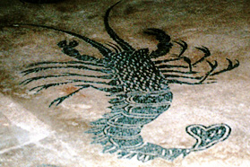
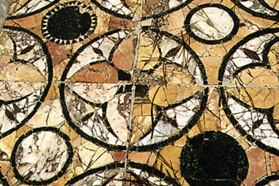

https://penelope.uchicago.edu/Thayer/L/Roman/Texts/Suetonius/12Caesars/Julius*.html

# The Life of Julius Caesar

1 [Legamen ad paginam Latinam] 1 In the course of his sixteenth year​1 he lost his father. In the next consulate, having previously been nominated priest of Jupiter,​2 he broke his engagement with Cossutia, a lady of only equestrian rank, but very wealthy, who had been betrothed to him before he assumed the gown of manhood, and married Cornelia, daughter of that Cinna who was four times consul, by whom he afterwards had a daughter Julia; and the dictator Sulla could by no means force him to put away his wife. 2 Therefore besides being punished by the loss of his priesthood,​a his wife's dowry, and his family inheritances, Caesar was held to be one of the opposite party. He was accordingly forced to go into hiding, and though suffering from a severe attack of quartan ague, to change from one covert to another almost every night, and save himself from Sulla's detectives by bribes. But at last, through the good offices of the Vestal virgins and of his near kinsmen, Mamercus Aemilius and Aurelius Cotta, he obtained forgiveness. 3 Everyone knows that when Sulla had long  p5 held out against the most devoted and eminent men of his party who interceded for Caesar, and they obstinately persisted, he at last gave way and cried, either by divine inspiration or a shrewd forecast: "Have your way and take him; only bear in mind that the man you are so eager to save will one day deal the death blow to the cause of the aristocracy, which you have joined with me in upholding; for in this Caesar there is more than one Marius."

2 [Legamen ad paginam Latinam] 1 He served his first campaign in Asia on the personal staff of Marcus Thermus, governor of the province. Being sent by Thermus to Bithynia, to fetch a fleet, he dawdled so long at the court of Nicomedes that he was suspected of improper relations with the king; and he lent colour to this scandal by going back to Bithynia a few days after his return, with the alleged purpose of collecting a debt for a freedman, one of his dependents. During the rest of the campaign he enjoyed a better reputation, and at the storming of Mytilene Thermus awarded him the civic crown.3

3 [Legamen ad paginam Latinam] 1 He served too under Servilius Isauricus in Cilicia, but only for a short time; for learning of the death of Sulla, and at the same time hoping to profit by a counter revolution which Marcus Lepidus was setting on foot, he hurriedly returned to Rome. But he did not make common cause with Lepidus, although he was offered highly favourable terms, through lack of confidence both in that leader's capacity and in the outlook, which he found less promising than he had expected.

4 [Legamen ad paginam Latinam] 1 Then, after the civil disturbance had been quieted, he brought a charge of extortion against Cornelius Dolabella, an ex-consul who had been  p7 honoured with a triumph. On the acquittal of Dolabella Caesar determined to withdraw to Rhodes, to escape from the ill-will which he had incurred, and at the same time to rest and have leisure to study under Apollonius Molo, the most eminent teacher of oratory of that time. While crossing to Rhodes, after the winter season had already begun, he was taken by pirates near the island of Pharmacussa and remained in their custody for nearly forty days in a state of intense vexation, attended only by a single physician and two body-servants; 2 for he had sent off his travelling companions and the rest of his attendants at the outset, to raise money for his ransom. Once he was set on shore on payment of fifty talents, he did not delay then and there to launch a fleet and pursue the departing pirates, and the moment they were in his power to inflict on them the punishment which he had often threatened when joking with them.​4 He then proceeded to Rhodes, but as Mithridates was devastating the neighbouring regions, he crossed over into Asia, to avoid the appearance of inaction when the allies of the Roman people were in danger. There he levied a band of auxiliaries and drove the king's prefect from the province, thus holding the wavering and irresolute states to their allegiance.

5 [Legamen ad paginam Latinam] 1 While serving as military tribune, the first office which was conferred on him by vote of the people after his return to Rome, he ardently supported the leaders in the attempt to re-establish the authority of the tribunes of the commons, the extent of which Sulla had curtailed. Furthermore, through a bill proposed by one Plotius, he effected the recall of his wife's brother Lucius Cinna, as well  p9 as of the others who had taken part with Lepidus in his revolution and after the consul's death had fled to Sertorius; and he personally spoke in favour of the measure.

6 [Legamen ad paginam Latinam] 1 When quaestor, he pronounced the customary orations from the rostra in praise of his aunt Julia and his wife Cornelia, who had both died. And in the eulogy of his aunt he spoke in the following terms of her paternal and maternal ancestry and that of his own father: "The family of my aunt Julia is descended by her mother from the kings, and on her father's side is akin to the immortal Gods; for the Marcii Reges (her mother's family name) go back to Ancus Marcius, and the Julii, the family of which ours is a branch, to Venus. Our stock therefore has at once the sanctity of kings, whose power is supreme among mortal men, and the claim to reverence which attaches to the Gods, who hold sway over kings themselves."

2 In place of Cornelia he took to wife Pompeia, daughter of Quintus Pompeius and granddaughter of Lucius Sulla. But he afterward divorced her, suspecting her of adultery with Publius Clodius; and in fact the report that Clodius had gained access to her in woman's garb during a public religious ceremony​5 was so persistent, that the senate decreed that the pollution of the sacred rites be judicially investigated.

7 [Legamen ad paginam Latinam] 1 As quaestor it fell to his lot to serve in Further Spain. When he was there, while making the circuit of the assize-towns, to hold court under commission from the praetor, he came to Gades, and noticing a statue of Alexander the Great in the temple of Hercules, he heaved a sigh, and as if out of patience with his own  p11 incapacity in having as yet done nothing noteworthy at a time of life when Alexander had already brought the world to his feet, he straightway asked for his discharge, to grasp the first opportunity for greater enterprises at Rome. 2 Furthermore, when he was dismayed by a dream the following night (for he thought that he had offered violence to his mother) the soothsayers inspired him with high hopes by their interpretation, which was: that he was destined to rule the world, since the mother whom he had seen in his power was none other than the earth, which is regarded as the common parent of all mankind.

8 [Legamen ad paginam Latinam] 1 Departing therefore before his term was over, he went to the Latin colonies which were in a state of unrest and meditating a demand for citizen­ship;​6 and he might have spurred them on to some rash act, had not the consuls, in anticipation of that very danger, detained there for a time the legions which had been enrolled for service in Cilicia.

9 [Legamen ad paginam Latinam] 1 For all that he presently made a more daring attempt at Rome; for a few days before he entered upon his aedile­ship he was suspected of having made a conspiracy with Marcus Crassus, an ex-consul, and likewise with Publius Sulla and Lucius Autronius, who, after their election to the consul­ship, had been found guilty of corrupt practices. The design was to set upon the senate at the opening of the year and put to the sword as many as they thought good; then Crassus was to usurp the dictator­ship, naming Caesar as his master of horse, and when they had organized the state according to their pleasure, the consul­ship was to be restored to Sulla and Autronius. 2 This plot is mentioned by Tanusius Geminus in his  p13 History, by Marcus Bibulus in his edicts, and by Gaius Curio the elder in his speeches. Cicero too seems to hint at it in a letter to Axius, where he says that Caesar in his consul­ship established the despotism which he had had in mind when he was aedile. Tanusius adds that Crassus, either conscience-stricken or moved by fear, did not appear on the day appointed for the massacre, and that therefore Caesar did not give the signal which it had been arranged that he should give; and Curio says that the arrangement was that Caesar should let his toga fall from his shoulder. 3 Not only Curio, but Marcus Actorius Naso as well declare that Caesar made another plot with Gnaeus Piso, a young man to whom the province of Spain had been assigned unasked and out of the regular order, because he was suspected of political intrigues at Rome; that they agreed to rise in revolt at the same time, Piso abroad and Caesar at Rome, aided by the Ambrani and the peoples beyond the Po; but that Piso's death brought both their designs to naught.

10 [Legamen ad paginam Latinam] 1 When aedile, Caesar decorated​7 not only the Comitium and the Forum with its adjacent basilicas, but the Capitol as well, building temporary colonnades for the display of a part of his material. He exhibited combats with wild beasts and stage-plays too, both with his colleague and independently. The result was that Caesar alone took all the credit even for what they spent in common, and his colleague Marcus Bibulus openly said that his was the fate of Pollux: "For," said he, "just as the temple erected in the Forum to the twin brethren, bears only the name of Castor, so the joint liberality of Caesar and myself is credited to Caesar alone."  p15 2 Caesar gave a gladiatorial show besides, but with somewhat fewer pairs of combatants than he had purposed; for the huge band which he assembled from all quarters so terrified his opponents, that a bill was passed limiting the number of gladiators which anyone was to be allowed to keep in the city.

11 1  [Legamen ad paginam Latinam] Having won the goodwill of the masses, Caesar made an attempt through some of the tribunes to have the charge of Egypt given him by a decree of the commons, seizing the opportunity to ask for so irregular an appointment because the citizens of Alexandria had deposed their king, who had been named by the senate an ally and friend of the Roman people, and their action was generally condemned. He failed however because of the opposition of the aristocratic party; wishing therefore to impair their prestige in every way he could, he restored the trophies commemorating the victories of Gaius Marius over Jugurtha and over the Cimbri and Teutoni, which Sulla had long since demolished. Furthermore in conducting prosecutions for murder,​8 he included in the number of murderers even those who had received moneys from the public treasury during the proscriptions for bringing in the heads of Roman citizens, although they were expressly exempted by the Cornelian laws.

12 [Legamen ad paginam Latinam] 1 He also bribed a man to bring a charge of high treason against Gaius Rabirius, who some years before had rendered conspicuous service to the senate in repressing the seditious designs of the tribune Lucius Saturninus; and when he had been selected by lot to sentence the accused,​9 he did so with such eagerness, that when Rabirius appealed to  p17 the people, nothing was so much in his favour as the bitter hostility of his judge.

13 [Legamen ad paginam Latinam] 1 After giving up hope of the special commission,​10 he announced his candidacy for the office of pontifex maximus, resorting to the most lavish bribery. Thinking on the enormous debt which he had thus contracted, he is said to have declared to his mother on the morning of his election, as she kissed him when he was starting for the polls, that he would never return except as pontifex. And in fact he so decisively defeated two very strong competitors (for they were greatly his superiors in age and rank), that he polled more votes in their tribes than were cast for both of them in all the tribes.

14 [Legamen ad paginam Latinam] 1 When the conspiracy of Catiline was detected, and all the rest of the senate favoured inflicting the extreme penalty on those implicated in the plot, Caesar, who was now praetor elect, alone proposed that their goods be confiscated and that they be imprisoned each in a separate town. Nay, more, he inspired such fear in those who favoured severer measures, by picturing the hatred which the Roman commons would feel for them for all future time, that Decimus Silanus, consul elect, was not ashamed to give a milder interpretation to his proposal (since it would have been humiliating to change it) alleging that it had been understood in a harsher sense than he intended. 2 Caesar would have prevailed too, for a number had already gone over to him, including Cicero, the consul's brother, had not the address of Marcus Cato kept the wavering senate in line. Yet not even then did he cease to delay the proceedings, but only when an armed  p19 troop of Roman knights that stood on guard about the place threatened him with death as he persisted in his headstrong opposition. They even drew their swords and made such passes at him that his friends who sat next him forsook him, while a few had much ado to shield him in their embrace or with their robes. Then, in evident fear, he not only yielded the point, but for the rest of the year kept aloof from the House.

15 [Legamen ad paginam Latinam] 1 On the first day of his praetor­ship he called upon Quintus Catulus to render an account owing to the people touching the restoration of the Capitol, proposing a bill for turning over the commission to another.​11 But he withdrew the measure, since he could not cope with the united opposition of the aristocrats, seeing that they had at once dropped their attendance on the newly elected consuls​12 and hastily gathered in throngs, resolved on an obstinate resistance.

16 [Legamen ad paginam Latinam] 1 Nevertheless, when Caecilius Metellus, tribune of the commons, brought forward some bills of a highly seditious nature in spite of the veto of his colleagues, Caesar abetted him and espoused his cause in the stubbornest fashion, until at last both were suspended from the exercise of their public functions by a decree of the senate. Yet in spite of this Caesar had the audacity to continue in office and to hold court; but when he learned that some were ready to stop him by force of arms, he dismissed his lictors, laid aside his robe of office, and slipped off privily to his house, intending to remain in retirement because of the state of the times. 2 Indeed, when the populace on the following day flocked to him quite of their own accord, and with riotous  p21 demonstrations offered him their aid in recovering his position, he held them in check. Since this action of his was wholly unexpected, the senate, which had been hurriedly convoked to take action about that very gathering, publicly thanked him through its leading men; then summoning him to the House and lauding him in the strongest terms, they rescinded their former decree and restored him to his rank.

17 [Legamen ad paginam Latinam] 1 He again fell into danger by being named among the accomplices of Catiline, both before the commissioner​13 Novius Niger by an informer called Lucius Vettius and in the senate by Quintus Curius, who had been voted a sum of money from the public funds as the first to disclose the plans of the conspirators. Curius alleged that his information came directly from Catiline, while Vettius actually offered to produce a letter to Catiline in Caesar's handwriting. 2 But Caesar, thinking that such an indignity could in no wise be endured, showed by appealing to Cicero's testimony that he had of his own accord reported to the consul certain details of the plot, and thus prevented Curius from getting the reward. As for Vettius, after his bond was declared forfeit and his goods seized, he was roughly handled by the populace assembled before the rostra, and all but torn to pieces. Caesar then put him in prison, and Novius the commissioner went there too, for allowing an official of superior rank to be arraigned before his tribunal.

18 [Legamen ad paginam Latinam] 1 Being allotted the province of Farther Spain after his praetor­ship, Caesar got rid of his creditors, who tried to detain him, by means of sureties and contrary both to precedent and law was  p23 on his way before the provinces were provided for;​14 possibly through fear of a private impeachment or perhaps to respond more promptly to the entreaties of our allies for help. After restoring order in his province, he made off with equal haste, and without waiting for the arrival of his successor, to sue at the same time for a triumph and the consul­ship. 2 But inasmuch as the day for the elections had already been announced and no account be taken of Caesar's candidacy unless he entered the city as a private citizen, and since his intrigues to gain exemption from the laws met with general protest, he was forced to forgo the triumph, to avoid losing the consul­ship.

19 [Legamen ad paginam Latinam] 1 Of the two other candidates for this office, Lucius Lucceius and Marcus Bibulus, Caesar joined forces with the former, making a bargain with him that since Lucceius had less influence but more funds, he should in their common name promise largess to the electors from his own pocket. When this became known, the aristocracy authorized Bibulus to promise the same amount, being seized with fear that Caesar would stick at nothing when he became chief magistrate, if he had a colleague who was heart and soul with him. Many of them contributed to the fund, and even Cato did not deny that bribery under such circumstances was for the good of the commonwealth.

2 So Caesar was chosen consul with Bibulus. With the same motives the aristocracy took care that provinces of the smallest importance should be assigned to the newly elected consuls; that is, mere woods and pastures.​15 Thereupon Caesar, especially incensed by this slight, by every possible attention courted the  p25 goodwill of Gnaeus Pompeius, who was at odds with the senate because of its tardiness in ratifying his acts after his victory over king Mithridates. He also patched up a peace between Pompeius and Marcus Crassus, who had been enemies since their consul­ship, which had been one of constant wrangling. Then he made a compact with both of them, that no step should be taken in public affairs which did not suit any one of the three.

20 [Legamen ad paginam Latinam] 1 Caesar's very first enactment after becoming consul was, that the proceedings both of the senate and of the people should day by day be compiled and published. He also revived a by-gone custom, that during the months when he did not have the fasces an orderly should walk before him, while the lictors followed him. He brought forward an agrarian law too, and when his colleague announced adverse omens,​16 he resorted to arms and drove him from the Forum; and when next day Bibulus made complaint in the senate and no one could be found who ventured to make a motion, or even to express an opinion about so high-handed a proceeding (although decrees had often been passed touching less serious breaches of the peace), Caesar's conduct drove him to such a pitch of desperation, that from that time until the end of his term he did not leave his house, but merely issued proclamations announcing adverse omens.

2 From that time on Caesar managed all the affairs of state alone and after his own pleasure; so that sundry witty fellows, pretending by way of jest to sign and seal testamentary documents,​17 wrote "Done in the consul­ship of Julius and Caesar," instead of "Bibulus and Caesar," writing down  p27 the same man twice, by name and by surname. Presently too the following verses were on everyone's lips:—

"In Caesar's year, not Bibulus', an act took place of late;

For naught do I remember done in Bibulus' consulate."

3 The plain called Stellas,​b which had been devoted to public uses by the men of by-gone days, and the Campanian territory, which had been reserved to pay revenues for the aid of the government, he divided without casting lots​18 among twenty thousand citizens who had three or more children each. When the publicans asked for relief, he freed them from a third part of their obligation, and openly warned them in contracting for taxes in the future not to bid too recklessly. He freely granted everything else that anyone took it into his head to ask, either without opposition or by intimidating anyone who tried to object. 4 Marcus Cato, who tried to delay proceedings,​19 was dragged from the House by a lictor at Caesar's command and taken off to prison. When Lucius Lucullus was somewhat too outspoken in his opposition, he filled him with such fear of malicious prosecution,​20 that Lucullus actually fell on his knees before him. Because Cicero, while pleading in court, deplored the times, Caesar transferred the orator's enemy Publius Clodius that very same day from the patricians to the plebeians, a thing for which Clodius had for a long time been vainly striving; and that too at the ninth hour.​21 5 Finally taking action against all the opposition in a body, he bribed an informer to declare that he had been  p29 egged on by certain men to murder Pompey, and to come out upon the rostra and name the guilty parties according to a prearranged plot. But when the informer had named one or two to no purpose and not without suspicion of double-dealing, Caesar, hopeless of the success of his over-hasty attempt, is supposed to have had him taken off by poison.

21 [Legamen ad paginam Latinam] 1 At about the same time he took to wife Calpurnia, daughter of Lucius Piso, who was to succeed him in the consul­ship, and affianced his own daughter Julia to Gnaeus Pompeius, breaking a previous engagement with Servilius Caepio, although the latter had shortly before rendered him conspicuous service in his contest with Bibulus. And after this new alliance he began to call upon Pompey first to give his opinion in the senate, although it had been his habit to begin with Crassus, and it was the rule for the consul in calling for opinions to continue throughout the year the order which he had established on the Kalends of January.

22 [Legamen ad paginam Latinam] 1 Backed therefore by his father-in‑law and son-in‑law, out of all the numerous provinces he made the Gauls his choice, as the most likely to enrich him and furnish suitable material for triumphs. At first, it is true, by the bill of Vatinius he received only Cisalpine Gaul with the addition of Illyricum; but presently he was assigned Gallia Comata as well by the senate, since the members feared that even if they should refuse it, the people would give him this also. 2 Transported with joy at this success, he could not keep from boasting a few days later before a crowded house, that having gained his heart's desire to the grief and lamentation of his opponents, he would therefore from that time mount  p31 on their heads;​22 and when someone insultingly remarked that that would be no easy matter for any woman, he replied in the same vein that Semiramis too had been queen in Syria and the Amazons in days of old had held sway over a great part of Asia.

23 [Legamen ad paginam Latinam] 1 When at the close of his consul­ship the praetors Gaius Memmius and Lucius Domitius moved an inquiry into his conduct during the previous year, Caesar laid the matter before the senate; and when they failed to take it up, and three days had been wasted in fruitless wrangling, went off to his province. Whereupon his quaestor was at once arraigned on several counts, as a preliminary to his own impeachment. Presently he himself too was prosecuted by Lucius Antistius, tribune of the commons, and it was only by appealing to the whole college that he contrived not to be brought to trial, on the ground that he was absent on public service. 2 Then to secure himself for the future, he took great pains always to put the magistrates for the year under personal obligation, and not to aid any candidates or suffer any to be elected, save such as guaranteed to defend him in his absence. And he did not hesitate in some cases to exact an oath to keep this pledge or even a written contract.

24 [Legamen ad paginam Latinam] 1 When however Lucius Domitius, candidate for the consul­ship, openly threatened to effect as consul what he had been unable to do as praetor, and to take his armies from him, Caesar compelled Pompeius and Crassus to come to Luca, a city in his province, where he prevailed on them to stand for a second consul­ship, to defeat Domitius; and he also  p33 succeeded through their influence in having his term as governor of Gaul made five years longer. 2 Encouraged by this, he added to the legions which he had received from the state others at his own cost, one actually composed of men of Transalpine Gaul and bearing a Gallic name too (for it was called Alauda),​23 which he trained in the Roman tactics and equipped with Roman arms; and later on he gave every man of it citizen­ship. 3 After that he did not let slip any pretext for war, however unjust and dangerous it might be, picking quarrels as well with allied, as with hostile and barbarous nations; so that once the senate decreed that a commission be sent to inquire into the condition of the Gallic provinces, and some even recommended that Caesar be handed over to the enemy. But as his enterprises prospered, thanksgivings were appointed in his honour oftener and for longer periods than for anyone before his time.

25 [Legamen ad paginam Latinam] 1 During the nine years of his command this is in substance what he did. All that part of Gaul which is bounded by the Pyrenees, the Alps and the Cévennes, and by the Rhine and Rhone rivers, a circuit of some 3,200​24 miles, with the exception of some allied states which had rendered him good service, he reduced to the form of a province; and imposed upon it a yearly tribute of 40,000,000 sesterces.​25 2 He was the first Roman to build a bridge and attack the Germans beyond the Rhine; and he inflicted heavy losses upon them. He invaded the Britons too, a people unknown before,  p35 vanquished them, and exacted moneys and hostages. Amid all these successes he met with adverse fortune but three times in all: in Britain, where his fleet narrowly escaped destruction in a violent storm; in Gaul, when one of his legions was routed at Gergovia; and on the borders of Germany, when his lieutenants Titurius and Aurunculeius were ambushed and slain.

26 [Legamen ad paginam Latinam] 1 Within this same space of time he lost first his mother, then his daughter, and soon afterwards his grandchild. Meanwhile, as the community was aghast at the murder of Publius Clodius, the senate had voted that only one consul should be chosen, and expressly named Gnaeus Pompeius. When the tribunes planned to make him Pompey's colleague, Caesar urged them rather to propose to the people that he be permitted to stand for a second consul­ship without coming to Rome, when the term of his governor­ship drew near its end, to prevent his being forced for the sake of the office to leave his province prematurely and without finishing the war. 2 On the granting of this, aiming still higher and flushed with hope, he neglected nothing in the way of lavish expenditure or of favours to anyone, either in his public capacity or privately. He began a forum with the proceeds of his spoils, the ground for which cost more than a hundred million sesterces. He announced a combat of gladiators and a feast for the people in memory of his daughter, a thing quite without precedent. To raise the expectation of these events to the highest possible pitch, he had the material for the banquet prepared in part by his own household, although he had let contracts to the  p37 markets as well. 3 He gave orders that whenever famous gladiators fought without winning the favour of the people,​26 they should be rescued by force and kept for him. He had the novices trained, not in a gladiatorial school by professionals, but in private houses by Roman knights and even by senators who were skilled in arms, earnestly beseeching them, as is shown by his own letters, to give the recruits individual attention and personally direct their exercises. He doubled the pay of the legions for all time. Whenever grain was plenti­ful, he distributed it to them without stint or measure, and now and then gave each man a slave from among the captives.

27 [Legamen ad paginam Latinam] 1 Moreover, to retain his relation­ship and friendship with Pompey, Caesar offered him his sister's granddaughter Octavia in marriage, although she was already the wife of Gaius Marcellus, and asked for the hand of Pompey's daughter, who was promised to Faustus Sulla. When he had put all Pompey's friends under obligation, as well as the greater part of the senate, through loans made without interest or at a low rate, he lavished gifts on men of all other classes, both those whom he invited to accept his bounty and those who applied to him unasked, including even freedmen and slaves who were special favourites of their masters or patrons. 2 In short, he was the sole and ever ready help of all who were in legal difficulties or in debt and of young spendthrifts, excepting only those whose burden of guilt or poverty was so heavy, or who were so given up to riotous living, that even he could not save them; and to these he declared in the plainest terms that what they needed was a civil war.

 p39 28 [Legamen ad paginam Latinam] 1 He took no less pains to win the devotion of princes and provinces all over the world, offering prisoners to some by the thousand as a gift, and sending auxiliary troops to the aid of others whenever they wished, and as often as they wished, without the sanction of the senate or people, besides adorning the principal cities of Asia and Greece with magnificent public works, as well as those of Italy and the provinces of Gaul and Spain. 2 At last, when all were thunder-struck at his actions and wondered what their purpose could be, the consul Marcus Claudius Marcellus, after first making proclamation that he purposed to bring before the senate a matter of the highest public moment, proposed that a successor to Caesar be appointed before the end of his term, on the ground that the war was ended, peace was established, and the victorious army ought to be disbanded; also that no account be taken of Caesar at the elections, unless he were present, since Pompey's subsequent action​27 had not annulled the decree of the people. 3 And it was true that when Pompey proposed a bill touching the privileges of officials, in the clause whereby he debarred absentees from candidacy for office he forgot to make a special exception in Caesar's case, and did not correct the oversight until the law had been inscribed on a tablet of bronze and deposited in the treasury. Not content with depriving Caesar of his provinces and his privilege, Marcellus also moved that the colonists whom Caesar had settled in Novum Comum by the bill of Vatinius should lose their citizen­ship, on the ground that it had been given from political motives and was not authorized by the law.

 p41 29 [Legamen ad paginam Latinam] 1 Greatly troubled by these measures, and thinking, as they say he was often heard to remark, that now that he was the leading man of the state, it was harder to push him down from the first place to the second than it would be from the second to the lowest, Caesar stoutly resisted Marcellus, partly through vetoes of the tribunes and partly through the other consul, Servius Sulpicius. When next year Gaius Marcellus, who had succeeded his cousin Marcus as consul, tried the same thing, Caesar by a heavy bribe secured the support of the other consul, Aemilius Paulus, and of Gaius Curio, the most reckless of the tribunes. 2 But seeing that everything was being pushed most persistently, and that even the consuls elect were among the opposition, he sent a written appeal to the senate, not to take from him the privilege which the people had granted, or else to compel the others in command of armies to resign also; feeling sure, it was thought, that he could more readily muster his veterans as soon as he wished, than Pompey his newly levied troops. He further proposed a compromise to his opponents, that after giving up eight legions and Transalpine Gaul, he be allowed to keep two legions and Cisalpine Gaul, or at least one legion and Illyricum, until he was elected consul.

30 [Legamen ad paginam Latinam] 1 But when the senate declined to interfere, and his opponents declared that they would accept no compromise in a matter affecting the public welfare, he crossed to Hither Gaul, and after holding all the assizes, halted at Ravenna, intending to resort to war if the senate took any drastic action against the tribunes of the commons who interposed vetoes in his behalf.​28 2 Now this was his excuse  p43 for the civil war, but it is believed that he had other motives. Gnaeus Pompeius used to declare that since Caesar's own means were not sufficient to complete the works which he had planned, nor to do all that he had led the people to expect on his return, he desired a state of general unrest and turmoil. 3 Others say that he dreaded the necessity of rendering an account for what he had done in his first consul­ship contrary to the auspices and the laws, and regardless of vetoes; for Marcus Cato often declared, and took oath too, that he would impeach Caesar the moment he had disbanded his army. It was openly said too that if he was out of office on his return, he would be obliged, like Milo, to make his defence in a court hedged about by armed men. 4 The latter opinion is the more credible one in view of the assertion of Asinius Pollio, that when Caesar at the battle of Pharsalus saw his enemies slain or in flight, he said, word for word: "They would have it so. Even I, Gaius Caesar, after so many great deeds, should have been found guilty, if I had not turned to my army for help." 5 Some think that habit had given him a love of power, and that weighing the strength of his adversaries against his own, he grasped the opportunity of usurping the despotism which had been his heart's desire from early youth. Cicero too was seemingly of this opinion, when he wrote in the third book of his De Officiis​29 that Caesar ever had upon his lips these lines of Euripides,​30 of which Cicero himself adds a version:

"If wrong may e'er be right, for a throne's sake

Were wrong most right:— be God in all else feared."​31

 p45 31 [Legamen ad paginam Latinam] 1 Accordingly, when word came that the veto of the tribunes had been set aside and they themselves had left the city, he at once sent on a few cohorts with all secrecy, and then, to disarm suspicion, concealed his purpose by appearing at a public show inspecting the plans of a gladiatorial school which he intended building, and joining as usual in a banquet with a large company. 2 It was not until after sunset that he set out very privily with a small company, taking the mules from a bakeshop hard by and harnessing them to a carriage; and when his lights went out and he lost his way, he was astray for some time, but at last found a guide at dawn and got back to the road on foot by narrow by-paths. Then, overtaking his cohorts at the river Rubicon, which was the boundary of his province, he paused for a while, and realising what a step he was taking, he turned to those about him and said: "Even yet we may draw back; but once cross yon little bridge, and the whole issue is with the sword."

32 [Legamen ad paginam Latinam] 1 As he stood in doubt, this sign was given him. On a sudden there appeared hard by a being of wondrous stature and beauty, who sat and played upon a reed; and when not only the shepherds flocked to hear him, but many of the soldiers left their posts, and among them some of the trumpeters, the apparition snatched a trumpet from one of them, rushed to the river, and sounding the war-note with mighty blast, strode to the opposite bank. Then Caesar cried: "Take we the course which the signs of the gods and the false dealing of our foes point out. The die is cast," said he.

33 [Legamen ad paginam Latinam] 1 Accordingly, crossing with his army, and welcoming the tribunes of the commons, who had  p47 come to him after being driven from Rome, he harangued the soldiers with tears, and rending his robe from his breast besought their faithful service. It is even thought that he promised every man a knight's estate, but that came of a misunderstanding: for since he often pointed to the finger of his left hand as he addressed them and urged them on, declaring that to satisfy all those who helped him to defend his honour he would gladly tear this very ring from his hand, those on the edge of the assembly, who could see him better than they could hear his words, assumed that he said what his gesture seemed to mean; and so the report went about that he had promised them the right of the ring and four hundred thousand sesterces​32 as well.

34 [Legamen ad paginam Latinam] 1 The sum total of his movements after that is, in their order, as follows: He overran Umbria, Picenum, and Etruria, took prisoner Lucius Domitius, who had been irregularly​33 named his successor, and was holding Corfinium with a garrison, let him go free, and then proceeded along the Adriatic to Brundisium, where Pompey and the consuls had taken refuge, intending to cross the sea as soon as might be. 2 After trying by every kind of hindrance to prevent their sailing, he marched off to Rome, and after calling the senate together to discuss public business, went to attack Pompey's strongest forces, which were in Spain under command of three of his lieutenants — Marcus Petreius, Lucius Afranius, and Marcus Varro — saying to his friends before he left "I go to meet an army without a leader, and I shall return to meet a leader without an army." And in fact, though his advance was delayed by the siege of Massilia, which had shut  p49 its gates against him, and by extreme scarcity of supplies, he nevertheless quickly gained a complete victory.

35 [Legamen ad paginam Latinam] 1 Returning thence to Rome, he crossed into Macedonia, and after blockading Pompey for almost four months behind mighty ramparts, finally routed him in the battle at Pharsalus, followed him in his flight to Alexandria, and when he learned that his rival had been slain, made war on King Ptolemy, whom he perceived to be plotting against his own safety as well; a war in truth of great difficulty, convenient neither in time nor place, but carried on during the winter season, within the walls of a well-provisioned and crafty foeman, while Caesar himself was without supplies of any kind and ill-prepared. Victor in spite of all, he turned over the rule of Egypt to Cleopatra and her younger brother, fearing that if he made a province of it, it might one day under a headstrong governor be a source of revolution. 2 From Alexandria he crossed to Syria, and from there went to Pontus, spurred on by the news that Pharnaces, son of Mithridates the Great, had taken advantage of the situation to make war, and was already flushed with numerous successes; but Caesar vanquished him in a single battle within five days after his arrival and four hours after getting sight of him, often remarking on Pompey's good luck in gaining his principal fame as a general by victories over such feeble foemen. Then he overcame Scipio and Juba, who were patching up the remnants of their party in Africa, and the sons of Pompey in Spain.

36 [Legamen ad paginam Latinam] 1 In all the civil wars he suffered not a single disaster except through his lieutenants, of  p51 whom Gaius Curio perished in Africa, Gaius Antonius fell into the hands of the enemy in Illyricum, Publius Dolabella lost a fleet also off Illyricum, and Gnaeus Domitius Calvinus an army in Pontus. Personally he always fought with the utmost success, and the issue was never even in doubt save twice: once at Dyrrachium, where he was put to flight, and said of Pompey, who failed to follow up his success, that he did not know how to use a victory; again in Spain, in the final struggle, when, believing the battle lost, he actually thought of suicide.

37 [Legamen ad paginam Latinam] 1 Having ended the wars, he celebrated five triumphs, four in a single month, but at intervals of a few days, after vanquishing Scipio; and another on defeating Pompey's sons. The first and most splendid was the Gallic triumph, the next the Alexandrian, then the Pontic, after that the African, and finally the Spanish, each differing from the rest in its equipment and display of spoils. 2 As he rode through the •Velabrum on the day of his Gallic triumph, the axle of his chariot broke, and he was all but thrown out; and he mounted the Capitol by torchlight, with forty elephants bearing lamps on his right and his left. In his Pontic triumph he displayed among the show-pieces of the procession an inscription of but three words, "I came, I saw, I conquered," not indicating the events of the war, as the others did, but the speed with which it was finished.

38 [Legamen ad paginam Latinam] 1 To each and every foot-soldier of his veteran legions he gave twenty-four thousand sesterces by way of booty, over and above the two thousand apiece which he had paid them at the beginning of the civil strife. He also assigned them lands, but  p53 not side by side, to avoid dispossessing any of the former owners. To every man of the people, besides ten pecks of grain and the same number of pounds of oil,​c he distributed the three hundred sesterces which he had promised at first, and one hundred apiece to boot because of the delay. 2 He also remitted a year's rent in Rome to tenants who paid two thousand sesterces or less, and in Italy up to five hundred sesterces. He added a banquet and a dole of meat, and after his Spanish victory two dinners;​34 for deeming that the former of these had not been served with a liberality creditable to his generosity, he gave another five days later on a most lavish scale.

39 [Legamen ad paginam Latinam] 1 He gave entertainments of divers kinds: a combat of gladiators and also stage-plays in every ward all over the city, performed too by actors of all languages, as well as races in the circus, athletic contests, and a sham sea-fight. In the gladiatorial contest in the Forum Furius Leptinus, a man of praetorian stock, and Quintus Calpenus, a former senator and pleader at the bar, fought to a finish. A Pyrrhic dance was performed by the sons of the princes of Asia and Bithynia. 2 During the plays Decimus Laberius, a Roman knight, acted a farce of his own composition, and having been presented with five hundred thousand sesterces and a gold ring,​35 passed from the stage through the orchestra and took his place in the fourteen rows.​36 For the races the circus was lengthened at either end and a broad canal​37 was dug all about it; then young men of the highest rank drove four-horse and two-horse chariots and rode pairs of horses, vaulting from one to the other. The game called Troy was performed by two troops, of  p55 younger and of older boys. 3 Combats with wild beasts were presented on five successive days, and last of all there was a battle between two opposing armies, in which five hundred foot-soldiers, twenty elephants, and thirty horsemen engaged on each side. To make room for this, the goals were taken down and in their place two camps were pitched over against each other. The athletic competitions lasted for three days in a temporary stadium built for the purpose in the region of the Campus Martius. 4 For the naval battle a pool was dug in the lesser Codeta and there was a contest of ships of two, three, and four banks of oars, belonging to the Tyrian and Egyptian fleets, manned by a large force of fighting men. Such a throng flocked to all these shows from every quarter, that many strangers had to lodge in tents pitched in streets or along the roads, and the press was often such that many were crushed to death, including two senators.

40 [Legamen ad paginam Latinam] 1 Then turning his attention to the reorganisation of the state, he reformed the calendar, which the negligence of the pontiffs had long since so disordered, through their privilege of adding months or days at pleasure, that the harvest festivals did not come in summer nor those of the vintage in the autumn; and he adjusted the year to the sun's course by making it consist of three hundred and sixty-five days, abolishing the intercalary month,​38 and adding one day every fourth year. 2 Furthermore, that the correct reckoning of seasons might begin with the next Kalends of January, he inserted two other months between those of November and December; hence the year in which these arrangements were made was one of fifteen months,  p57 including the intercalary month, which belonged to that year according to the former custom.

41 [Legamen ad paginam Latinam] 1 He filled the vacancies in the senate, enrolled additional patricians, and increased the number of praetors, aediles, and quaestors, as well as of the minor officials; he reinstated those who had been degraded by official action of the censors or found guilty of bribery by verdict of the jurors. 2 He shared the elections with the people on this basis: that except in the case of the consul­ship, half of the magistrates should be appointed by the people's choice, while the rest should be those whom he had personally nominated. And these he announced in brief notes like the following, circulated in each tribe: "Caesar the Dictator to this or that tribe. I commend to you so and so, to hold their positions by your votes." He admitted to office even the sons of those who had been proscribed. He limited the right of serving as jurors to two classes, the equestrian and senatorial orders, disqualifying the third class, the tribunes of the treasury.39

3 He made the enumeration of the people​40 neither in the usual manner nor place, but from street to street aided by the owners of blocks of houses, and reduced the number of those who received grain at public expense from three hundred and twenty thousand to one hundred and fifty thousand. And to prevent the calling of additional meetings at any future time for purposes of enrolment, he provided that the places of such as died should be filled each year by the praetors from those who were not on the list.

42 [Legamen ad paginam Latinam] 1 Moreover, to keep up the population of the city, depleted as it was by the assignment of  p59 eighty thousand citizens to colonies across the sea, he made a law that no citizen older than twenty or younger than forty, who was not detained by service in the army, should be absent from Italy for more than three successive years; that no senator's son should go abroad except as the companion of a magistrate or on his staff; and that those who made a business of grazing should have among their herdsmen at least one-third who were men of free birth. He conferred citizen­ship on all who practised medicine at Rome, and on all teachers of the liberal arts, to make them more desirous of living in the city and to induce others to resort to it.

2 As to debts, he disappointed those who looked for their cancellation, which was often agitated, but finally decreed that the debtors should satisfy their creditors according to a valuation of their possessions at the price what they had paid for them before the civil war, deducting from the principal whatever interest had been paid in cash or pledged through bankers; an arrangement which wiped out about a fourth part of their indebtedness. 3 He dissolved all guilds, except those of ancient foundation. He increased the penalties for crimes; and inasmuch as the rich involved themselves in guilt with less hesitation because they merely suffered exile, without any loss of property, he punished murderers of freemen​41 by the confiscation of all their goods, as Cicero writes, and others by the loss of one-half.

43 [Legamen ad paginam Latinam] 1 He administered justice with the utmost conscientiousness and strictness. Those convicted of extortion he even dismissed from the senatorial order. He annulled the marriage of an ex-praetor, who had married a woman the very day after her  p61 divorce, although there was no suspicion of adultery. He imposed duties on foreign wares. He denied the use of litters and the wearing of scarlet robes or pearls to all except those of a designated position and age, and on set days. 2 In particular he enforced the laws against extravagance, setting watchmen in various parts of the market, to seize and bring to him dainties which were exposed for sale in violation of the law; and sometimes he sent his lictors and soldiers to take from a dining-room any articles which had escaped the vigilance of his watchmen, even after they had been served.

44 [Legamen ad paginam Latinam] 1 In particular, for the adornment and convenience of the city, also for the protection and extension of the Empire, he formed more projects and more extensive ones every day: first of all, to rear a temple of Mars, greater than any in existence, filling up and levelling the pool in which he had exhibited the sea-fight, and to build a theatre of vast size, sloping down from the Tarpeian rock; 2 to reduce the civil code to fixed limits, and of the vast and prolix mass of statutes to include only the best and most essential in a limited number of volumes; to open to the public the greatest possible libraries of Greek and Latin books, assigning to Marcus Varro the charge of procuring and classifying them; 3 to drain the Pomptine marshes; to let out the water from Lake Fucinus; to make a highway from the Adriatic across the summit of the Apennines as far as the Tiber; to cut a canal through the Isthmus; to check the Dacians, who had poured into Pontus and Thrace; then to make war on the Parthians by way of Lesser Armenia, but not to risk a battle with them until he had first tested their mettle.

 p63 4 All these enterprises and plans were cut short by his death. But before I speak of that, it will not be amiss to describe briefly his personal appearance, his dress, his mode of life, and his character, as well as his conduct in civil and military life.

45 [Legamen ad paginam Latinam] 1 He is said to have been tall of stature with a fair complexion, shapely limbs, a somewhat full face, and keen black eyes; sound of health, except that towards the end he was subject to sudden fainting fits and to nightmare as well. He was twice attacked by the falling sickness​42 during his campaigns. 2 He was somewhat overnice in the care of his person, being not only carefully trimmed and shaved, but even having superfluous hair plucked out, as some have charged; while his baldness was a disfigurement which troubled him greatly, since he found that it was often the subject of the gibes of his detractors. Because of it he used to comb forward his scanty locks from the crown of his head, and of all the honours voted him by the senate and people there was none which he received or made use of more gladly than the privilege of wearing a laurel wreath at all times. 3 They say, too, that he was remarkable in his dress; that he wore a senator's tunic​43 with fringed sleeves reaching to the wrist, and always had a girdle​44 over it, though rather a loose one; and this, they say, was the occasion of Sulla's mot, when he often warned the nobles to keep an eye on the ill-girt boy.

 p65 46 [Legamen ad paginam Latinam] 1 He lived at first in the •Subura in a modest house, but after he became pontifex maximus, in the official residence on the •Sacred Way. Many have written that he was very fond of elegance and luxury; that having laid the foundations of a country-house on his estate at Nemi and finished it at great cost, he tore it all down because it did not suit him in every particular, although at the time he was still poor and heavily in debt; and that he carried tesselated and mosaic floors​d about with him on his campaigns.

47 [Legamen ad paginam Latinam] 1 They say that he was led to invade Britain by the hope of getting pearls, and that in comparing their size he sometimes weighed them with his own hand; that he was always a most enthusiastic collector of gems, carvings, statues, and pictures by early artists; also of slaves of exceptional figure and training at enormous prices, of which he himself was so ashamed that he forbade their entry in his accounts.

48 [Legamen ad paginam Latinam] 1 It is further reported that in the provinces he gave banquets constantly in two dining-halls, in one of which his officers or Greek companions, in the other Roman civilians and the more distinguished of the provincials reclined at table. He was so punctilious and strict in the management of his household, in small matters as well as in those of greater importance, that he put his baker in irons for serving him with one kind of bread and his guests with another; and he inflicted capital punishment on a favourite freedman for adultery with the wife of a Roman knight, although no complaint was made against him.

49 [Legamen ad paginam Latinam] 1 There was no stain on his reputation for  p67 chastity except his intimacy with King Nicomedes, but that was a deep and lasting reproach, which laid him open to insults from every quarter. I say nothing of the notorious lines of Licinius Calvus:

"Whate'er Bithynia had, and Caesar's paramour."

I pass over, too, the invectives of Dolabella and the elder Curio, in which Dolabella calls him "the queen's rival, the inner partner of the royal couch," and Curio, "the brothel of Nicomedes and the stew of Bithynia." 2 I take no account of the edicts of Bibulus, in which he posted his colleague as "the queen of Bithynia," saying that "of yore he was enamoured of a king, but now of a king's estate." At this same time, so Marcus Brutus declares, one Octavius, a man whose disordered mind made him somewhat free with his tongue, after saluting Pompey as "king" in a crowded assembly, greeted Caesar as "queen." But Gaius Memmius makes the direct charge that he acted as cup-bearer to Nicomedes with the rest of his wantons at a large dinner-party, and that among the guests were some merchants from Rome, whose names Memmius gives. 3 Cicero, indeed, is not content with having written in sundry letters that Caesar was led by the king's attendants to the royal apartments, that he lay on a golden couch arrayed in purple, and that the virginity of this son of Venus was lost in Bithynia; but when Caesar was once addressing the senate in defence of Nysa, daughter of Nicomedes, and was enumerating his obligations to the king, Cicero cried: "No more of that, pray, for it is well known what he gave you, and what you gave him in turn." 4 Finally, in his Gallic triumph his soldiers, among the bantering  p69 songs which are usually sung by those who followed the chariot, shouted these lines, which became a by-word:

"All the Gauls did Caesar vanquish, Nicomedes vanquished him;

Lo! now Caesar rides in triumph, victor over all the Gauls,

Nicomedes does not triumph, who subdued the conqueror."

50 [Legamen ad paginam Latinam] 1 That he was unbridled and extravagant in his intrigues is the general opinion, and that he seduced many illustrious women, among them Postumia, wife of Servius Sulpicius, Lollia, wife of Aulus Gabinius, Tertulla, wife of Marcus Crassus, and even Gnaeus Pompey's wife Mucia. At all events there is no doubt that Pompey was taken to task by the elder and the younger Curio, as well as by many others, because through a desire for power he had afterwards married the daughter of a man on whose account he divorced a wife who had borne him three children, and whom he had often referred to with a groan as an Aegisthus.​e 2 But beyond all others Caesar loved Servilia, the mother of Marcus Brutus, for whom in his first consul­ship he bought a pearl costing six million sesterces. During the civil war, too, besides other presents, he knocked down some fine estates to her in a public auction at a nominal price, and when some expressed their surprise at the low figure, Cicero wittily remarked: "It's a better bargain than you think, for there is a third off."​45 And in fact it was thought that Servilia was prostituting her own daughter Tertia to Caesar.

 p71 51 [Legamen ad paginam Latinam] 1 That he did not refrain from intrigues in the provinces is shown in particular by this couplet, which was also shouted by the soldiers in his Gallic triumph:

"Men of Rome, keep close to your consorts, here's a bald adulterer.

Gold in Gaul you spent in dalliance, which you borrowed here in Rome."

52 [Legamen ad paginam Latinam] 1 He had love affairs with queens too, including Eunoe the Moor, wife of Bogudes, on whom, as well as on her husband, he bestowed many splendid presents, as Naso writes;​46 but above all with Cleopatra, with whom he often feasted until daybreak, and he would have gone through Egypt with her in her state-barge almost to Aethiopia, had not his soldiers refused to follow him. Finally he called her to Rome and did not let her leave until he had ladened her with high honours and rich gifts, and he allowed her to give his name to the child which she bore. 2 In fact, according to certain Greek writers, this child was very like Caesar in looks and carriage. Mark Antony declared to the senate that Caesar had really acknowledged the boy, and that Gaius Matius, Gaius Oppius, and other friends of Caesar knew this. Of these Gaius Oppius, as if admitting that the situation required apology and defence, published a book, to prove that the child whom Cleopatra fathered on Caesar was not his. 3 Helvius Cinna, tribune of the commons, admitted to several that he had a bill drawn up in due form, which Caesar had ordered him to propose to the people in his absence, making it lawful for Caesar to marry what wives he wished, and as many as he wished, "for the purpose of begetting  p73 children."​47 But to remove all doubt that he had an evil reputation both for shameless vice and for adultery, I have only to add that the elder Curio in one of his speeches calls him "every woman's man and every man's woman."

53 [Legamen ad paginam Latinam] 1 That he drank very little wine not even his enemies denied. There is a saying of Marcus Cato that Caesar was the only man who undertook to overthrow the state when sober. Even in the matter of food Gaius Oppius tells us that he was so indifferent, that once when his host served stale oil instead of fresh, and the other guests would have none of it, Caesar partook even more plenti­fully than usual, not to seem to charge his host with carelessness or lack of manners.

54 [Legamen ad paginam Latinam] 1 Neither when in command of armies nor as a magistrate at Rome did he show a scrupulous integrity; for as certain men have declared in their memoirs, when he was proconsul in Spain,​48 he not only begged money from the allies, to help pay his debts, but also attacked and sacked some towns of the Lusitanians although they did not refuse his terms and opened their gates to him on his arrival. 2 In Gaul he pillaged shrines and temples of the gods filled with offerings, and oftener sacked towns for the sake of plunder than for any fault. In consequence he had more gold than he knew what to do with, and offered it for sale throughout Italy and the provinces at the rate of three thousand sesterces the pound.​49 3 In his first consul­ship he stole three thousand pounds of gold from the Capitol, replacing it with the same weight of gilded bronze. He made alliances and thrones a matter of barter, for he extorted from Ptolemy alone in his own name  p75 and that of Pompey nearly six thousand talents, while later on he met the heavy expenses of the civil wars and of his triumphs and entertainments by the most bare-faced pillage and sacrilege.

55 [Legamen ad paginam Latinam] 1 In eloquence and in the art of war he either equalled or surpassed the fame of their most eminent representatives. After his accusation of Dolabella, he was without question numbered with the leading advocates. At all events when Cicero reviews the orators in his Brutus,​50 he says that he does not see to whom Caesar ought to yield the palm, declaring that his style is elegant as well as transparent, even grand and in a sense noble.​f Again in a letter to Cornelius Nepos he writes thus of Caesar: 2 "Come now, what orator would you rank above him of those who have devoted themselves to nothing else? Who has cleverer or more frequent epigrams? Who is either more picturesque or more choice in diction?" He appears, at least in his youth, to have imitated the manner of Caesar Strabo, from whose speech entitled "For the Sardinians" he actually transferred some passages word for word to a trial address​51 of his own. He is said to have delivered himself in a high-pitched voice with impassioned action and gestures, which were not without grace. 3 He left several speeches, including some which are attributed to him on insufficient evidence. Augustus had good reason to think that the speech "For Quintus Metellus" was rather taken down by shorthand writers who could not keep pace with his delivery, than published by Caesar himself; for in some copies I find that even the title is not "For Metellus," but, "Which he wrote for Metellus," although the discourse purports to be from Caesar's lips, defending Metellus and himself  p77 against the charges of their common detractors. 4 Augustus also questions the authenticity of the address "To His Soldiers in Spain," although there are two sections of it, one purporting to have been spoken at the first battle, the other at the second, when Asinius Pollio writes that because of the sudden onslaught of the enemy he actually did not have time to make an harangue.

56 [Legamen ad paginam Latinam] 1 He left memoirs too of his deeds in the Gallic war and in the civil strife with Pompey; for the author of the Alexandrian, African, and Spanish Wars is unknown; some think it was Oppius, others Hirtius, who also supplied the final book of the Gallic War, which Caesar left unwritten. With regard to Caesar's memoirs Cicero, also in the Brutus​52 speaks in the following terms: 2 "He wrote memoirs which deserve the highest praise; they are naked in their simplicity, straightforward yet graceful, stripped of all rhetorical adornment, as of a garment; but while his purpose was to supply material to others, on which those who wished to write history might draw, he haply gratified silly folk, who will try to use the curling-irons on his narrative, but he has kept men of any sense from touching the subject." 3 Of these same memoirs Hirtius uses this emphatic language:​53 "They are so highly rated in the judgment of all men, that he seems to have deprived writers of an opportunity, rather than given them one; yet our admiration for this feat is greater than that of others; for they know how well and faultlessly he wrote, while we know besides how easily and rapidly he finished his task." 4 Asinius Pollio thinks that they were put together somewhat carelessly and without strict regard for truth; since in many cases Caesar was too  p79 ready to believe the accounts which others gave of their actions, and gave a perverted account of his own, either designedly or perhaps from forgetfulness; and he thinks that he intended to rewrite and revise them. 5 He left besides a work in two volumes "On Analogy," the same number of "Speeches criticising Cato," in addition to a poem, entitled "The Journey." He wrote the first of these works while crossing the Alps and returning to his army from Hither Gaul, where he had held the assizes; the second about the time of the battle of Munda, and the third in the course of a twenty-four days' journey from Rome to Farther Spain. 6 Some letters of his to the senate are also preserved, and he seems to have been the first to reduce such documents to pages and the form of a note-book,​54 whereas previously consuls and generals sent their reports written right across the sheet. There are also letters of his to Cicero, as well as to his intimates on private affairs, and in the latter, if he had anything confidential to say, he wrote it in cipher, that is, by so changing the order of the letters of the alphabet, that not a word could be made out. If anyone wishes to decipher these, and get at their meaning, he must substitute the fourth letter of the alphabet, namely D, for A, and so with the others. 7 We also have mention of certain writings of his boyhood and early youth, such as the "Praises of Hercules," a tragedy "Oedipus," and a "Collection of Apophthegms"; but Augustus forbade the publication of all these minor works in a very brief and frank letter sent to Pompeius Macer, whom he had selected to set his libraries in order.

 p81 57 [Legamen ad paginam Latinam] 1 He was highly skilled in arms and horseman­ship, and of incredible powers of endurance. On the march he headed his army, sometimes on horseback, but oftener on foot, bareheaded both in the heat of the sun and in rain. He covered great distances with incredible speed, making a hundred miles a day in a hired carriage and with little baggage, swimming the rivers which barred his path or crossing them on inflated skins, and very often arriving before the messengers sent to announce his coming.

58 [Legamen ad paginam Latinam] 1 In the conduct of his campaigns it is a question whether he was more cautious or more daring, for he never led his army where ambuscades were possible without carefully reconnoitring the country, and he did not cross to Britain without making personal inquiries​55 about the harbours, the course, and the approach to the island. But on the other hand, when news came that his camp in Germany was beleaguered, he made his way to his men through the enemies' pickets, disguised as a Gaul. 2 He crossed from Brundisium to Dyrrachium in winter time, running the blockade of the enemy's fleets; and when the troops which he had ordered to follow him delayed to do so, and he had sent to fetch them many times in vain, at last in secret and alone he boarded a small boat at night with his head muffled up; and he did not reveal who he was, or suffer the helmsman to give way to the gale blowing in their teeth, until he was all but overwhelmed by the waves.

59 [Legamen ad paginam Latinam] 1 No regard for religion ever turned him from any undertaking, or even delayed him. Though the victim escaped as he was offering sacrifice, he did not put off his expedition against Scipio and Juba. Even  p83 when he had a fall as he disembarked, he gave the omen a favourable turn by crying: "I hold thee fast, Africa." Furthermore, to make the prophecies ridiculous which declared that the stock of the Scipios was fated to be fortunate and invincible in that province, he kept with him in camp a contemptible fellow belonging to the Cornelian family, to whom the nickname Salvito​56 had been given as a reproach for his manner of life.

60 [Legamen ad paginam Latinam] 1 He joined battle, not only after planning his movements in advance but on a sudden opportunity, often immediately at the end of a march, and sometimes in the foulest weather, when one would least expect him to make a move. It was not until his later years that he became slower to engage, through a conviction that the oftener he had been victor, the less he ought to tempt fate, and that he could not possibly gain as much by success as he might lose by defeat. He never put his enemy to flight without also driving him from his camp, thus giving him no respite in his panic. When the issue was doubtful, he used to send away the horses, and his own among the first, to impose upon the troops the greater necessity of standing their ground by taking away that aid to flight.

61 [Legamen ad paginam Latinam] 1 He rode a remarkable horse, too, with feet that were almost human; for its hoofs were cloven in such a way as to look like toes. This horse was foaled on his own place, and since the soothsayers had declared that it foretold the rule of the world for its master, he reared it with the greatest care, and was the first to mount it, for it would endure no other rider. Afterwards, too, he dedicated a statue of it before the temple of Venus Genetrix.

 p85 62 [Legamen ad paginam Latinam] 1 When his army gave way, he often rallied it single-handed, planting himself in the way of the fleeing men, laying hold of them one by one, and even catching them by the throat and forcing them to face the enemy; that, too, when they were in such a panic that an eagle-bearer made a pass at him with the point​57 as he tried to stop him, while another left the standard in Caesar's hand when he would hold him back.

63 [Legamen ad paginam Latinam] 1 His presence of mind was no less renowned, and the instances of it will appear even more striking. After the battle of Pharsalus, when he had sent on his troops and was crossing the strait of the Hellespont in a small passenger boat, he met Lucius Cassius, of the hostile party, with ten armoured ships,​58 and made no attempt to escape, but went to meet Cassius and actually urged him to surrender; and Cassius sued for mercy and was taken on board.

64 [Legamen ad paginam Latinam] 1 At Alexandria, while assaulting a bridge, he was forced by a sudden sally of the enemy to take to a small skiff; when many others threw themselves into the same boat, he plunged into the sea, and after swimming for •two hundred paces, got away to the nearest ship, holding up his left hand all the way, so as not to wet some papers which he was carrying, and dragging his cloak after him with his teeth, to keep the enemy from getting it as a trophy.

65 [Legamen ad paginam Latinam] 1 He valued his soldiers neither for their personal character nor for their fortune, but solely for their prowess, and he treated them with equal strictness and indulgence; for he did not curb them everywhere and at all times, but only in the presence  p87 of the enemy. Then he required the strictest discipline, not announcing the time of a march or a battle, but keeping them ready and alert to be led on a sudden at any moment wheresoever he might wish. He often called them out even when there was no occasion for it, especially on rainy days and holidays. And warning them every now and then that they must keep close watch on him, he would steal away suddenly by day or night and make a longer march than usual, to tire out those who were tardy in following.

66 [Legamen ad paginam Latinam] 1 When they were in a panic through reports about the enemy's numbers, he used to rouse their courage not by denying or discounting the rumours, but by falsely exaggerating the true danger. For instance, when the anticipation of Juba's coming filled them with terror, he called the soldiers together and said: "Let me tell you that within the next few days the king will be here with ten legions, thirty thousand horsemen, a hundred thousand light-armed troops, and three hundred elephants. Therefore some of you may as well cease to ask further questions or make surmises and may rather believe me, since I know all about it. Otherwise, I shall surely have them shipped on some worn out craft and carried off to whatever lands the wind may blow them."

67 [Legamen ad paginam Latinam] 1 He did not take notice of all their offences or punish them by rule, but he kept a sharp look out for deserters and mutineers, and chastised them most severely, shutting his eyes to other faults. Sometimes, too, after a great victory he relieved of all duties and gave them full licence to revel, being in the habit of boasting that his soldiers could fight well even when reeking of perfumes.  p89 2 In the assembly he addressed them not as "soldiers," but by the more flattering term "comrades," and he kept them in fine trim, furnishing them with arms inlaid with silver and gold, both for show and to make them hold the faster to them in battle, through fear of the greatness of the loss. Such was his love for them that when he heard of the disaster to Titurius, he let his hair and beard grow long, and would not cut them until he had taken vengeance.

68 [Legamen ad paginam Latinam] 1 In this way he made them most devoted to his interests as well as most valiant. When he began the civil war, every centurion of each legion proposed to supply a horseman from his own savings, and the soldiers one and all offered their service without pay and without rations, the richer assuming the care of the poorer. Throughout the long struggle not one deserted and many of them, on being taken prisoner, refused to accept their lives, when offered them on the condition of consenting to serve against Caesar. 2 They bore hunger and other hardships, both when in a state of siege and when besieging others, with such fortitude, that when Pompey saw in the works at Dyrrachium a kind of bread made of herbs, on which they were living, he said that he was fighting wild beasts; and he gave orders that it be put out of sight quickly and shown to none of his men, for fear that the endurance and resolution of the foe would break their spirit.

3 How valiantly they fought is shown by the fact that when they suffered their sole defeat before Dyrrachium, they insisted on being punished, and their commander felt called upon rather to console them than to chastise them. In the other battles they  p91 overcame with ease countless forces of the enemy, though decidedly fewer in number themselves. Indeed one cohort of the sixth legion, when set to defend a redoubt, kept four legions of Pompey at bay for several hours, though almost all were wounded by the enemy's showers of arrows, of which a hundred and thirty thousand were picked up within the ramparts. 4 And no wonder, when one thinks of the deeds of individual soldiers, either of Cassius Scaeva the centurion, or of Gaius Acilius of the rank and file, not to mention others. Scaeva, with one eye gone, his thigh and shoulder wounded, and his shield bored through in a hundred and twenty places, continued to guard the gate of a fortress put in his charge. Acilius in the sea-fight at Massilia grasped the stern of one of the enemy's ships, and when his right hand was lopped off, rivalling the famous exploit of the Greek hero Cynegirus, boarded the ship and drove the enemy before him with the boss of his shield.

69 [Legamen ad paginam Latinam] 1 They did not mutiny once during the ten years of the Gallic war; in the civil wars they did so now and then, but quickly resumed their duty, not so much owing to any indulgence of their general as to his authority. For he never gave way to them when they were insubordinate, but always boldly faced them, discharging the entire ninth legion in disgrace before Placentia, though Pompey was still in the field, reinstating them unwillingly and only after many abject entreaties, and insisting on punishing the ringleaders.

70 [Legamen ad paginam Latinam] 1 Again at Rome, when the men of the Tenth clamoured for their discharge and rewards with terrible threats and no little peril to the city, though the war in Africa was then raging, he did  p93 not hesitate to appear before them, against the advice of his friends, and to disband them. But with a single word, calling them "citizens," instead of "soldiers," he easily brought them round and bent them to his will; for they at once replied that they were his "soldiers" and insisted on following him to Africa, although he refused their service. Even then he punished the most insubordinate by the loss of a third part of the booty and of the land intended for them.

71 [Legamen ad paginam Latinam] 1 Even when a young man he showed no lack of devotion and fidelity to his dependents. He defended Masintha, a youth of high birth, against king Hiempsal with such spirit, that in the dispute he caught the king's son Juba by the beard. On Masintha's being declared tributary to the king, he at once rescued him from those who would carry him off and kept him hidden for some time in his own house; and when presently he left for Spain after his praetor­ship, he carried the young man off in his own litter, unnoticed amid the crowd that came to see him off and the lictors with their fasces.

72 [Legamen ad paginam Latinam] 1 His friends he treated with invariable kindness and consideration. When Gaius Oppius was his companion on a journey through a wild, woody country and was suddenly taken ill, Caesar gave up to him the only shelter​59 there was, while he himself slept on the ground out-of‑doors. Moreover, when he came to power, he advanced some of his friends to the highest positions, even though they were of the humblest origin, and when taken to task for it, flatly declared that if he had been helped in defending his honour by brigands and cut-throats, he would have requited even such men in the same way.

 p95 73 [Legamen ad paginam Latinam] 1 On the other hand he never formed such bitter enmities that he was not glad to lay them aside when opportunity offered. Although Gaius Memmius had made highly caustic speeches against him, to which he had replied with equal bitterness, he went so far as to support Memmius afterwards in his suit for the consul­ship. When Gaius Calvus, after some scurrilous epigrams, took steps through his friends towards a reconciliation, Caesar wrote to him first and of his own free will. Valerius Catullus, as Caesar himself did not hesitate to say, inflicted a lasting stain on his name by the verses about Mamurra;​60 yet when he apologised, Caesar invited the poet to dinner that very same day, and continued his usual friendly relations with Catullus's father.

74 [Legamen ad paginam Latinam] 1 Even in avenging wrongs he was by nature most merci­ful, and when he got hold of the pirates who had captured him, he had them crucified, since he had sworn beforehand that he would do so, but ordered that their throats be cut first. He could never make up his mind to harm Cornelius Phagites, although when he was sick and in hiding,​61 the man had waylaid him night after night, and even a bribe had barely saved him from being handed over to Sulla. The slave Philemon, his amanuensis, who had promised Caesar's enemies that he would poison him, he merely punished by death, without torture. 2 When summoned as a witness against Publius Clodius, the paramour of his wife Pompeia, charged on the same count with sacrilege, Caesar declared that he had no evidence, although both his mother Aurelia and his sister Julia had given the same jurors a faithful account of the whole affair; and on being asked why it was then that he had put away his  p97 wife, he replied: "Because I maintain that the members of my family should be free from suspicion, as well as from accusation."

75 [Legamen ad paginam Latinam] 1 He certainly showed admirable self-restraint and mercy, both in his conduct of the civil war and in the hour of victory. While Pompey announced that he would treat as enemies those who did not take up arms for the government, Caesar gave out that those who were neutral and of neither party would be numbered with his friends. He freely allowed all those whom he had made centurions on Pompey's recommendation to go over to his rival. 2 When conditions of surrender were under discussion at Ilerda, and friendly intercourse between the two parties was constant, Afranius and Petreius, with a sudden change of purpose, put to death all of Caesar's soldiers whom they found in their camp; but Caesar could not bring himself to retaliate in kind. At the battle of Pharsalus he cried out, "Spare your fellow citizens," and afterwards allowed each of his men to save any one man he pleased of the opposite party. 3 And it will be found that no Pompeian lost his life except in battle, save only Afranius and Faustus, and the young Lucius Caesar; and it is believed that not even these men were slain by his wish, even though the two former had taken up arms again after being pardoned, while Caesar had not only cruelly put to death the dictator's slaves and freedmen with fire and sword, but had even butchered the wild beasts which he had procured for the entertainment of the people. 4 At last, in his later years, he went so far as to allow all those whom he had not yet pardoned to return to Italy, and to hold magistracies and the command of armies:  p99 and he actually set up the statues of Lucius Sulla and Pompey, which had been broken to pieces by the populace. After this, if any dangerous plots were formed against him, or slanders uttered, he preferred to quash rather than to punish them. 5 Accordingly, he took no further notice of the conspiracies which were detected, and of meetings by night, than to make known by proclamation that he was aware of them; and he thought it enough to give public warning to those who spoke ill of him, not to persist in their conduct, bearing with good nature the attacks on his reputation made by the scurrilous volume of Aulus Caecina and the abusive lampoons of Pitholaus.

76 [Legamen ad paginam Latinam] 1 Yet after all, his other actions and words so turn the scale, that it is thought that he abused his power and was justly slain. For not only did he accept excessive honours, such as an uninterrupted consul­ship, the dictator­ship for life, and the censor­ship of public morals, as well as the forename Imperator, the surname of Father of his Country, a statue among those of the kings, and a raised couch in the orchestra;​62 but he also allowed honours to be bestowed on him which were too great for mortal man: a golden throne in the House and on the judgment seat; a chariot and litter​63 in the procession at the circus; temples, altars, and statues beside those of the gods; a special priest, an additional college of the Luperci, and the calling of one of the months by his name. In fact, there were no honours which he did not receive or confer at pleasure.

2 He held his third and fourth consul­ships in name only, content with the power of the dictator­ship  p101 conferred on him at the same time as the consul­ships. Moreover, in both years he substituted two consuls for himself for the last three months, in the meantime holding no elections except for tribunes and plebeian aediles, and appointing praefects instead of the praetors, to manage the affairs of the city during his absence. When one of the consuls suddenly died the day before the Kalends of January, he gave the vacant office for a few hours to a man who asked for it. 3 With the same disregard of law and precedent he named magistrates for several years to come, bestowed the emblems of consular rank on ten ex-praetors, and admitted to the House men who had been given citizen­ship, and in some cases half-civilised Gauls. He assigned the charge of the mint and of the public revenues to his own slaves, and gave the oversight and command of the three legions which he had left at Alexandria to a favourite of his called Rufio, son of one of his freedmen.

77 [Legamen ad paginam Latinam] 1 No less arrogant were his public utterances, which Titus Ampius records: that the state was nothing, a mere name without body or form; that Sulla did not know his A. B. C. when he laid down his dictator­ship; that men ought now to be more circumspect in addressing him, and to regard his word as law. So far did he go in his presumption, that when a soothsayer once reported direful inwards without a heart, he said: "They will be more favourable when I wish it; it should not be regarded as a portent, if a beast has no heart."64

78 [Legamen ad paginam Latinam] 1 But it was the following action in particular that roused deadly hatred against him. When the Senate approached him in a body with many highly honorary decrees, he received them  p103 before the temple of Venus Genetrix without rising. Some think that when he attempted to get up, he was held back by Cornelius Balbus; others, that he made no such move at all, but on the contrary frowned angrily on Gaius Trebatius when he suggested that he should rise. 2 And this action of his seemed the more intolerable, because when he himself in one of his triumphal processions rode past the benches of the tribunes, he was so incensed because a member of the college, Pontius Aquila, did not rise, that he cried: "Come then, Aquila, take back the republic from me,​65 you tribune"; and for several days he would not make a promise to any one without adding, "That is, if Pontius Aquila will allow me."

79 [Legamen ad paginam Latinam] 1 To an insult which so plainly showed his contempt for the Senate he added an act of even greater insolence; for at the Latin Festival, as he was returning to the city, amid the extravagant and unprecedented demonstrations of the populace, someone in the press placed on his statue a laurel wreath with a white fillet tied to it;​66 and when Epidius Marullus and Caesetius Flavius, tribunes of the commons, gave orders that the ribbon be removed from the wreath and the man taken off to prison, Caesar sharply rebuked and deposed them, either offended that the hint at regal power had been received with so little favour, or, as he asserted, that he had been robbed of the glory of refusing it. 2 But from that time on he could not rid himself of the odium of having aspired to the title of monarch, although he replied to the commons, when they hailed him as king, "I am Caesar and no king,"​67 and at the •Lupercalia, when  p105 the consul Antony several times attempted to place a crown upon his head as he spoke from the rostra, he put it aside and at last sent it to the Capitol, to be offered to Jupiter Optimus Maximus. 3 Nay, more, the report had spread in various quarters that he intended to move to Ilium or Alexandria, taking with him the resources of the state, draining Italy by levies, and leaving the charge of the city to his friends; also that at the next meeting of the Senate Lucius Cotta would announce as the decision of Fifteen,​68 that inasmuch as it was written in the books of fate that the Parthians could be conquered only by a king, Caesar should be given that title.

80 [Legamen ad paginam Latinam] 1 It was this that led the conspirators to hasten in carrying out their designs, in order to avoid giving their assent to this proposal.

Therefore the plots which had previously been formed separately, often by groups of two or three, were united in a general conspiracy, since even the populace no longer were pleased with present conditions, but both secretly and openly rebelled at his tyranny and cried out for defenders of their liberty. 2 On the admission of foreigners to the Senate, a placard was posted: "God bless the Commonwealth!​69 let no one consent to point out the House to a newly made senator." The following verses too were sung everywhere:—

"Caesar led the Gauls in triumph, led them to the senate house;

Then the Gauls put off their breeches, and put on the laticlave."​70

3 When Quintus Maximus, whom he had appointed consul in his place for three months, was entering  p107 the theatre, and his lictor called attention to his arrival in the usual manner, a general shout was raised: "He's no consul!" At the first election after the deposing of Caesetius and Marullus, the tribunes, several votes were found for their appointment as consuls. Some wrote on the base of Lucius Brutus' statue: "Oh, that you were still alive"; and on that of Caesar himself:

"First of all was Brutus consul, since he drove the kings from Rome;

Since this man drove out the consuls, he at last is made our king."

4 More than sixty joined the conspiracy against him, led by Gaius Cassius and Marcus and Decimus Brutus. At first they hesitated whether to form two divisions at the elections in the Campus Martius, so that while some hurled him from the bridge​71 as he summoned the tribes to vote, the rest might wait below and slay him; or to set upon him in the Sacred Way or at the entrance to the theatre. When, however, a meeting of the Senate was called for the Ides of March in the Hall of Pompey, they readily gave that time and place the preference.

81 [Legamen ad paginam Latinam] 1 Now Caesar's approaching murder was foretold to him by unmistakable signs. A few months before, when the settlers assigned to the colony at Capua by the Julian Law were demolishing some tombs of great antiquity, to build country houses, and plied their work with the greater vigour because as they rummaged about they found a quantity of vases of ancient workman­ship, there was discovered in a tomb, which was said to be that of Capys, the founder of Capua, a bronze tablet,  p109 inscribed with Greek words and characters to this purport: "Whenever the bones of Capys shall be moved, it will come to pass that a son of Ilium shall be slain at the hands of his kindred, and presently avenged at heavy cost to Italy." 2 And let no one think this tale a myth or a lie, for it is vouched for by Cornelius Balbus, an intimate friend of Caesar. Shortly before his death, as he was told, the herds of horses which he had dedicated to the river Rubicon when he crossed it, and had let loose without a keeper, stubbornly refused to graze and wept copiously. Again, when he was offering sacrifice, the soothsayer Spurinna warned him to beware of danger, which would come not later than the Ides of March; 3 and on the day before the Ides of that month a little bird called the king-bird flew into the Hall of Pompey​g with a sprig of laurel, pursued by others of various kinds from the grove hard by, which tore it to pieces in the hall. In fact the very night before his murder he dreamt now that he was flying above the clouds, and now that he was clasping the hand of Jupiter; and his wife Calpurnia thought that the pediment​72 of their house fell, and that her husband was stabbed in her arms; and on a sudden the door of the room flew open of its own accord.

4 Both for these reasons and because of poor health he hesitated for a long time whether to stay at home and put off what he had planned to do in the senate; but at last, urged by Decimus Brutus not to disappoint the full meeting which had for some time been waiting for him, he went forth almost at the end of the fifth hour; and when a note revealing the plot was handed him by someone on the way, he  p111 put it with others which he held in his left hand, intending to read them presently. Then, after several victims had been slain, and he could not get favourable omens, he entered the House in defiance of portents, laughing at Spurinna and calling him a false prophet, because the Ides of March were come without bringing him harm; though Spurinna replied that they had of a truth come, but they had not gone.

82 [Legamen ad paginam Latinam] 1 As he took his seat, the conspirators gathered about him as if to pay their respects, and straightway Tillius Cimber, who had assumed the lead, came nearer as though to ask something; and when Caesar with a gesture put him off to another time, Cimber caught his toga by both shoulders; then as Caesar cried, "Why, this is violence!" one of the Cascas stabbed him from one side just below the throat.​73 2 Caesar caught Casca's arm and ran it through with his stylus,​74 but as he tried to leap to his feet, he was stopped by another wound. When he saw that he was beset on every side by drawn daggers, he muffled his head in his robe, and at the same time drew down its lap to his feet with his left hand, in order to fall more decently, with the lower part of his body also covered. And in this wise he was stabbed with three and twenty wounds, uttering not a word, but merely a groan at the first stroke, though some have written that when Marcus Brutus rushed at him, he said in Greek, "You too, my child?"​h 3 All the conspirators made off, and he lay there lifeless for some time, and finally three common slaves put him on a litter and carried him home, with one arm hanging down. And of so many wounds none turned out to be mortal, in the opinion of the  p113 physician Antistius, except the second one in the breast.

4 The conspirators had intended after slaying him to drag his body to the Tiber, confiscate his property, and revoke his decrees; but they forebore through fear of Marcus Antonius the consul, and Lepidus, the master of horse.

83 [Legamen ad paginam Latinam] 1 Then at the request of his father-in‑law, Lucius Piso, the will was unsealed and read in Antony's house, which Caesar had made on the preceding Ides of September at his place near Lavicum, and put in the care of the chief of the Vestals. Quintus Tubero states that from his first consul­ship until the beginning of the civil war it was his wont to write down Gnaeus Pompeius as his heir, and to read this to the assembled soldiers. 2 In his last will, however, he named three heirs, his sisters' grandsons, Gaius Octavius, to three-fourths of his estate, and Lucius Pinarius and Quintus Pedius to share the remainder. At the end of the will, too, he adopted Gaius Octavius into his family and gave him his name. He named several of his assassins among the guardians of his son, in case one should be born to him, and Decimus Brutus even among his heirs in the second degree.​75 To the people he left his gardens near the Tiber for their common use and three hundred sesterces to each man.

84 [Legamen ad paginam Latinam] 1 When the funeral was announced, a pyre was erected in the Campus Martius near the tomb of Julia, and on the rostra a gilded shrine was placed, made after the model of the temple of Venus Genetrix; within was a couch of ivory with coverlets of purple and gold, and at its head a pillar hung with the robe in which he was slain. Since it was clear  p115 that the day would not be long enough for those who offered gifts, they were directed to bring them to the Campus by whatsoever streets of the city they wished, regardless of any order of precedence. 2 At the funeral games, to rouse pity and indignation at his death, these words from the "Contest for the Arms" of Pacuvius were sung:—

"Saved I these men that they might murder me?"

and words of like purport from the "Electra" of Atilius. Instead of a eulogy the consul Antonius caused a herald to recite the decree of the Senate in which it had voted Caesar all divine and human honours at once, and likewise the oath with which they had all pledged themselves to watch over his personal safety; to which he added a very few words of his own. 3 The bier on the rostra was carried down into the Forum by magistrates and ex-magistrates; and while some were urging that it be burned in the temple of Jupiter on the Capitol, and others in the Hall of Pompey, on a sudden two beings​76 with swords by their sides and brandishing a pair of darts set fire to it with blazing torches, and at once the throng of bystanders heaped upon it dry branches, the judgment seats with the benches, and whatever else could serve as an offering. 4 Then the musicians and actors tore off their robes, which they had taken from the equipment of his triumphs and put on for the occasion, rent them to bits and threw them into the flames, and the veterans of the legions the arms with which they had adorned themselves for the funeral; many of the women too, offered up the jewels which they wore and the amulets and robes of their children.

 p117 5 At the height of the public grief a throng of foreigners went about lamenting each after the fashion of his country, above all the Jews,​77 who even flocked to the place for several successive nights.

85 [Legamen ad paginam Latinam] 1 Immediately after the funeral the commons ran to the houses of Brutus and Cassius with firebrands, and after being repelled with difficulty, they slew Helvius Cinna when they met him, through a mistake in the name, supposing that he was Cornelius Cinna, who had the day before made a bitter indictment of Caesar and for whom they were looking; and they set his head upon a spear and paraded it about the streets. Afterwards they set up in the Forum a solid column of Numidian marble •almost twenty feet high, and inscribed upon it, "To the Father of his Country." At the foot of this they continued for a long time to sacrifice, make vows, and settle some of their disputes by an oath in the name of Caesar.

86 [Legamen ad paginam Latinam] 1 Caesar left in the minds of some of his friends the suspicion that he did not wish to live longer and had taken no precautions, because of his failing health; and that therefore he neglected the warnings which came to him from portents and from the reports of his friends. Some think that it was because he had full trust in the last decree of the senators and their oath that he dismissed even the armed bodyguard of Spanish soldiers that formerly attended him. 2 Others, on the contrary, believe that he elected to expose himself once for all to the plots that threatened him on every hand, rather than to be always anxious and on his guard. Some, too, say that he was wont to declare that it was not so much to his own interest  p119 as to that of his country that he remain alive; he had long since had his fill of power and glory; but if aught befell him, the commonwealth would have no peace, but would be plunged in strife under much worse conditions.

87 [Legamen ad paginam Latinam] 1 About one thing almost all are fully agreed, that he all but desired such a death as he met; for once when he read in Xenophon​78 how Cyrus in his last illness gave directions for his funeral, he expressed his horror of such a lingering kind of end and his wish for one which was swift and sudden. And the day before his murder, in a conversation which arose at a dinner at the house of Marcus Lepidus, as to what manner of death was most to be desired, he had given his preference to one which was sudden and unexpected.

88 [Legamen ad paginam Latinam] 1 He died in the fifty-sixth year of his age, and was numbered among the gods, not only by a formal decree, but also in the conviction of the common people. For at the first of the games which his heir Augustus gave in honour of his apotheosis, a comet shone for seven successive days, rising about the eleventh hour,​79 and was believed to be the soul of Caesar, who had been taken to heaven; and this is why a star is set upon the crown of his head in his statue.

It was voted that the hall in which he was slain be walled up, that the Ides of March be called the Day of Parricide, and that a meeting of the senate should never be called on that day.

89 [Legamen ad paginam Latinam] 1 Hardly any of his assassins survived him for more than three years, or died a natural death. They were all condemned, and they perished in various ways — some by shipwreck, some in battle; some took their own lives with the self-same dagger with which they had impiously slain Caesar.

The Editor's Notes:
1 85/84 B.C., according to the chronology of Suetonius, which makes the year of Caesar's birth 100 B.C. The arguments in favour of 102 are however very strong.

2 By Marius and Cinna, consuls in 86; see Vell. 2.43.1.

3 A chaplet of oak leaves, given for saving the life of a fellow-citizen, the Victoria Cross of antiquity.

Thayer's Note: For comprehensive details and sources, plus an engraving, see the article Corona in Smith's Dictionary of Greek and Roman Antiquities.

4 See chap. lxxiv.1.

5 The festival of Bona Dea, from which all men were excluded.

6 The towns beyond the river Po, such as Verona, Comum, and Cremona, wished to obtain the rights of citizen­ship, which had been given to many of the Italian towns at the close of the Social War (89‑88 B.C.).

7 Forum ornare was the technical term for the display there by the aediles of the material to be used in their public shows.

8 As iudex quaestionis, an office held by Caesar between the aedile­ship and the praetor­ship.

9 As iudex perduellionis, or duumvir perduellionis, one of a commission of two men appointed to try cases of high treason. Of these one was selected by lot (sorte ductus) to conduct the trial, if one were necessary, and pass sentence. An appeal was allowed and the duumvir then brought the case before the comitia centuriata (in the regal period before the comitia curiata). See Liv. 1.26.5 ff.; Cic. Rab. 4.

10 As governor of Egypt; see chap. xi.

11 Namely, Gnaeus Pompeius.

12 When the consuls went to the Capitol to offer sacrifice at the commencement of their term of office (on January 1), their friends escorted them to the temple and back to their homes. Caesar took advantage of the absence of the aristocrats for his attack on Catulus.

13 Novius seems to have been quaesitor, a special commissioner appointed to conduct the investigation (quaestio) of the Catilinarian conspiracy; perhaps we should read quaesitorem.

14 That is, without waiting for the decrees of the senate which formally confirmed the appointments of the new governors, and provided them with funds and equipment.

15 If silvae callesque should stand in the text, it is used in a different sense from calles in Tac. Ann. 4.27. It seems to designate provinces where the duties of the governor would be confined to guarding the mountain-pastures and keeping the woods free from brigands. The senate would not run the risk of letting Caesar secure a province involving the command of an army. Cf. note on xxiv.1.

Thayer's Note: Although the subject of chapter xxiv is germane, there is no note on xxiv.1, q.v.

16 Business could be interrupted or postponed at Rome by the announcement of an augur or a magistrate that he had seen a flash of lightning or some other adverse sign; sometimes an opponent merely announced that he would "watch the skies" for such omens.

17 Torrentius put per iocum after signarent, but such jesting would not be tolerated in actual legal documents.

18 Through a special commission of twenty men.

19 By making a speech of several hours' duration; Gell. 4.10.8. The senate arose in a body and escorted Cato to prison, and Caesar was forced to release him.

20 For his conduct during the war with Mithridates.

21 That is, after the close of the business day, an indication of the haste with which the adoption was rushed through.

22 Used in a double sense, the second unmentionable.

23 A Celtic word meaning a crested lark, (Plin. N. H. 11.37) which was the device on the helmets of the legion.

Thayer's Note: For comprehensive details and sources, see the article Alauda in Smith's Dictionary of Greek and Roman Antiquities.

24 Roman measure; •about 3106 English miles, taking the Roman foot (296 mm) as 0·97 English.

25 For this and similar sums see Index, s.v. sestertius.

26 When ordinarily they would be put to death.

27 That is, in correcting the bill after it had been passed and filed, as explained in the following sentence.

28 When the senate passed a decree that Caesar should disband his army before a given date, the tribunes Mark Antony and Quintus Cassius exercised their privilege and vetoed it (Caesar, B. C. 1.2.6‑7); not only did the senate disregard the veto, but the tribunes were obliged to see safety in flight (id. 1.5.1‑2).

29 3.82.

30 Phoenissae, 542 f.

31 Way.

32 Knights (as well as senators) had the privilege of wearing a gold ring, and must possess an estate of 400,000 sesterces.

33 Per tumultum is a strong expression for contra legem or extra ordinem, since the Lex Sempronia provided that the consuls be appointed to their provinces before election; cf. xix.2.

34 The prandium was the first substantial meal of the day, taken about noon; the translation "dinner" is used advisedly.

35 In token of his restoration to the rank of knight, which he forfeited by appearing on the stage; see chap. xxxiii.

36 The first fourteen rows above the orchestra, reserved for the knights by the law of L. Roscius Otho, tribune of the commons, 67 B.C.

37 Euripus, the strait between Euboea and Boeotia, was used also as a common noun, meaning "a ditch" or "canal."

Thayer's Note: Caesar's euripus in the circus was a safety measure. Typically, Nero had it removed. For further details and sources, see this passage in Smith's Dictionary of Greek and Roman Antiquities.

38 The year had previously consisted of 355 days, and the deficiency of about eleven days was made up by inserting an intercalary month of twenty-two or twenty-three days after February.

Thayer's Note: For comprehensive details and sources on Caesar's calendrical reform, the old intercalary month, etc., see the article Calendarium in Smith's Dictionary of Greek and Roman Antiquities.

39 Plebeians, connected in some way with the treasury.

Thayer's Note: As vague as this is, it is by no means certain. For a careful discussion, see this passage in Smith's Dictionary of Greek and Roman Antiquities, and the further links there.

40 i.e., of the commons, with reference to the distribution of grain.

41 The derivation of parricida is uncertain, but it cannot come from pater and caedo. In early times it meant wilful murder of a freeman; XII. Tab. ap. Fest. s.v., si qui hominem liberum dolo sciens morti duit, paricidas esto; later, it was associated by popular etymology with pater and caedo, and used also in the modern sense of the word.

42 Epilepsy, called morbus comitialis, because an attack was regarded as sufficient cause for the postponement of elections, or other public business. Sometimes a seizure was feigned for political reasons.

43 Latus clavus, the broad purple stripe, is also applied to a tunic with the broad stripe. All senators had the right to (p63)wear this; the peculiarity in Caesar's case consisted in the long fringed sleeves.

44 While a girdle was commonly worn with the ordinary tunic, it was not usual to wear one with the latus clavus; Quint. XI.3.138. The looseness of the girdle was an additional peculiarity.

45 The word play on tertia (pars) and Tertia, daughter of Servilia, as well as on the two senses of deducta, is quite untranslatable. The first meaning is given in the translation, and the second is implied in the following sentence. Cf. Macrobius, Saturnalia, 2.2.5.

46 M. Actorius Naso; see chap. ix.3.

47 The words liberorum quaerendorum causa are a legal formula indicating that the purpose of marriage is to beget legal heirs.

48 Caesar was in reality propraetor, but proconsul (pro consule) is sometimes used of the governor of a province, regardless of his rank.

49 Apparently about half the usual price: see Index s.v. sestertius.

50 Cic. Brut. 261.

51 That is, a speech in which he competed with other advocates for the right to conduct a prosecution.

52 Cic. Brut. 262.

53 De Bell. Gall. VIII, preface, 5‑6.

54 That is, Caesar reduced his reports to book form. If the book was a roll, the writing was arranged in columns, parallel with the edges (or long sides) of the roll. If it was a codex, several sheets were folded and fastened together and the writing was arranged on each page in one or two columns. His predecessors merely took a sheet, or sheets, and wrote from side to side and from top to bottom, without columns or margins.

55 Through Gaius Volusenus (Caes. B. G. 4.21.1). Suetonius's words per se do not necessarily imply that Caesar went to Britain himself for this purpose.

56 The significance of this name can only be conjectured. Salutio was an actor of mimes, mentioned by Pliny, N. H. 7.10 and 35.2.

57 The standard of the legion was a silver eagle with outstretched wings, mounted on a pole which had a sharp point at the other end, so that it could be set firmly in the ground.

58 Rostratae naves, ships of war provided with brazen beaks (rostra) or rams.

59 Probably some woodcutter's hut; deversorium means 'inn, lodging.'

60 Catull. 29 and 57.

61 See chap. 1.2.

62 At the theatre.

63 For carrying his statue among those of the gods.

Thayer's Note: For comprehensive details and sources on the opening procession at the circus games, and the special "chariot and litter" involved ("litter and chariot", actually — tensam et ferculum) see this section of the article Circus in Smith's Dictionary of Greek and Roman Antiquities, and the further articles linked there. The modern American reader can imagine something very much like a float at the Rose Bowl.

64 Playing on the double meaning of cor, also regarded as the seat of intelligence.

65 That is, "make me restore the republic."

66 The white fillet was emblematic of royalty.

67 With a pun on Rex as a Roman name; cf. Horace, Serm. 1.7, etc.

68 The college of fifteen priests (quindecimviri sacris faciundis) in charge of the Sybilline books.

69 Bonum factum (sit) was a formula prefixed to edicts, here used in jest; cf. the similar formulas in proposals to the senate, Aug. lviii.2,º Calig. xv.3.

70 See note on xlv.3.

71 The pons suffragiorum, a temporary bridge of planks over which the voters passed one by one, to cast their ballots; Cic. Ad Att. I.14; Ovid, Fasti, V.634.

72 Properly said of a temple; according to Florus, 4.2.91; one of the honours bestowed on Caesar was fastigium in domo; cf. Plutarch, Caesar, lxiii.

73 Possibly "from behind," though it is hard to see how a wound paulo infra iugulum could have been dealt from that position. Aversum has better mss. authority than adversum, is a priori more probable, and is supported by Plutarch's version; but it may mean "turned away."

74 A pointed instrument of bone or metal, for writing on waxen tablets.

Thayer's Note: For comprehensive details and sources, plus an engraving, see the article Stilus in Smith's Dictionary of Greek and Roman Antiquities.

75 To inherit a share of his estate in the event of the death of the heirs in the first degree or their refusal to accept the inheritance; it was often a mere compliment.

76 Cf. the apparition at the Rubicon; chap. xxxii.

77 Caesar was beloved by the Jews, not only because he had overthrown Pompey, who had violated their Holy of Holies, but because of many acts of kindness besides.

78 Cyropedeia, 8.7.

79 About an hour before sunset.

Thayer's Notes:
a The flamen dialis had to be married, could not divorce, and if his wife died had to resign: thus by putting away his wife, Caesar was automatically bombing himself out of the priesthood. See the article Flamen in Smith's Dictionary of Greek and Roman Antiquities for these and many other details.

b Usually referred to as "the district of Stellae", a relatively remote area of eastern Campania on the borders of Samnite territory, over which one of the Samnite wars was fought, as recorded by Livy (IX.44). The area can hardly be characterized as a plain.

c At roughly 8.75 liters, the modius is a close equivalent to the English peck (9.09 litres); the Roman pound, however, was about 325 grams, much less than the English pound (just under 457 grams). At any rate, Caesar's distribution was around 90 liters of grain and 3 liters of oil: enough of one to cook the other in, and a basic ration for one person for 3 months.

d A translation error in the Loeb edition, made more striking by the fact that "tessellated floors" (the usual spelling, by the way) are mosaic floors. The Latin tessellata et sectilia pavimenta refers to:

			
and

		
tessellata pavimenta:

floors made of tesserae (small cubes, most often black and white, sometimes colored) arranged in patterns — i.e., mosaics;

Bevagna:
Roman Baths, v. di Porta Guelfa

sectilia pavimenta:

floors made of crustae (sliced veneers of precious marbles) cut in specific shapes to form what our translator should have called opus sectile.

Ostia Antica:
House of Amor and Psyche

The photos are at roughly the same scale.
e An appalling thing to say of someone, and one wonders whether Pompey had any inside information. In the kinky and bloodthirsty legends of the Greeks, Aegisthus was the son of Thyestes sleeping with his own daughter: so that his mother was his half-sister, and his father was his grandfather. Abandoned as a baby, he was adopted by his uncle Atreus who had killed Thyestes' children and fed them to him as stew. Understandably, Aegisthus, the original angry young man, winds up killing his uncle then cuckolding his uncle's son Agamemnon as soon as the latter goes off to war.

Caesar did indeed cuckold a lot of people, including Pompey, who in tagging him as Aegisthus, was giving himself out as Agamemnon doing his warrior's duty overseas while this shiftless lecher was stealing his wife: but Pompey was also getting back at Caesar in a classic and very hostile piece of psychoanalysis.

f At least, such is the general meaning of the passage, which is peculiarly difficult to translate. For the details, see Prof. Rolfe's own Notes on Suetonius (TAPA 45:46‑47).

g More usually referred to today as the Curia of Pompey. For details and sources, see the article Curia Pompei in Platner and Ashby's Topographical Dictionary of Ancient Rome.

h It is quite possible to speculate that Caesar was being literal, and that Brutus was his son. For one piece of evidence see above, 50.2.