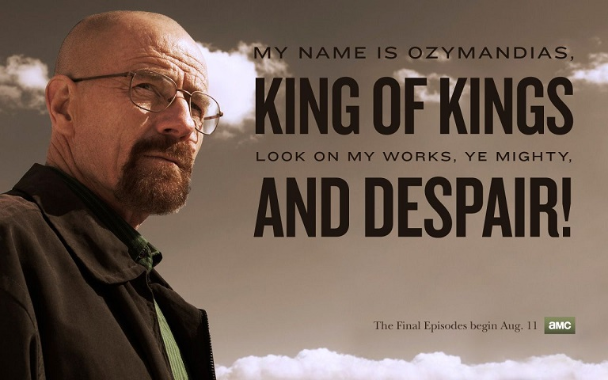

Ozymandias
奥兹曼迪亚斯

原作：英国诗人雪莱于1818年
翻译：杨绛

I met a traveller from an antique land,
我遇见一位来自古国的旅人，

Who said—“Two vast and trunkless legs of stone
他说：有两条巨大的石腿

Stand in the desert. . . . Near them, on the sand,
半掩于沙漠之间，

Half sunk a shattered visage lies, whose frown,
近旁的沙土中，有一张破碎的石脸，

And wrinkled lip, and sneer of cold command,
抿着嘴，蹙着眉，面孔依旧威严。

Tell that its sculptor well those passions read
想那雕刻者，必定深谙其人情感

Which yet survive, stamped on these lifeless things,
那神态还留在石头上，

The hand that mocked them, and the heart that fed;
而斯人已逝，化作尘烟。

And on the pedestal, these words appear:
看那石座上刻着字句：

My name is Ozymandias, King of Kings;
“我是万王之王，奥兹曼斯迪亚斯

Look on my Works, ye Mighty, and despair!
功业盖物，强者折服”

Nothing beside remains. Round the decay
此外，荡然无物。

Of that colossal Wreck, boundless and bare
废墟四周，唯余黄沙莽莽，

The lone and level sands stretch far away.”
寂寞荒凉，伸展四方。

无论你是欧美文学影视爱好者，还是游戏玩家，《奥兹曼迪亚斯》是一道绕不过去的丰碑。雪莱这首诗引来无数传奇神片的致敬，包括：

《异形-契约》里面的生化人大卫用黑水炸弹毁灭母星文明的朗诵的诗歌就是它。

《巴斯特的歌谣》里面的肉票无腿人卖艺时朗诵的诗歌也是它。

《绝命毒师》有一集就叫《奥兹曼迪亚斯》，老白也朗诵了它。

网上有无数中译版本，翻来覆去，我看还是杨绛的翻译最为优雅贴切。尤其是这两句“功业盖物，强者折服”和“唯余黄沙莽莽”直接带人身临其境。从这首诗就可以看出杨绛的翻译功力不在其丈夫钱钟书之下。

想看全诗视频的话，可以参考[B站](https://www.bilibili.com/video/BV1Cr4y1c7bs/)

历史上真有奥兹曼迪亚斯其人，他的故事比雪莱这首诗更为传奇。

此人就是埃及的“康熙”大帝：拉美西斯二世（奥兹曼迪亚斯是希腊人给他的名字）。不过他比康熙早将近3000年，而且统治埃及的时间长达67年（公元前1279-1213年），比康熙多了六年。活得也比康熙久，91岁高龄在三千多年前算是奇迹。

拉美西斯二世一生娶了八名王后和近两百名妃子，生了103个女儿和96个儿子。王妃中包括他的几个姐妹和女儿。那个时代的埃及显然伦理道德禁忌比我们少得多。我们在埃及的向导们提到这些事都不觉不妥，反而隐隐有炫耀之意。

尽管有这么多“雨露均沾”的老婆，拉美西斯二世其实是个“宠妻狂魔”。他专门为发妻兼正宫王后妮菲塔莉在阿布辛巴建了一座和他平起平坐的神庙。古往今来的君王里面这也算独一无二吧。

最神奇的是这么多儿子竟然没有爆发和康熙一样九子夺嫡的狗血剧情。拉美西斯二世去世后，因为前面的十二个哥哥都活得没老爸久，由十三王子麦伦普塔顺利继位。

拉美西斯二世是埃及十九王朝的第三位法老。埃及历史学家相比之下比较懒，给每个朝代简单给一个顺序号，第一王朝，第二王朝，直到最后第三十一王朝被亚历山大大帝征服。不像中国每个朝代有正式名称，唐宋元明清等等。

十九王朝发迹于埃及中部的卢克索，但逐步势力扩到到尼罗河上游的努比亚，和下游的尼罗河三角洲，最终统一全埃及后，拉美西斯二世把他的目光投向东方。

他挥兵越过红海，不费吹灰之力占领地中海东岸的叙利亚。进而继续北上，和盘踞在土耳其的赫梯帝国发生冲突。双方在卡叠石大战一场，不分胜负。最终赫梯和埃及签署了世界上第一个和约。

我们在土耳其安纳托利亚探访了从火山岩挖出来的地下城。向导说，祖先们挖地下城，最早就是为了躲避埃及人的入侵。显然，入侵者就是拉美西斯二世的士兵。

在埃及，我们见到无数的拉美西斯的巨大雕像。这可能是最爱自拍的法老。所以站姿的拉美西斯二世雕像都是左脚迈前。据向导说，这是全世界士兵出操时先迈左脚的来源。

拉美西斯二世的故事还有很多很多，有兴趣的朋友可以进一步展开阅读：

* [维基](https://zh.wikipedia.org/wiki/%E6%8B%89%E7%BE%8E%E8%A5%BF%E6%96%AF%E4%BA%8C%E4%B8%96)
* [知乎](https://zhuanlan.zhihu.com/p/31240101)
* [萌娘百科](https://zh.moegirl.org.cn/index.php?title=%E6%8B%89%E7%BE%8E%E8%A5%BF%E6%96%AF%E4%BA%8C%E4%B8%96(Fate))
* [百度](https://baike.baidu.com/item/%E6%8B%89%E7%BE%8E%E8%A5%BF%E6%96%AF%E4%BA%8C%E4%B8%96/383082)
* [搜狐](https://www.sohu.com/a/460771876_501385)
* [油管](https://www.youtube.com/hashtag/%E6%8B%89%E7%BE%8E%E8%A5%BF%E6%96%AF%E4%BA%8C%E4%B8%96)

最后我们回到雪莱的这首诗。无疑，雪莱想表达的是人生无常。尽管是千古一帝，武功盖世，赫赫威名，死后也不过是黄土一抷，淹没在时间的长河和沙漠里。

如果拉美西斯二世这样的人物都只能落得灰飞烟灭的结局，那人生的意义何在？我们的奋斗有何意义？

其实，雪莱太过悲观了。我们在埃及看到的恰恰相反：埃及人记住了拉美西斯二世。他们把他倒塌的雕像一个个重新树立起来，重新恢复还原，重新敬拜。拉美西斯二世的木乃伊送到法国去修复时，法国政府还鸣礼炮欢迎这位“已殁”国王。

人类长河的历史中，总会有一些出类拔萃的人物，成为不可磨灭的传奇，构成人类总体记忆的一部分，在流传后辈的歌谣中，永远存活。

拉美西斯二世如此，燃烧了短短三十年生命的雪莱亦是如此。

版权声明：本文部分照片来自作者在埃及和土耳其的旅程。未经同意，请勿转载。

